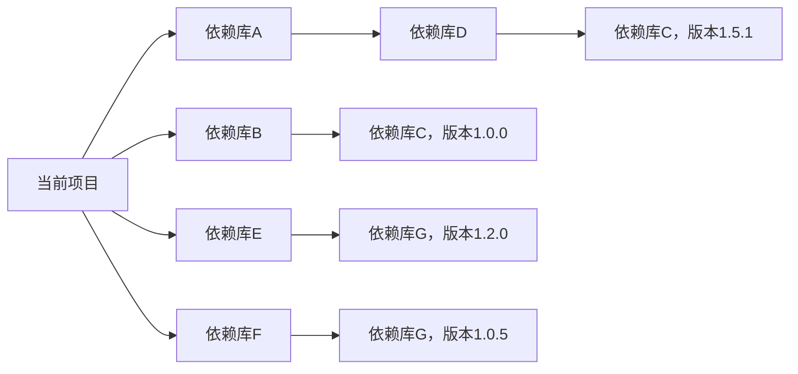
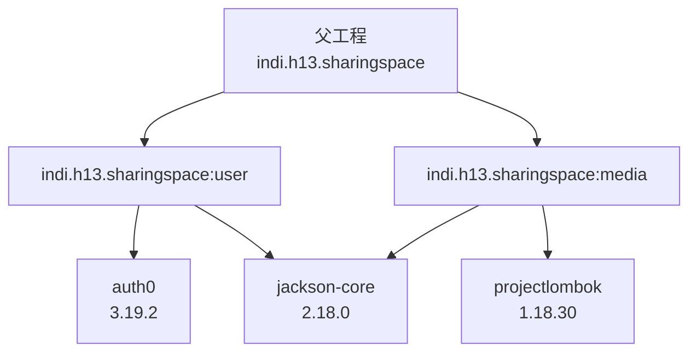

#Java #Maven

## 1 目录

```toc
```

## 2 Maven简介

Maven是一个Java的项目构建与管理工具，可以自动化安装依赖，构建、打包和发布项目。

## 3 使用Maven创建项目

### 3.1 项目名及项目版本管理

Maven相比于普通的工程项目，其还需要额外配置一组属性，这组属性被称为 `GAVP` 属性，其具体为：
- `GroupID` ：<span style="background:#fff88f"><font color="#c00000">组织标识</font></span>，通常最多不超过四级，格式为 `${组织属性}.${组织名}.${业务线}.[${子业务线}]`
	- 组织属性通常有如下可选选项：
		- `indi` ：个体项目，指个人发起，但非自己独自完成的项目，可公开或私有项目，copyright主要属于发起者。
		- `pers` ：个人项目，指个人发起，独自完成，可分享的项目，copyright主要属于个人。
		- `priv` ：私有项目，指个人发起，独自完成，非公开的私人使用的项目，copyright属于个人。
		- `onem` ：同 `indi` ，并且推荐使用 `indi` 。
		- `team` ：团队项目，指由团队发起，并由该团队开发的项目，copyright属于该团队所有。
		- `com` ：公司项目，copyright由项目发起的公司所有。
	- 子业务线为可选字段。
- `ArtifactID` ：一般为项目名或模块名，或者 `${项目名}-${模块名}` ，命名前可以去仓库中心搜索一下避免重复。
- `Version` ：版本号，<u>推荐</u>格式为 `${主版本号}.${次版本号}.${Patch号}` 。
- `Packaging` ：<font color="#c00000">可选属性</font>，拥有默认值。其含义为Maven工程的打包方式，其值只有如下三种：
	- `jar` ：<font color="#c00000">默认值</font>，打包为 `*.jar` 文件
	- `war` ：打包为JavaWeb工程
	- `pom` ：标识不会打包，通常用于当成做继承的父工程

### 3.2 使用Maven构建Java SE工程

在IDE中创建新工程(或者Module)时选择使用Maven构建即可，注意需要指定 `GroupID` 和 `ArtifactID` 即可：

![[idea64_On9moKqDbO.png]]

随后该项目下会出现：
1. 一个 `src` 文件夹用于存放Java代码
2. 一个 `pom.xml` 存放Maven配置信息。

`pom.xml` 的默认配置信息如下：

```xml
<?xml version="1.0" encoding="UTF-8"?>  
<project xmlns="http://maven.apache.org/POM/4.0.0"  
         xmlns:xsi="http://www.w3.org/2001/XMLSchema-instance"  
         xsi:schemaLocation="http://maven.apache.org/POM/4.0.0 http://maven.apache.org/xsd/maven-4.0.0.xsd">  
    <modelVersion>4.0.0</modelVersion>  
  
    <groupId>indi.h13</groupId>  
    <artifactId>maven-javase-project-01</artifactId>  
    <version>1.0-SNAPSHOT</version>  
  
    <properties> 
	    <maven.compiler.source>22</maven.compiler.source>  
        <maven.compiler.target>22</maven.compiler.target>  
        <project.build.sourceEncoding>UTF-8</project.build.sourceEncoding>  
    </properties>  
</project>
```

可以在上述配置文件中修改 `GroupID` 、 `ArtifactID` 和 `Version` 等项目信息。而在上述的默认配置中，并未提供 `Packaging` 信息，因此 `pom.xml` 中的项目信息可以做如下修改：

```xml
    <groupId>indi.h13</groupId>  
    <artifactId>maven-javase-project-01</artifactId>  
    <version>1.0.0</version>  
    <packaging>jar</packaging>
```

### 3.3 使用Maven构建Java EE工程

正如[[Java语言基础#2 1 Java SE、EE、ME的区别和联系]]所述，Java EE是基于Java SE的拓展，因此使用Maven构建Java EE工程有两种方式：
1. 直接使用IDE创建Java EE工程
2. 手动基于Java SE补全工程

#### 3.3.1 直接使用IDE创建Java EE工程

直接使用IDE创建Java EE工程的具体方式取决于具体的IDE，其中，在IDEA下的操作步骤如下：
1. 安装插件 `JBLJavaToWeb` 。
	![[idea64_hdyM53TwBe.png]]
2. 先创建普通Java SE工程。
3. 在该工程右键选择 `JBLJavaToWeb` 即可。
	![[sEShHZ6AGM.png]]

#### 3.3.2 手动基于Java SE补全工程

手动基于Java SE补全工程只需要补全对应文件即可，例如若需要使用Java EE创建WebApp(Servlet)，则只需要：
1. 在 `src/main` 文件夹下补充 `webapp/WEB-INF` 目录并补充 `web.xml` 文件。
2. 在 `pom.xml` 中将打包方式改为 `war` 。
3. 重新加载Maven即可。

## 4 使用Maven进行项目依赖管理

### 4.1 添加依赖

在完成章节[[Maven#3 2 使用Maven构建Java SE工程]]的配置后，所形成的 `pom.xml` 代码如下：

```xml
<?xml version="1.0" encoding="UTF-8"?>  
<project xmlns="http://maven.apache.org/POM/4.0.0"  
         xmlns:xsi="http://www.w3.org/2001/XMLSchema-instance"  
         xsi:schemaLocation="http://maven.apache.org/POM/4.0.0 http://maven.apache.org/xsd/maven-4.0.0.xsd">  
    <modelVersion>4.0.0</modelVersion>  
  
    <groupId>indi.h13</groupId>  
    <artifactId>maven-javase-project-01</artifactId>  
    <version>1.0-SNAPSHOT</version>  
    <packaging>jar</packaging>
  
    <properties> 
	    <maven.compiler.source>22</maven.compiler.source>  
        <maven.compiler.target>22</maven.compiler.target>  
        <project.build.sourceEncoding>UTF-8</project.build.sourceEncoding>  
    </properties>  
</project>
```

而当需要使用Maven管理依赖时则需要在 `project` 块中添加并形成如下内容：

```xml
<?xml version="1.0" encoding="UTF-8"?>  
<project xmlns="http://maven.apache.org/POM/4.0.0"  
         xmlns:xsi="http://www.w3.org/2001/XMLSchema-instance"  
         xsi:schemaLocation="http://maven.apache.org/POM/4.0.0 http://maven.apache.org/xsd/maven-4.0.0.xsd">  
    <modelVersion>4.0.0</modelVersion>  
  
    <groupId>indi.h13</groupId>  
    <artifactId>maven-javase-project-01</artifactId>  
    <version>1.0-SNAPSHOT</version>  
    <packaging>jar</packaging>
  
    <properties> 
	    <maven.compiler.source>22</maven.compiler.source>  
        <maven.compiler.target>22</maven.compiler.target>  
        <project.build.sourceEncoding>UTF-8</project.build.sourceEncoding>  
    </properties>  

<dependencies>  

	<!-- https://mvnrepository.com/artifact/com.fasterxml.jackson.core/jackson-core -->
	<dependency>
	    <groupId>com.fasterxml.jackson.core</groupId>
	    <artifactId>jackson-core</artifactId>
	    <version>2.18.0</version>
	</dependency>

	<!-- https://mvnrepository.com/artifact/com.fasterxml.jackson.core/jackson-databind -->
	<dependency>
	    <groupId>com.fasterxml.jackson.core</groupId>
	    <artifactId>jackson-databind</artifactId>
	</dependency>
	
</dependencies>

</project>
```

正如上文配置，每一个依赖均需要 `GAVP` 属性，但是 `version` 属性可以省略(<span style="background:#fff88f"><font color="#c00000">不推荐</font></span>)、使用特殊值(<span style="background:#fff88f"><font color="#c00000">不推荐</font></span>)、引用版本变量(<span style="background:#fff88f"><font color="#c00000">常用</font></span>)、使用版本区间等。详见下一章节。

而每个依赖所需要的 `GAVP` 属性可以去Maven仓库官网 https://mvnrepository.com 搜索。也可以使用 `Maven-search` 插件进行搜索和复制配置信息。
在完成 `pom.xml` 的修改之后刷新Maven即可。

### 4.2 依赖的版本管理

正如上一章节所述，版本信息的配置方式有如下几种：
- 省略
- 特殊值，特殊值有：
	- `LATEST` ：表示最新的版本，包括开发中的快照(snapshot)版本。
	- `RELEASE` ：表示最新的稳定版本，但是不包括快照版本。
	(从Maven2.1开始，`LATEST` 和 `RELEASE` <font color="#c00000">已经被标记为不推荐使用</font>，并在Maven3中<span style="background:#fff88f"><font color="#c00000">强烈不推荐使用</font></span>，<span style="background:#fff88f"><font color="#c00000">并且会在未来版本中移除</font></span>)。
- 使用版本区间：
	例如 `<version>[3.0,3.9]</version>` 表示支持使用3.0到3.9版本中的任意一个(不过该特性也需要谨慎使用)。
- 引用版本变量：
	例如可以直接在 `pom.xml` 中的 `properties` 块中定义依赖的版本变量，例如：
	```xml
<properties> 
	<maven.compiler.source>22</maven.compiler.source>  
    <maven.compiler.target>22</maven.compiler.target>  
    <project.build.sourceEncoding>UTF-8</project.build.sourceEncoding> 
	<!-- 声明jackson版本变量 -->
	<!-- 命名的标签建议使用两层及以上 -->
	<jackson.version>2.18.0</jackson.version>
</properties>  
	```
	随后在定义 `dependency` 时使用该变量即可：
	```xml
<!-- https://mvnrepository.com/artifact/com.fasterxml.jackson.core/jackson-core -->
<dependency>
    <groupId>com.fasterxml.jackson.core</groupId>
    <artifactId>jackson-core</artifactId>
    <version>${jackson.version}</version>
</dependency>
<!-- https://mvnrepository.com/artifact/com.fasterxml.jackson.core/jackson-databind -->
<dependency>
    <groupId>com.fasterxml.jackson.core</groupId>
    <artifactId>jackson-databind</artifactId>
    <version>${jackson.version}</version>
</dependency>
	```

### 4.3 依赖的作用域管理

在 `dependency` 块中可以添加一个 `scope` 属性用于限定依赖的作用域，其可选项有：
- `compile` ：<font color="#c00000">默认值</font>，在编辑、打包和运行时都会被生效。
- `main` ：仅在主程序中使用。
- `test` ：仅在测试中生效。
- `runtime` ：仅在运行时有效，在打包和运行时使用，例如 `mysql` 的驱动。
- `provided` ：仅在 `main` 和 `test` 中会被使用，打包和运行时不会使用(与上一项相反)，例如 `servlet` ，Tomcat本身提供了 `servlet` ，因此打包时不会将该依赖打包进去。

### 4.4 依赖传递和依赖冲突

例如工程有如下的项目依赖(从上到下为在 `pom.xml` 中依赖的顺序)：



则Maven会自动根据依赖传递导入依赖库A、B、C、D...。
但是关于依赖库D、G的版本问题，Maven则按照如下顺序判定(先判定1再判定2)：
1. <font color="#c00000">谁短谁优先</font>：引用路径谁短就引用谁。例如上图会<font color="#c00000">引入依赖库C的1.0.0版本</font>。
2. <font color="#c00000">谁上谁优先</font>：由于在 `pom.xml` 的 `dependencies` 中哪个依赖靠上就引用哪个。例如上图会<font color="#c00000">引入依赖库G的1.2.0版本</font>。

## 5 Java项目构建流程与Maven常用命令

Java项目构建流程为：
1. 清理
2. 编译
3. 测试
4. 报告(主要汇总并输出项目的依赖信息)
5. 打包
6. 部署

与上述流程对应的Maven命令为：
1. `mvn clean`
2. `mvn compile`
3. `mvn test`
4. `mvn site`
5. `mvn package`
6. `mvn install`
7. `mvn deploy`

## 6 Maven的继承和聚合特性

### 6.1 Maven工程的继承关系

Maven的继承通常用于将大项目拆分为若干个小项目后，在父项目中统一管理各子项目的依赖信息。
通常的做法是：
1. 将父工程的打包方式设置为 `pom` 。
2. 在父工程的 `project` 块下，引入 `dependenciesManagement` 块。
3. 将各 `dependency` 块在其中引入并指定版本。
4. 在子工程的 `project` 块下，使用 `parent` 标签指定父工程的GAV信息。
5. 在子工程的 `project` 块。

以下方的工程结构图为例，



则对应的父工程 `pom.xml` 可以如下编写：

```xml
<?xml version="1.0" encoding="UTF-8"?>  
<project xmlns="http://maven.apache.org/POM/4.0.0"  
         xmlns:xsi="http://www.w3.org/2001/XMLSchema-instance"  
         xsi:schemaLocation="http://maven.apache.org/POM/4.0.0 http://maven.apache.org/xsd/maven-4.0.0.xsd">  
    <modelVersion>4.0.0</modelVersion>  
  
    <groupId>indi.h13</groupId>  
    <artifactId>sharingspace</artifactId>  
    <version>1.0.0</version>  
    <packaging>pom</packaging>
  
    <properties> 
	    <maven.compiler.source>22</maven.compiler.source>  
        <maven.compiler.target>22</maven.compiler.target>  
        <project.build.sourceEncoding>UTF-8</project.build.sourceEncoding>  
    </properties>  

	<!-- 使用dependenciesManagement声明版本信息，但不导入 -->
	<!-- 该版本信息可以被子工程继承 -->
	<dependenciesManagement>
		<dependency>  
		    <groupId>com.auth0</groupId>  
		    <artifactId>java-jwt</artifactId>  
		    <version>3.19.2</version>  
		</dependency>

		<dependency>  
		    <groupId>com.fasterxml.jackson.core</groupId>  
		    <artifactId>jackson-core</artifactId>  
		    <version>2.18.0</version>  
		</dependency>
		  
		<dependency>  
		    <groupId>org.projectlombok</groupId>  
		    <artifactId>lombok</artifactId>  
		    <version>1.18.30</version>  
		</dependency>  
	</dependenciesManagement>

</project>
```

随后在子工程(以 `indi.h13.sharingspace.user` 为例)的 `pom.xml` 中可以如下配置：

```xml
<?xml version="1.0" encoding="UTF-8"?>  
<project xmlns="http://maven.apache.org/POM/4.0.0"  
         xmlns:xsi="http://www.w3.org/2001/XMLSchema-instance"  
         xsi:schemaLocation="http://maven.apache.org/POM/4.0.0 http://maven.apache.org/xsd/maven-4.0.0.xsd">  
    <modelVersion>4.0.0</modelVersion>  

	<!-- 使用parent标签来继承父工程 -->
	<parent>
		<groupId>indi.h13</groupId>  
	    <artifactId>sharingspace</artifactId>  
	    <version>1.0.0</version>  
	</parent>

	<artifactId>user</artifactId>  

    <properties> 
	    <maven.compiler.source>22</maven.compiler.source>  
        <maven.compiler.target>22</maven.compiler.target>  
        <project.build.sourceEncoding>UTF-8</project.build.sourceEncoding>  
    </properties>  

	<!-- 使用dependencies导入依赖 -->
	<!-- 所有受本pom影响的工程均会被导入该块中的依赖 -->
	<dependencies>
		<!-- 不用指定版本号!!! -->
		<dependency>  
		    <groupId>com.auth0</groupId>  
		    <artifactId>java-jwt</artifactId>   
		</dependency>

		<dependency>  
		    <groupId>com.fasterxml.jackson.core</groupId>  
		    <artifactId>jackson-core</artifactId>  
		</dependency>
		  
		<dependency>  
		    <groupId>org.projectlombok</groupId>  
		    <artifactId>lombok</artifactId>  
		</dependency>  
	</dependencies>

</project>
```

需要额外注意的是：
1. <font color="#c00000">如果子工程中也重新定义一个版本信息，则子工程的版本信息会覆盖父工程中声明的版本信息</font>。

### 6.2 Maven工程的聚合特性

Maven中聚合的概念是指将多个项目组合回一个父项目中，并可以通过父工程的项目构建命令统一构建子工程。
而在上文中的子模块中已经配置了 `parent` 属性，但是该属性无法满足上述的父工程的统一管理功能，还需要在父工程的 `pom.xml` 中添加 `modules` 属性。修改后的代码如下：

```xml
<?xml version="1.0" encoding="UTF-8"?>  
<project xmlns="http://maven.apache.org/POM/4.0.0"  
         xmlns:xsi="http://www.w3.org/2001/XMLSchema-instance"  
         xsi:schemaLocation="http://maven.apache.org/POM/4.0.0 http://maven.apache.org/xsd/maven-4.0.0.xsd">  
    <modelVersion>4.0.0</modelVersion>  
  
    <groupId>indi.h13</groupId>  
    <artifactId>sharingspace</artifactId>  
    <version>1.0.0</version>  
    <packaging>pom</packaging>

	<!-- 将需要统一管理的模块的artifactID写入下方modules中 -->
	<modules>
		<module>user</module>
		<module>media</module>
	</modules>

    <properties> 
	    <maven.compiler.source>22</maven.compiler.source>  
        <maven.compiler.target>22</maven.compiler.target>  
        <project.build.sourceEncoding>UTF-8</project.build.sourceEncoding>  
    </properties>  

	<!-- 使用dependenciesManagement声明版本信息，但不导入 -->
	<!-- 该版本信息可以被子工程继承 -->
	<dependenciesManagement>
		<dependency>  
		    <groupId>com.auth0</groupId>  
		    <artifactId>java-jwt</artifactId>  
		    <version>3.19.2</version>  
		</dependency>

		<dependency>  
		    <groupId>com.fasterxml.jackson.core</groupId>  
		    <artifactId>jackson-core</artifactId>  
		    <version>2.18.0</version>  
		</dependency>
		  
		<dependency>  
		    <groupId>org.projectlombok</groupId>  
		    <artifactId>lombok</artifactId>  
		    <version>1.18.30</version>  
		</dependency>  
	</dependenciesManagement>

</project>
```
