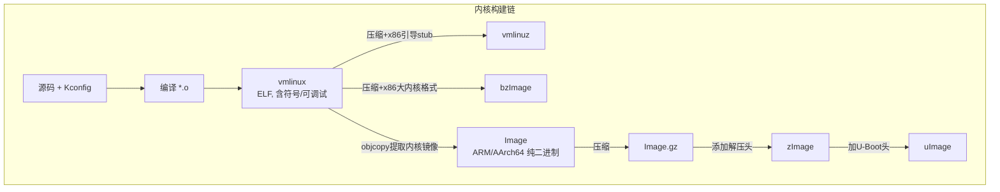

#嵌入式 

# 1 目录

```toc
```

# 2 常见格式及区别

linux内核的常见格式关系如下图所示：



## 2.1 vmlinux

基本特性：
- vmlinux是<font color="#c00000">内核源码编译出来的原始文件</font>，elf格式，未压缩处理，<span style="background:#fff88f"><font color="#c00000">是后续一切格式的基础</font></span>
- vm是指虚拟内存(即用硬盘空间做内存)
- 不可用作引导
- 其包含全部符号与调试信息，可以使用 `readelf` 、 `nm` 、 `objdump` 等工具对其符号进行分析和调试
- `System.map` 也是从此处提取

获取方式与位置：
- 对内核源码进行编译后，通常会生成在源码的根目录

## 2.2 vmlinuz

是<font color="#c00000">x86上的可引导的、压缩的内核</font>，添加了引导代码。z表示 `zip` 。

## 2.3 bzImage

即 `big zImage` ，是x86的新格式的内核镜像，用于引导更大的内核。

## 2.4 Image

基本特性：
- 使用 `objcopy` 处理vmlinux，并：
	1. 删除 `.note` 段
	2. 删除 `.note.gnu.build-id` 段
	3. 删除 `.commit` 段
	4. 删除(不复制)重定位信息和符号信息
	后生成的<font color="#c00000">ARM/ARM64平台的</font>二进制内核镜像，未压缩，<font color="#c00000">可以用引导启动</font>

获取方式与位置：
- 其获取命令的示例为

## 2.5 Image.gz

是Image的压缩版本，可用于ARM64 u-boot和fastboot引导

## 2.6 zImage

使用gzip压缩Image后，添加了解压功能头的格式

## 2.7 uImage

在zImage前添加一个64字节的头，描述文件类型、加载位置和大小等信息，适用于<font color="#c00000">老版本</font>uboot的引导镜像，通常用于ARM和MIPS架构。

# 3 

## 3.1 initrd

引导时的临时根文件系统，可压缩