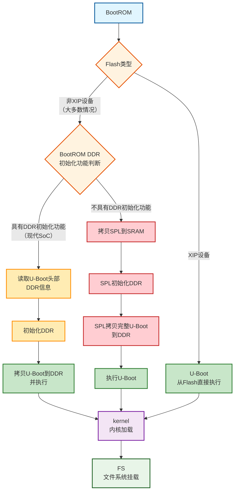

#嵌入式 #Linux驱动开发 #操作系统

# 1 目录

```toc
```

# 2 U-Boot及其功能

U-Boot全称为Universal Bootloader，<font color="#c00000">是一个裸机程序</font>。其目的是为了解决不同硬件上的内核启动需求。
此外，U-Boot支持ARM、RISC-V、x86等架构，因此在工程上较为复杂。

## 2.1 U-Boot基本需求 ^cv97lr

考虑如下几个要点：
- 在单片机上，其RAM、Flash通常和CPU直接组合在一起，且其Flash通常也可以直接映射到内存空间从而实现程序的直接运行，这种设备也被称为<font color="#9bbb59">XIP设备</font>。
	- <font color="#9bbb59">XIP</font>：Execute in place，原地执行。
	- <font color="#9bbb59">XIP设备</font>：CPU可以直接在存储器中执行代码的设备。
- 而在嵌入式Linux硬件上，其：
	- RAM、Flash通常都独立于CPU之外，SoC通常只有内存控制器和Flash控制器，这些都不具备<font color="#9bbb59">XIP</font>功能。
	- RAM和Flash的型号、容量、类型多种多样，其无法做到像单片机一样直接完全由CPU硬件完成系统的启动。
因此嵌入式Linux硬件需要一个额外的Bootloader来实现内核的启动与更新等功能。

## 2.2 U-Boot基本职责

在此需求之上，U-Boot主要负责：
1. 初始化必要硬件，例如：
	1. DDR
	2. 时钟
	3. Flash
2. 将内核拷贝到内存中
3. 启动内核

此外，U-Boot还有如下的(可选)功能：
1. 网络下载功能(避免每次调试时都需要重新刷写分区)，例如：
	1. 从网络下载并启动内核
	2. 从网络下载并更新设备树
2. 传递启动参数到内核

## 2.3 U-Boot与设备树

在<font color="#c00000">上述硬件需求中</font>，例如CPU、时钟、内存、屏幕<u>甚至网卡驱动</u>等<font color="#c00000">需要设备树技术的介入</font>。而<font color="#c00000">设备树的介入也将</font>同一种芯片的不同电路设计、驱动选择所组成的<font color="#c00000">成千上万种的板级配置拆分到U-Boot和内核源代码之外</font>，<font color="#c00000">设备树也将被独立编译为一个单独的</font> `.dtb` <font color="#c00000">文件</font>，<font color="#c00000">以供U-Boot加载和读取</font>。

注：
1. U-Boot使用的设备树与内核使用的设备树并非同一个二进制设备树文件。但是其通常由<font color="#c00000">同套</font>设备树源文件编译而成(可以通过include或者overlay等方式为U-Boot的设备树添加补丁)。

# 3 U-Boot的加载流程 ^ro5d63

对于大多数嵌入式Linux系统：
- 其SoC只拥有Flash控制器，而不拥有内置的Flash。
- 而U-Boot通常存放于外置Flash中。
- 而对于外置的Flash，其通常均不是XIP设备，需要额外一段(或多段)程序来完成U-Boot的加载，这些程序(或者启动阶段)分别为：
	- <font color="#9bbb59">BootROM</font>：一个可以直接被CPU读取和执行的存储区域(即XIP设备)，其通常在出厂时被刷写。<font color="#c00000">其使命是通过Flash控制器将Bootloader拷贝到内存中并执行</font>。
	- <font color="#9bbb59">SPL</font>：若SoC的SRAM容量不足以放下完整U-Boot时，BootROM会将精简版的U-Boot拷贝到SRAM，然后初始化DDR，从而继续拉起U-Boot。这个精简版的U-Boot就是SPL(Secondary Program Loader)。

也就是说对于嵌入式Linux，其： ^c45lgx
- 若Flash为非XIP设备(<font color="#c00000">大多数为此情况</font>)
	- 若BootROM具有DDR初始化功能(<font color="#c00000">现代SoC较多使用</font>)，则：
		1. 读取存储在U-Boot头部的DDR信息
		2. 初始化DDR
		3. 拷贝U-Boot到DDR并执行
	- 若BootROM不具有DDR初始化功能，则其启动顺序为：
        1. `BootROM` 会拷贝指定启动设备的头部若干尺寸的代码到SRAM(通常是与SRAM一样大)，这部分代码即 `SPL`
        2. `SPL` 会执行初始化DDR、拷贝包含 `SPL` 的完整U-Boot到DDR
        3. 执行 `U-Boot` 
- 若Flash为XIP设备，直接加载U-Boot

注：
1. 采用BootROM配置DDR的SoC有：
    - IMX6ULL
    - RK3399、RK3588等
2. 采用SPL的SoC有：
    - S3C2440

其流程图为：



## 3.1 BootROM

在BootROM阶段，SoC通常会执行如下操作：
1. 检查BootPin配置，从而选择启动设备，其策略通常有：
	- 通过BootPin<font color="#c00000">选择启动设备</font>，例如：
        - NXP的IMX6ULL：选择是 `SD` 、 `EMMC` 或者是 `USB` 
	- 通过BootPin<font color="#c00000">选择启动顺序</font>，例如：
		- 全志、瑞芯微系列：选择是 `SD->NAND` 或者 `NAND->SD` 


## 3.2 SPL


# 4 U-Boot的启动流程

U-Boot的启动流程主要可以分为汇编部分和C语言部分。


汇编部分：
- 关闭中断、看门狗、cache、mmu，保证代码的稳定性
- 进入SVC模式(特权模式)
- 基本硬件初始化，通常包含：
	- 时钟
	- 串口
	- Flash
	- DDR
- 初始化堆栈
- 自搬移，主要包含：
	- 将U-Boot程序搬运到内存上
	- 重定位(Flash地址和内存中的地址不一致)


# 5 U-Boot源码结构及其编译

## 5.1 U-Boot源码结构

```shell
u-boot:
├── api/
├── arch/                   # 各架构所属代码
│   ├── arc/
│   ├── arm/              	# arm架构目录
│	│	├── cpu/			# arm各版本架构目录
│	│	│	├── arm11/
│	│	│	├── arm1136/
│	│	│	├── ...
│	│	│	└── armv8/		# armv8
│	│	│		├── bcmns3/			# 各厂商的CPU侧极早期初始化代码
│	│	│		├── fsl-layerscape/
│	│	│		├── hisilicon/
│	│	│		├── xen/
│	│	│		├── *.S				# 该子架构通用CPU初始化代码
│	│	│		├── *.c
│	│	│		└── ...
│	│	├── dts/			# 该架构的SoC级和板级设备树
│	│	├── include/
│	│	│	├── asm/		# 架构相关头文件
│	│	│	└── debug/
│	│	├── lib/          	# arm架构的通用例程(例如memcpy等，包含C和汇编)
│	│	├── mach-airoha/    # 各CPU厂家的通用代码
│	│	├── mach-apple/     # 包括apple、sunxi、mediatek、rockchip等
│	│	├── ...
│	│	└── thumb1/
│   ├── ...
│   └── xtensa
├── board/ 					# 板级支持包，包含SoC厂家和Board厂家
│	├── abilis/
│	├── acer/				# 宏碁
│	├── ...
│	├── firefly/			# firefly的板级支持包
│	├── ...
│	├── rockchip/   		# 瑞芯微，包含SoC及官方Board
│	│	├── evb_px30/
│	│	├── evb_px5/
│	│	├── ...
│	│	├── evb_rk3588/
│	│	├── ...
│	│	├── tinker_rk3288/
│	│	└── toybrick_rk3588/
│	├── ...
│	└── zyxel/
├── boot/					# 镜像装载、解析等
├── cmd/						# U-Boot shell命令的实现(如mmc、fat等)
├── common/					# 启动所需公共框架
│	├── eeprom/				# 
│	├── init/				# 启动阶段调度、自举逻辑、autoboot、环境装载等
│	└── spl/				# SPL框架，即裁剪后的早期引导，用于拉起完整的U-Boot
├── configs/			    # 板级编辑配置文件，编译时引用
│   ├── 10m50_defconfig         # 可使用 `make 10m50_defconfig` 指定该配置
│   ├── 3c120_defconfig
│   ├── ...
│   └── zynq_cse_qspi_defconfig
├── disk/
├── doc/					# 开发、使用、架构对应文档
│	├── android/
│	├── ...
│	├── arch/
│	├── board/
│	├── ...
│	├── develop/
│	├── device-tree-bindings/
│	├── ...
│	├── SPL/
│	└── usage/
├── drivers/				# 各种外设与硬件驱动
│	├── adc/
│	├── ...
│	├── clk/
│	├── core/
│	├── cpu/
│	├── crypto/
│	├── ddr/
│	├── ...
│	└── xen/
├── dts/					# 
├── env/
├── examples/				# 示例
├── fs/						# 文件系统实现
├── include/
├── lib/					# 通用库，包含压缩算法、加密算法、ACPI、EFI子系统等
├── Licenses/				# 许可证
├── net/					# 网络协议库，包含TCP/IP、UDP、lwip等
├── post/					# 上电自检框架(Power-On Self-Test)
├── scripts/				# 构建等相关脚本
├── test/					# 测试库等
└── tools/					# 编译时构建、打包工具，及python辅助库
```

## 5.2 U-Boot编译

U-Boot编译时可使用如下命令：

```Shell
make ${config_name}
```

其中， `${config_name}` 为路径 `configs` 下的配置文件。

使用：

```shell
make ${config_name} -p > 
```
