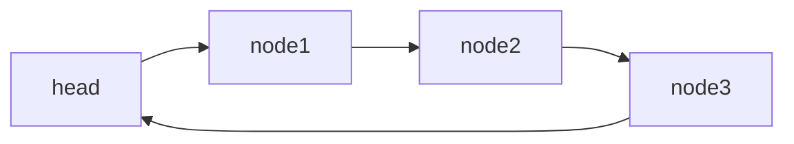

#操作系统 #Linux系统原理 #Linux内核开发


## 1 目录

```toc
```

## 2 Readme

本笔记仅记录 `include/linux/types.h` 下定义的基本数据结构及其设计。

## 3 链表锚点 ^xl7wru

在C语言大型项目中，<font color="#c00000">往往要使用类型想当繁多的链表</font>。<font color="#c00000">但是如果分别为每一个链表都加入增、删、改、查、搜索、排序等功能的话代码又显得相当繁琐</font>。因此需要将链表的常用操作统一拆分出来。

在面向对象语言中，可以考虑定义一个链表基类即可实现上述需求。但是C语言结构体并不具备面向对象的继承关系，因此在C语言中实现一个通用的链表通常使用如下两种方式实现：
1. 在通用链表中定义一个 `void *data` 成员，随后 `void *data` 交由开发者自行控制和处理。使用这种方法的例子有[clibs-list](https://github.com/clibs/list)。
	- 优点：不使用宏。
	- 缺点：所有链表的类型均会被统一为同一个链表类型，例如 `list_t` 。
2. 设计链表锚点：
	1. 在链表锚点内部定义数据引索指针，例如 `*next` 、 `*prev` 等指针，例如：
	```C
struct list_head {
	struct list_head *next, *prev;
};
	```
	2. 将链表锚点添加到需要托管的链表节点的结构体中，例如：
	```C
struct my_data_list {
    int data;
    struct list_head list;
};
	```
	3. 则此时可以使用 `.list` 成员找到上一个或下一个链表节点的 `.list` 成员。<font color="#c00000">但是此时的问题是如何使用</font> `.list` <font color="#c00000">成员完成获取链表的节点等操作</font>。
	4. 此时就可以考虑使用宏函数 `container_of` 等方法解决上述问题，例如：
		- <font color="#c00000">通过宏自动计算字段在结构体中的偏移量来获取整个结构体的地址</font>。
	- 优点：任何一个链表都可以定义为其自己的类型，这在大型项目中想当有用。
	- 缺点：使用了宏。

### 3.1 双向链表锚点(struct list_head)

`struct list_head` 的定义为：

```C
struct list_head {
	struct list_head *next, *prev;
};
```

<font color="#c00000">本章节的宿主结构体统一定义如下</font>： ^4l9s1l

```C
struct mdata_list {
	int data;
	struct list_head list;
}
```

#### 3.1.1 基本数据结构

为了简化程序设计：
- <font color="#c00000">该链表必须为含有头结点的链表</font>( `list_empty` 等函数要求)
- <font color="#c00000">当链表为空时，其prev、next两个指针均指向自己</font>：
	![[Pasted image 20241124170145.png]]
- <font color="#c00000">为了方便从尾部插入，其表头的prev指向链表表尾节点，表头的next指向第一个节点</font>：
	![[Pasted image 20241124170623.png]]

#### 3.1.2 静态创建链表(LIST_HEAD_INIT)

`LIST_HEAD_INIT` 函数的定义为：

```C
#define LIST_HEAD_INIT(name) { &(name), &(name) }
```

因此其参数类型为 `struct list_head *list` 。示例如下：

```C
static struct mdata_list mdata_list_head = {
	.data = -1;
	.list = LIST_HEAD_INIT(mdata_list_head.list)
}
```

#### 3.1.3 动态创建链表(INIT_LIST_HEAD)

`INIT_LIST_HEAD` 函数的定义为：

```C
static inline void INIT_LIST_HEAD(struct list_head *list)
{
	list->next = list;
	list->prev = list;
}
```

其使用示例如下：

```C
static void func() {
	struct mdata_list mdata_list_head = { 0 };
	
	INIT_LIST_HEAD(&mdata_list_head.list);
}
```

#### 3.1.4 获取宿主链表入口 list_entry/container_of(list_head \*ptr, host_type, member_id)

获取宿主链表入口有两个函数 `list_entry` 和 `container_of` ，其本质相同互为别名，定义如下：

```C
/**
 * list_entry - get the struct for this entry
 * @ptr:	the &struct list_head pointer.
 * @type:	the type of the struct this is embedded in.
 * @member:	the name of the list_head within the struct.
 */
#define list_entry(ptr, type, member) \
	container_of(ptr, type, member)

/**
 * container_of - cast a member of a structure out to the containing structure
 * @ptr:	the pointer to the member.
 * @type:	the type of the container struct this is embedded in.
 * @member:	the name of the member within the struct.
 *
 */
#define container_of(ptr, type, member) ({			\
	const typeof( ((type *)0)->member ) *__mptr = (ptr);	\
	(type *)( (char *)__mptr - offsetof(type,member) );})
```

均为使用 `list` 链表锚点获取宿主结构体 `entry` ，使用demo如下：

```C
struct my_data_list *entry = list_entry(
	&(node.list), 
	struct my_data_list,
	list
)
```

#### 3.1.5 向指定节点后添加一个节点 list_add(list_head \*new, list_head \*head)

`list_add` 函数的定义为：

```C
/**
 * list_add - add a new entry
 * @new: new entry to be added
 * @head: list head to add it after
 *
 * Insert a new entry after the specified head.
 * This is good for implementing stacks.
 */
static inline void list_add(struct list_head *new, struct list_head *head)
{
	__list_add(new, head, head->next);
}
```

假设各宿主节点关系如下：



各宿主节点均遵从上方定义的[[内核基本数据结构(types.h部分)#^4l9s1l|统一的宿主数据结构]]，要在 `node1` 和 `node2` 之间增加 `node4` ，则示例如下：

```C
list_add(&(node4.list), &(node1.list));
```

#### 3.1.6 向尾部添加一个节点 list_add_tail(list_head \*new, list_head \*head)

`list_add_tail` 函数的定义为：

```C
/**
 * list_add_tail - add a new entry
 * @new: new entry to be added
 * @head: list head to add it before
 *
 * Insert a new entry before the specified head.
 * This is useful for implementing queues.
 */
static inline void list_add_tail(struct list_head *new, struct list_head *head)
{
	__list_add(new, head->prev, head);
}
```

#### 3.1.7 删除指定节点 list_del(list_head \*entry)

`list_del` 函数的定义为：

```C
/**
 * list_del - deletes entry from list.
 * @entry: the element to delete from the list.
 * Note: list_empty() on entry does not return true after this, the entry is
 * in an undefined state.
 */
static inline void list_del(struct list_head *entry)
{
	__list_del(entry->prev, entry->next);
	entry->next = LIST_POISON1;
	entry->prev = LIST_POISON2;
}
```

假设各宿主节点关系如下：


各宿主节点均遵从上方定义的[[内核基本数据结构(types.h部分)#^4l9s1l|统一的宿主数据结构]]，则删除node2节点的示例为：

```C
list_del(node1);
```

#### 3.1.8 遍历节点 list_for_each(list_head \*pos, list_head \*head)

`list_for_each` 函数的定义如下：

```C
/**
 * list_for_each	-	iterate over a list
 * @pos:	the &struct list_head to use as a loop cursor.
 * @head:	the head for your list.
 */
#define list_for_each(pos, head) \
	for (pos = (head)->next; pos != (head); pos = pos->next)
```

### 3.2 单向链表


