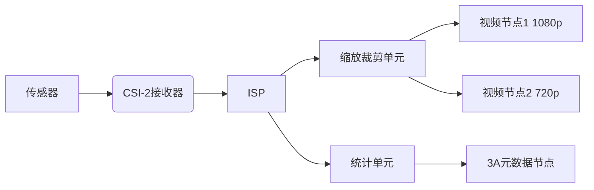

## 1 目录

```toc
```

## 2 V4L2用户态基础开发

本章节仅介绍内核态开发所必要的用户态基础开发知识。

### 2.1 V4L2用户态开发概述

V4L2提供了如下的硬件能力类型：
- 视频采集接口()
- 视频输出接口
- 直接传输视频接口
- 视频间隔消隐信号接口
- 收音机接口
V4L2可以为含有上述能力的设备提供统一的开发接口，提高用户态代码的可移植性，降低内核态驱动编写的复杂度。

与V4L2相关的文件系统节点主要有 `/dev/mediax` 、 `/dev/v4l-subdevx` 、 `/dev/videox` ，其主要区别如下：
- `/dev/mediax` ：媒体控制器节点

V4L2用户态开发流程图如下：
	![[V4L2用户态流程.svg]]

### 2.2 基础V4L2操作

#### 2.2.1 打开设备节点

和普通字符设备一样，使用Linux操作摄像头时，第一步依旧是打开摄像头对应的文件节点。

```C
#include <fcntl.h>
#include <stdio.h>

int fd = open(device, O_RDWR);  
if(fd < 0) {  
    printf("open device: %s failed.\r\n", device);  
}
```

#### 2.2.2 查询设备能力 ^vda0ux

一些设备往往能够同时输出不知一种数据类型，例如一个电视采集卡可以将有线电视的信号转化为linux的音视频输入：
	![[Pasted image 20250326133304.png]]

而当我们想要确认该设备是否有需要的输出能力、或可能需要该设备同时输出多种数据类型时，就需要查询设备能力( `capability` )从而做进一步判断。
查询API为：

```C
#include <sys/ioctl.h>
struct v4l2_capability cap = { 0 };  
int ret = ioctl(fd, VIDIOC_QUERYCAP, &cap);  
if(ret < 0) {  
    printf("get v4l2_capability failed");  
}
```

参考查询结果：
	![[Pasted image 20250325165307.png]]

上述查询结果可以按照如下方式使用：

```C
#include <sys/ioctl.h>
struct v4l2_capability cap = { 0 };  
int ret = ioctl(fd, VIDIOC_QUERYCAP, &cap);  
if(ret < 0) {  
    printf("get v4l2_capability failed.\r\n");  
}

if (cap.capabilities & V4L2_CAP_VIDEO_CAPTURE)  
    printf("Support video capture.\r\n");  
  
if (cap.capabilities & V4L2_CAP_AUDIO)  
    printf("Support audio input.\r\n");  
  
if (cap.capabilities & V4L2_CAP_RADIO)  
    printf("Support radio input.\r\n");

...
```

#### 2.2.3 枚举输出格式

在V4L2中，获取一个设备支持的所有输出格式需要依靠类似于遍历的方法实现(该方法被称为枚举、Enumeration)，其示例如下：

```C
struct v4l2_fmtdesc fmtdesc = { 0 };
fmtdesc.type = V4L2_BUF_TYPE_VIDEO_CAPTURE;
//fmtdesc.index = 0;
while (1) {
    ret = ioctl(fd, VIDIOC_ENUM_FMT, &fmtdesc);
    if (ret == 0)
    {
        // 输出获取到的格式列表
        printf("-----------------------------------------------\r\n");
        printf("fmtdesc.index=%d\r\n", fmtdesc.index);
        printf("fmtdesc.type=%d\r\n", fmtdesc.type);
        printf("fmtdesc.flags=%d\r\n", fmtdesc.flags);
        printf("fmtdesc.description=%s\r\n", fmtdesc.description);
        printf("fmtdesc.pixelformat=%c.%c.%c.%c\r\n",
            fmtdesc.pixelformat >> 0  & 0xff,
            fmtdesc.pixelformat >> 8  & 0xff,
            fmtdesc.pixelformat >> 16 & 0xff,
            fmtdesc.pixelformat >> 24 & 0xff
        );

        // 4. 枚举指定视频格式支持的分辨率(暂时注释，需要结合下一章节)
        // enum_frame_size(fd, fmtdesc.pixelformat);
    } else {
        printf("video format enumeration end.\r\n");
        break;
    }
    fmtdesc.index ++;
}
```

注：
- 该API的文档可见[7.14. ioctl VIDIOC_ENUM_FMT — The Linux Kernel documentation](https://www.kernel.org/doc/html/latest/userspace-api/media/v4l/vidioc-enum-fmt.html)。

示例输出为：

```text
-----------------------------------------------
fmtdesc.index=0
fmtdesc.type=1
fmtdesc.flags=0
fmtdesc.description=32-bit BGRA/X 8-8-8-8
fmtdesc.pixelformat=B.G.R.4
-----------------------------------------------
fmtdesc.index=1
fmtdesc.type=1
fmtdesc.flags=0
fmtdesc.description=32-bit A/XRGB 8-8-8-8
fmtdesc.pixelformat=R.G.B.4
-----------------------------------------------
fmtdesc.index=2
fmtdesc.type=1
fmtdesc.flags=0
fmtdesc.description=24-bit BGR 8-8-8
fmtdesc.pixelformat=B.G.R.3
-----------------------------------------------
fmtdesc.index=3
fmtdesc.type=1
fmtdesc.flags=0
fmtdesc.description=24-bit RGB 8-8-8
fmtdesc.pixelformat=R.G.B.3
...
```

#### 2.2.4 枚举指定输出格式的分辨率

与枚举输出格式类似，枚举分辨率也需要进行类似的操作，其需要指定：
- `frame_size.pixel_format` ：要查询的目标格式
且需要注意Linux支持如下三种分辨率步进方式：
1. 离散分辨率，即设备只支持几个特定的离散分辨率。
	- 此时  `frame_size.type=V4L2_FRMSIZE_TYPE_DISCRETE` 。
	- 此时该 `ioctl` 操作需要多次枚举，每次会得到一个离散分辨率。
2. 连续分辨率，设备支持在该分辨率范围内任意指定。
	- 此时 `frame_size.type=V4L2_FRMSIZE_TYPE_CONTINUOUS` 。
	- 通常只需要一次枚举。
3. 步进分辨率，设备只能在该分辨率范围内步进选择。
	- 此时 `frame_size.type=V4L2_FRMSIZE_TYPE_STEPWISE` 。
	- 在不同长宽比例下需要多次枚举。

示例程序：

```C
void enum_frame_size(int fd, uint32_t format)
{
    struct v4l2_frmsizeenum frame_size = { 0 };
    frame_size.pixel_format = format;
    int ret = 0;
    while (1)
    {
        ret = ioctl(fd, VIDIOC_ENUM_FRAMESIZES, &frame_size);
        if (ret == 0)
        {
            switch (frame_size.type) {
            case V4L2_FRMSIZE_TYPE_DISCRETE:
                // 设备支持的帧尺寸是离散的
                printf("frame_size.type=V4L2_FRMSIZE_TYPE_DISCRETE\r\n");
                printf("frame_size.discrete.width=%d\r\n", frame_size.discrete.width);
                printf("frame_size.discrete.height=%d\r\n", frame_size.discrete.height);
                break;

            case V4L2_FRMSIZE_TYPE_CONTINUOUS:
                // 设备支持连续的帧尺寸范围
                printf("frame_size.type=V4L2_FRMSIZE_TYPE_CONTINUOUS\r\n");
                printf("frame_size.stepwise.min_width=%d\r\n", frame_size.stepwise.min_width);
                printf("frame_size.stepwise.max_width=%d\r\n", frame_size.stepwise.max_width);
                printf("frame_size.stepwise.step_width=%d\r\n", frame_size.stepwise.step_width);
                printf("frame_size.stepwise.min_height=%d\r\n", frame_size.stepwise.min_height);
                printf("frame_size.stepwise.max_height=%d\r\n", frame_size.stepwise.max_height);
                printf("frame_size.stepwise.step_height=%d\r\n", frame_size.stepwise.step_height);
                break;

            case V4L2_FRMSIZE_TYPE_STEPWISE:
                // 设备支持的帧尺寸在一个范围内，并且可以按特定步长进行调整
                printf("frame_size.type=V4L2_FRMSIZE_TYPE_STEPWISE\r\n");
                printf("frame_size.stepwise.min_width=%d\r\n", frame_size.stepwise.min_width);
                printf("frame_size.stepwise.max_width=%d\r\n", frame_size.stepwise.max_width);
                printf("frame_size.stepwise.step_width=%d\r\n", frame_size.stepwise.step_width);
                printf("frame_size.stepwise.min_height=%d\r\n", frame_size.stepwise.min_height);
                printf("frame_size.stepwise.max_height=%d\r\n", frame_size.stepwise.max_height);
                printf("frame_size.stepwise.step_height=%d\r\n", frame_size.stepwise.step_height);
                break;

            default:
                break;
            }
        } else {
            printf("frame size enumeration end.\r\n");
            break;
        }
        frame_size.index ++;
    }
}
```

示例输出如下：

```text
frame_size.type=V4L2_FRMSIZE_TYPE_CONTINUOUS
frame_size.stepwise.min_width=2
frame_size.stepwise.max_width=8192
frame_size.stepwise.step_width=1
frame_size.stepwise.min_height=1
frame_size.stepwise.max_height=8192
frame_size.stepwise.step_height=1
frame size enumeration end.
```

#### 2.2.5 设置指定的视频格式和分辨率

示例如下：

```C
struct v4l2_format fmt = { 0 };
fmt.type = V4L2_BUF_TYPE_VIDEO_CAPTURE;
fmt.fmt.pix.width = 1920;
fmt.fmt.pix.height = 1080;
fmt.fmt.pix.pixelformat = v4l2_fourcc('R', 'G', 'B', '3'); // RGB 8-8-8

// 需要注意当分辨率设置错误等情况时，可能并不会按照你的目标分辨率进行设置。
printf("try to set pix.width=%d\r\n", fmt.fmt.pix.width);
printf("try to set pix.height=%d\r\n", fmt.fmt.pix.height);
printf("try to set pix.height=%d\r\n", fmt.fmt.pix.height);
printf("try to set pix.pixelformat=%c.%c.%c.%c\r\n",
       fmt.fmt.pix.pixelformat >> 0  & 0xff,
       fmt.fmt.pix.pixelformat >> 8  & 0xff,
       fmt.fmt.pix.pixelformat >> 16 & 0xff,
       fmt.fmt.pix.pixelformat >> 24 & 0xff
);

ret = ioctl(fd, VIDIOC_S_FMT, &fmt);
if(ret < 0) {
    printf("exec ioctl(fd, VIDIOC_S_FMT) failed with ret %d.\r\n", ret);
}

// 需要检查实际分辨率等信息
printf("get pix.width=%d\r\n", fmt.fmt.pix.width);
printf("get pix.height=%d\r\n", fmt.fmt.pix.height);
printf("get pix.height=%d\r\n", fmt.fmt.pix.height);
printf("get pix.pixelformat=%c.%c.%c.%c\r\n",
       fmt.fmt.pix.pixelformat >> 0  & 0xff,
       fmt.fmt.pix.pixelformat >> 8  & 0xff,
       fmt.fmt.pix.pixelformat >> 16 & 0xff,
       fmt.fmt.pix.pixelformat >> 24 & 0xff
);
```

需要注意当分辨率等信息设置错误时，驱动可能会调整你的分辨率，从而导致实际分辨率和目标分辨率不一致的情况，因此设置完毕后需要再校验一下结果。

若图像格式设置错误，则通常会操作失败。

#### 2.2.6 申请缓冲区

V4L2框架一共提供了如下三种缓冲区：
- `V4L2_MEMORY_MMAP` ：使用 `mmap` 将内核分配的DMA缓冲区映射到用户空间
	- 数据流动：`硬件 -(DMA)-> DMA缓冲区 <-(内存映射)->用户空间`
	- 在用户态编程时，[[mmap#^go6lxw|mmap]]<font color="#c00000">的操作对象是将一个fd的offset处映射到指定内存区域</font>，因此在使用mmap方式操作缓冲区时也是<font color="#c00000">获取到缓冲区</font><span style="background:#fff88f"><font color="#c00000">相对于fd的offset</font></span>后进行操作。
	- 无需拷贝，性能较好。
- `V4L2_MEMORY_USERPTR` ：用户提供缓冲区，驱动直接通过DMA将数据写入这些缓冲区，而无需CPU介入。
	- 标准语义的数据流动：`硬件 -(DMA)-> 离散的用户空间`
	- 部分CPU可能不支持直接DMA到可能离散的用户内存空间。
	- V4L2的标准语义中也明确排除了使用CPU模拟拷贝的实现。大多数驱动实现也通常会直接拒绝提供该方法而非使用CPU模拟。
- `V4L2_MEMORY_DMABUF` ：允许用户直接使用DMA句柄，可以实现跨设备传输
	- 数据流动：`硬件 -(DMA)-> DMA句柄对应的缓冲区` ，允许多个设备公用一个DMA句柄。
	- 减少跨设备内存拷贝
上述三种缓冲区并非所有设备都支持，通常来说：
- `V4L2_MEMORY_MMAP` ：一定支持，这是V4L2的基础模式。
- `V4L2_MEMORY_USERPTR` ：由于用户空间内存不连续，需要额外拷贝。
- `V4L2_MEMORY_DMABUF` ：依赖内核DMA-BUF框架和硬件IOMMU，只有现代SoC支持。

查询支持能力可以使用如下的方法查询：

```C
if (cap.capabilities & V4L2_BUF_CAP_SUPPORTS_MMAP)
    printf("Support MMAP.\r\n");

if (cap.capabilities & V4L2_BUF_CAP_SUPPORTS_USERPTR)
    printf("Support USERPTR.\r\n");

if (cap.capabilities & V4L2_BUF_CAP_SUPPORTS_DMABUF)
    printf("Support DMABUF.\r\n");
```

随后使用如下API完成缓冲区申请：

```C
// 6. 申请缓冲区，缓冲区类型为队列
struct v4l2_requestbuffers req_buffers = { 0 };
req_buffers.type = V4L2_BUF_TYPE_VIDEO_CAPTURE;
req_buffers.count = 4;  // 缓冲区数量通常大于2
req_buffers.memory = V4L2_MEMORY_MMAP;

ret = ioctl(fd, VIDIOC_REQBUFS, &req_buffers);
if(ret < 0) {
    printf("request buffer failed with msg: %s.\r\n", strerror(errno));
}
// 需要注意获得的缓冲区数量不等于申请到的缓冲区数量
printf("The number of obtained buffers=%d.\r\n", req_buffers.count);
```

需要注意：
1. <span style="background:#fff88f"><font color="#c00000">获得的缓冲区数量不一定等于申请到的缓冲区数量</font></span>(并且很常见)。驱动会设定总缓冲区数量上限，并借此限制缓冲区数量上限(必然不会让用户态程序随便拉满缓冲区数量)。
2. 执行 `ioctl(fd, VIDIOC_REQBUFS, &req_buffers);` ，有如下逻辑：
	1. 释放旧缓冲区
	2. 当缓冲区类型：
		1. 为 `V4L2_MEMORY_MMAP` 时，内核会分配指定数量的内存。
		2. 为 `V4L2_MEMORY_USERPTR` 时，内核会进行虚拟地址记录，暂不分配物理内存。在后续 `VIDIOC_QBUF` 调用时，会PIN住该内存页防止换出。
		3. 为 `V4L2_MEMORY_DMABUF` 时，注册外部DMA句柄。在后续 `VIDIOC_QBUF` 调用时会传递句柄。
	3. 准备硬件资源，例如DMA

#### 2.2.7 将缓存加入缓存队列

将缓存加入缓存队列的目的是： ^iuf8ml
- 显式的避免用户和内核同时操作同一片缓冲区，避免用户态访问到被内核正在使用且保护的缓冲区导致用户态挂掉。
- 提供一种用户态-内核态的缓冲区同步机制，该机制如下：
	1. 用户态将空的/使用过的缓冲区塞入内核态队列
	2. 用户态通过系统调用使得内核态将填满数据的[[V4L2#^qftknt|缓冲区出队]]并返回给用户态

因此，在用户态初始化V4L2摄像头时，其操作如下：

```C
struct v4l2_buffer buffer = { 0 };
buffer.type = V4L2_BUF_TYPE_VIDEO_CAPTURE;
buffer.memory = V4L2_MEMORY_MMAP;
for(int i = 0; i < req_buffers.count; i++)
{
    buffer.index = i;
    ret = ioctl(fd, VIDIOC_QBUF, &buffer);
    if(ret < 0) {
        printf("Enqueue buffer failed with msg: %s\r\n", strerror(errno));
    }
}
```

而在后续获取图像时，图像会通过缓冲区返回给用户态。用户态图像接收完毕后也需要将缓冲区重新塞回队列中。

#### 2.2.8 mmap映射缓存

如前文所述，[[mmap#^go6lxw|mmap]]<font color="#c00000">的操作对象是将一个fd的offset处映射到指定内存区域</font>。
在这里需要的操作对象就是：
- 设备文件fd
- 使用 `VIDIOC_QUERYBUF` 查询得到的offset

示例如下：

```C
void* addr[req_buffers.count];
memset(addr, 0, sizeof addr);
// 查询缓存信息
for(int i = 0; i < req_buffers.count; i++)
{
    buffer.index = i;
    ret = ioctl(fd, VIDIOC_QUERYBUF, &buffer);
    if(ret < 0) {
        printf("Query buffer failed with msg: %s\r\n", strerror(errno));
    } else {
        printf("V4L2 MMAP buffer[%d] offset=%d\r\n", i, buffer.m.offset);
        // mmap
        addr[i] = mmap(NULL /* start anywhere */ ,
                    buffer.length, PROT_READ | PROT_WRITE, MAP_SHARED,
                    fd, buffer.m.offset);
    }
}
```

#### 2.2.9 开启流传输

```C
enum v4l2_buf_type type = V4L2_BUF_TYPE_VIDEO_CAPTURE;  
ret = ioctl(fd, VIDIOC_STREAMON, &type);  
if(ret < 0) {  
    printf("VIDIOC_STREAMON failed with msg: %s\r\n", strerror(errno));  
}
```

#### 2.2.10 缓冲区出队 ^qftknt

当驱动采集到图像后，就会将图像放入缓冲区，再将缓冲区放入队列中。
而用户态想要读取图像时，就可以使用如下的方法将已经完成数据填装的缓冲区从队列中出队：

```C
memset(&buffer, 0x00, sizeof buffer);  
buffer.type = V4L2_BUF_TYPE_VIDEO_CAPTURE;  
int frame_id = 0;  
while(!exit)  
{  
    // 缓冲区出队  
    ret = ioctl(fd, VIDIOC_DQBUF, &buffer);  
    if(ret < 0) {  
        printf("VIDIOC_DQBUF failed with msg: %s\r\n", strerror(errno));  
    } else {  
        printf("VIDIOC_DQBUF get buffer index=%d, frame_nums=%d\r\n", buffer.index, frame_id);  
        
        do_sth(...);
        
        frame_id++;  
        // 重新将frame塞回队列中  
        ret = ioctl(fd, VIDIOC_QBUF, &buffer);  
        if(ret < 0) {  
            printf("Enqueue buffer failed with msg: %s\r\n", strerror(errno));  
        }  
    }  
}
```

注：
- `buffer.type` 字段需要设置。

#### 2.2.11 完整示例代码

```C
#include <linux/videodev2.h>

#include <fcntl.h>
#include <sys/ioctl.h>
#include <sys/mman.h>

#include <stdint.h>
#include <stdio.h>
#include <string.h>
#include <errno.h>
#include <stdbool.h>

const char* device = "/dev/video1";

void enum_frame_size(int fd, uint32_t format)
{
    struct v4l2_frmsizeenum frame_size = { 0 };
    frame_size.pixel_format = format;
    int ret = 0;
    while (1)
    {
        ret = ioctl(fd, VIDIOC_ENUM_FRAMESIZES, &frame_size);
        if (ret == 0)
        {
            switch (frame_size.type) {
            case V4L2_FRMSIZE_TYPE_DISCRETE:
                // 设备支持的帧尺寸是离散的
                printf("frame_size.type=V4L2_FRMSIZE_TYPE_DISCRETE\r\n");
                printf("frame_size.discrete.width=%d\r\n", frame_size.discrete.width);
                printf("frame_size.discrete.height=%d\r\n", frame_size.discrete.height);
                break;

            case V4L2_FRMSIZE_TYPE_CONTINUOUS:
                // 设备支持连续的帧尺寸范围
                printf("frame_size.type=V4L2_FRMSIZE_TYPE_CONTINUOUS\r\n");
                printf("frame_size.stepwise.min_width=%d\r\n", frame_size.stepwise.min_width);
                printf("frame_size.stepwise.max_width=%d\r\n", frame_size.stepwise.max_width);
                printf("frame_size.stepwise.step_width=%d\r\n", frame_size.stepwise.step_width);
                printf("frame_size.stepwise.min_height=%d\r\n", frame_size.stepwise.min_height);
                printf("frame_size.stepwise.max_height=%d\r\n", frame_size.stepwise.max_height);
                printf("frame_size.stepwise.step_height=%d\r\n", frame_size.stepwise.step_height);
                break;

            case V4L2_FRMSIZE_TYPE_STEPWISE:
                // 设备支持的帧尺寸在一个范围内，并且可以按特定步长进行调整
                printf("frame_size.type=V4L2_FRMSIZE_TYPE_STEPWISE\r\n");
                printf("frame_size.stepwise.min_width=%d\r\n", frame_size.stepwise.min_width);
                printf("frame_size.stepwise.max_width=%d\r\n", frame_size.stepwise.max_width);
                printf("frame_size.stepwise.step_width=%d\r\n", frame_size.stepwise.step_width);
                printf("frame_size.stepwise.min_height=%d\r\n", frame_size.stepwise.min_height);
                printf("frame_size.stepwise.max_height=%d\r\n", frame_size.stepwise.max_height);
                printf("frame_size.stepwise.step_height=%d\r\n", frame_size.stepwise.step_height);
                break;

            default:
                break;
            }
        } else {
            printf("frame size enumeration end.\r\n");
            break;
        }
        frame_size.index ++;
    }
}


int main(int argc, char **argv)
{
    // 0. 准备必要变量
    bool exit = false;


    // 1. 打开设备文件
    int fd = open(device, O_RDWR);
    if(fd < 0) {
        printf("open device: %s failed.\r\n", device);
        return -1;
    }

    // 2. 查询设备能力(设备能否提供视频输入、音频输入、收音功能等)
    struct v4l2_capability cap = { 0 };
    int ret = ioctl(fd, VIDIOC_QUERYCAP, &cap);
    if(ret < 0) {
        printf("get v4l2_capability failed.\r\n");
        return -2;
    }

    if (cap.capabilities & V4L2_CAP_VIDEO_CAPTURE)
        printf("Support video capture.\r\n");

    if (cap.capabilities & V4L2_CAP_AUDIO)
        printf("Support audio input.\r\n");

    if (cap.capabilities & V4L2_CAP_RADIO)
        printf("Support radio input.\r\n");

    if (cap.capabilities & V4L2_CAP_STREAMING)
        printf("Support streaming I/O.\r\n");

    if (cap.capabilities & V4L2_CAP_READWRITE)
        printf("Support read/write I/O.\r\n");

    if (cap.capabilities & V4L2_BUF_CAP_SUPPORTS_MMAP)
        printf("Support MMAP.\r\n");

    if (cap.capabilities & V4L2_BUF_CAP_SUPPORTS_USERPTR)
        printf("Support USERPTR.\r\n");

    if (cap.capabilities & V4L2_BUF_CAP_SUPPORTS_DMABUF)
        printf("Support DMABUF.\r\n");

    // 3. 枚举所支持的视频格式
    struct v4l2_fmtdesc fmtdesc = { 0 };
    fmtdesc.type = V4L2_BUF_TYPE_VIDEO_CAPTURE;
    //fmtdesc.index = 0;
    while (1) {
        ret = ioctl(fd, VIDIOC_ENUM_FMT, &fmtdesc);
        if (ret == 0)
        {
            // 输出获取到的格式列表
            printf("-----------------------------------------------\r\n");
            printf("fmtdesc.index=%d\r\n", fmtdesc.index);
            printf("fmtdesc.type=%d\r\n", fmtdesc.type);
            printf("fmtdesc.flags=%d\r\n", fmtdesc.flags);
            printf("fmtdesc.description=%s\r\n", fmtdesc.description);
            printf("fmtdesc.pixelformat=%c.%c.%c.%c\r\n",
                fmtdesc.pixelformat >> 0  & 0xff,
                fmtdesc.pixelformat >> 8  & 0xff,
                fmtdesc.pixelformat >> 16 & 0xff,
                fmtdesc.pixelformat >> 24 & 0xff
            );

            // 4. 枚举指定视频格式支持的分辨率
            enum_frame_size(fd, fmtdesc.pixelformat);
        } else {
            printf("video format enumeration end.\r\n");
            break;
        }
        fmtdesc.index ++;
    }

    // 5. 设置视频格式和分辨率
    struct v4l2_format fmt = { 0 };
    fmt.type = V4L2_BUF_TYPE_VIDEO_CAPTURE;
    fmt.fmt.pix.width = 1920;
    fmt.fmt.pix.height = 1080;
    fmt.fmt.pix.pixelformat = v4l2_fourcc('M', 'G', 'P', 'G'); // RGB 8-8-8

    // 需要注意当分辨率设置错误等情况时，可能并不会按照你的目标分辨率进行设置。
    printf("try to set pix.width=%d\r\n", fmt.fmt.pix.width);
    printf("try to set pix.height=%d\r\n", fmt.fmt.pix.height);
    printf("try to set pix.height=%d\r\n", fmt.fmt.pix.height);
    printf("try to set pix.pixelformat=%c.%c.%c.%c\r\n",
           fmt.fmt.pix.pixelformat >> 0  & 0xff,
           fmt.fmt.pix.pixelformat >> 8  & 0xff,
           fmt.fmt.pix.pixelformat >> 16 & 0xff,
           fmt.fmt.pix.pixelformat >> 24 & 0xff
    );

    ret = ioctl(fd, VIDIOC_S_FMT, &fmt);
    if(ret < 0) {
        printf("exec ioctl(fd, VIDIOC_S_FMT) failed with msg: %s.\r\n", strerror(errno));
        return -5;
    }

    // 需要检查实际分辨率等信息
    printf("get pix.width=%d\r\n", fmt.fmt.pix.width);
    printf("get pix.height=%d\r\n", fmt.fmt.pix.height);
    printf("get pix.height=%d\r\n", fmt.fmt.pix.height);
    printf("get pix.pixelformat=%c.%c.%c.%c\r\n",
        fmt.fmt.pix.pixelformat >> 0  & 0xff,
        fmt.fmt.pix.pixelformat >> 8  & 0xff,
        fmt.fmt.pix.pixelformat >> 16 & 0xff,
        fmt.fmt.pix.pixelformat >> 24 & 0xff
    );

    // 6. 申请缓冲区，缓冲区类型为队列
    struct v4l2_requestbuffers req_buffers = { 0 };
    req_buffers.type = V4L2_BUF_TYPE_VIDEO_CAPTURE;
    req_buffers.count = 4;  // 缓冲区数量通常大于2
    req_buffers.memory = V4L2_MEMORY_MMAP;

    ret = ioctl(fd, VIDIOC_REQBUFS, &req_buffers);
    if(ret < 0) {
        printf("request buffer failed with msg: %s.\r\n", strerror(errno));
        return -6;
    }
    // 需要注意获得的缓冲区数量不等于申请到的缓冲区数量
    printf("The number of obtained buffers=%d.\r\n", req_buffers.count);

    // 7. 将申请到的缓冲加入到驱动队列
    struct v4l2_buffer buffer = { 0 };
    buffer.type = V4L2_BUF_TYPE_VIDEO_CAPTURE;
    buffer.memory = V4L2_MEMORY_MMAP;
    for(int i = 0; i < req_buffers.count; i++)
    {
        buffer.index = i;
        ret = ioctl(fd, VIDIOC_QBUF, &buffer);
        if(ret < 0) {
            printf("Enqueue buffer failed with msg: %s\r\n", strerror(errno));
            return -7;
        }
    }

    // 8. 映射缓存
    void* addr[req_buffers.count];
    memset(addr, 0, sizeof addr);
    // 8.1 查询缓存信息
    for(int i = 0; i < req_buffers.count; i++)
    {
        buffer.index = i;
        ret = ioctl(fd, VIDIOC_QUERYBUF, &buffer);
        if(ret < 0) {
            printf("Query buffer failed with msg: %s\r\n", strerror(errno));
            return -8;
        } else {
            printf("V4L2 MMAP buffer[%d] offset=%d\r\n", i, buffer.m.offset);

            // 8.2 mmap
            addr[i] = mmap(NULL /* start anywhere */ ,
                        buffer.length, PROT_READ | PROT_WRITE, MAP_SHARED,
                        fd, buffer.m.offset);
        }
    }

    // 9. 开启流传输
    enum v4l2_buf_type type = V4L2_BUF_TYPE_VIDEO_CAPTURE;
    ret = ioctl(fd, VIDIOC_STREAMON, &type);
    if(ret < 0) {
        printf("VIDIOC_STREAMON failed with msg: %s\r\n", strerror(errno));
        return -9;
    }

    // 10. 循环获取图像
    memset(&buffer, 0x00, sizeof buffer);
    buffer.type = V4L2_BUF_TYPE_VIDEO_CAPTURE;
    int frame_id = 0;
    while(!exit)
    {
        // 10.1 缓冲区出队
        ret = ioctl(fd, VIDIOC_DQBUF, &buffer);
        if(ret < 0) {
            printf("VIDIOC_DQBUF failed with msg: %s\r\n", strerror(errno));
        } else {
            // TODO
            printf("VIDIOC_DQBUF get buffer index=%d, frame_nums=%d\r\n", buffer.index, frame_id);

            frame_id++;

            // 重新将frame塞回队列中
            ret = ioctl(fd, VIDIOC_QBUF, &buffer);
            if(ret < 0) {
                printf("Enqueue buffer failed with msg: %s\r\n", strerror(errno));
            }
        }
    }

    return 0;
}

```


### 2.3 V4L2用户态开发工具


## 3 V4L2内核态开发

学习本章节必须先学习Linux的[[Linux驱动开发笔记#^ygjg2l|总线、设备和驱动程序]]模型。

### 3.1 V4L2设备模型

V4L2设备模型可以分为如下几个类别：
1. 功能类型抽象出的设备模型：
	1. 视频捕获(Video Capture)
	2. 视频输出(Video Output)
	3. 内存捕获
	4. 视频输出覆盖
	5. 内存-内存设备([[V4L2#^vvh0h5|v4l2_m2m_dev]])
2. 描述设备拓扑的[[V4L2#3 1 5 媒体控制器 6dfn0t|媒体控制器]]，其又有如下几个子模型：
	1. 媒体控制器([[V4L2#^elqnrp|media_device]])
	2. 实体([[V4L2#^xup1xx|media_entity]])
	3. 焊盘([[V4L2#^ouhrtb|media_pad]])
	4. 链路([[V4L2#^hcefzg|media_link]])

#### 3.1.1 V4L2设备层级结构 ^5ppocs

通过上述用户态编程，可以明显地发现如下的基本需求：
1. <font color="#c00000">一个设备可能同时具有多个V4L2能力</font>( `capability` )
2. 一个设备可能不止有V4L2能力，还有其他功能
	- 不过即使强制一个设备只能有V4L2能力，其设备层级依旧不会发生改变，无非是成员 `v4l2_device.dev` 的命名会变成 `v4l2_device.parent` 

那么V4L2在设计时就有了如下的设备层级结构：
- Linux
	- Bus
		- 若干层级...
			- 物理设备对象(某个 `struct device` 的子类) ^3lh4de
				- V4L2根设备( `v4l2_device` )
					- `video_device` 暴露给用户空间的接口( `/dev/video0` )
						- 属性(成员)有：
							- `name`
							- `cdev`
					- `v4l2_subdev` 图像传感器
					- `v4l2_subdev` ISP设备
					- ...
				- 其他功能...
注：
1. V4L2的子设备名称与V4L2根设备不同，且各子设备之间的名称也需要尽可能不同
2. `v4l2_device` 根设备是一个平级容器，记录了一个物理设备下的所有子设备，但是其并不能表述子设备之间的拓扑关系，例如手机摄像头通常拓扑为：
	```mermaid
	graph LR
	 A[传感器] --> B(CSI-2接收器)
	 B --> C[ISP]
	 C --> D[缩放裁剪单元]
	 D --> E[视频节点1 1080p]
	 D --> F[视频节点2 720p]
	 C --> G[统计单元] --> H[3A元数据节点]
	```
3. 当内核开启了[[V4L2#^6dfn0t|媒体控制器]]特性后，上述结构就可以被媒体控制器所描述和管理。

#### 3.1.2 v4l2_device

正如上方V4L2层级结构所示，`v4l2_device` 是<font color="#c00000">所有</font>V4L2设备的顶层容器，是V4L2驱动所管理的设备的根对象。

##### 3.1.2.1 数据结构定义

其数据结构定义如下：

```C
/**
 * struct v4l2_device - main struct to for V4L2 device drivers
 *
 * @dev: pointer to struct device.
 * @mdev: pointer to struct media_device, may be NULL.
 * @subdevs: used to keep track of the registered subdevs
 * @lock: lock this struct; can be used by the driver as well
 *	if this struct is embedded into a larger struct.
 * @name: unique device name, by default the driver name + bus ID
 * @notify: notify operation called by some sub-devices.
 * @ctrl_handler: The control handler. May be %NULL.
 * @prio: Device's priority state
 * @ref: Keep track of the references to this struct.
 * @release: Release function that is called when the ref count
 *	goes to 0.
 *
 * Each instance of a V4L2 device should create the v4l2_device struct,
 * either stand-alone or embedded in a larger struct.
 *
 * It allows easy access to sub-devices (see v4l2-subdev.h) and provides
 * basic V4L2 device-level support.
 *
 * .. note::
 *
 *    #) @dev->driver_data points to this struct.
 *    #) @dev might be %NULL if there is no parent device
 */
struct v4l2_device {
	struct device *dev;
	struct media_device *mdev;
	struct list_head subdevs;
	spinlock_t lock;
	char name[36];
	void (*notify)(struct v4l2_subdev *sd,
			unsigned int notification, void *arg);
	struct v4l2_ctrl_handler *ctrl_handler;
	struct v4l2_prio_state prio;
	struct kref ref;
	void (*release)(struct v4l2_device *v4l2_dev);
};
```

在上述数据结构中：
- `struct device *dev` ：
	- 功能含义：指向[[V4L2#^3lh4de|物理父设备]]实例(可能是PCI设备、USB设备等)
	- 可选性：<font color="#c00000">驱动如实设置</font>
		- 若无父设备(例如虚拟设备)可以设置为NULL，其他情况如实设置
	- 关于 `dev->driver_data` ：
		- 当该物理父设备只有V4L2一个子功能时，驱动可以直接将 `dev->driver_data` 指向该 `v4l2_device` 实例，实现反向查找。
		- 当该物理父设备还支持其他子功能时，无非是再创建一个容器，存放多个子设备的实例，然后将 `dev->driver_data` 指向对应容器。
		- 总之V4L2框架不会强制或帮助驱动设置 `dev->driver_data` ，其需要驱动开发者手动完成。
- `struct media_device *mdev` ：
	- 功能含义：指向媒体控制器的成员。
	- 可选性：条件可选
- `struct list_head subdevs` ：
	- 功能含义：维护注册到该 `v4l2_device` 的子设备(`v4l2_subdev`)链表，指向其所有所支持的 `v4l2_subdev` 。
	- 可选性：由V4L2框架设置，禁止驱动直接操作该链表。
- `spinlock_t lock` ：
	- 功能含义：自旋锁
- `name` ：
	- 功能含义：<font color="#c00000">总线内唯一</font>的设备名称，默认格式为 `${驱动名称}-${总线ID}` 。
	  可以不设置，设置了驱动也可以更改，但是和驱动联动之后该成员也可以用于传递标识信息。
	- 默认值为 `${驱动名}-${总线ID}`
	- 注意这是V4L2的设备名，并非Linux设备模型的设备名，不参与驱动匹配。
- `notify` ：
	- V4L2子设备向主设备发送通知的接收函数。
- `ctrl_handler` ：管理视频设备控制项(例如曝光时间、ISO等)的数据结构
- `prio` ：设备优先级状态数组： ^3rx2nr
	- 其是一个长度为4的 `atomic` 数组
	- 优先级一共分为四类：
		1. `V4L2_PRIORITY_UNSET = 0` ：未设置优先级类别
		2. `V4L2_PRIORITY_BACKGROUND = 1` ：后台任务优先级类别
		3. `V4L2_PRIORITY_INTERACTIVE = 2` ：交互式任务优先级类别
		4. `V4L2_PRIORITY_RECORD = 3` ：高优先级录制类别
	- 上述四个优先级类别为枚举类型，用作访问 `prio` 数组的index。而数组元素表示以对应优先级访问设备的数量。
- `ref` ：引用计数器。
- `release` ：释放函数。

##### 3.1.2.2 注册设备

```C
/**
 * v4l2_device_register - Initialize v4l2_dev and make @dev->driver_data
 *	point to @v4l2_dev.
 *
 * @dev: pointer to struct &device
 * @v4l2_dev: pointer to struct &v4l2_device
 *
 * .. note::
 *	@dev may be %NULL in rare cases (ISA devices).
 *	In such case the caller must fill in the @v4l2_dev->name field
 *	before calling this function.
 */
int __must_check v4l2_device_register(struct device *dev,
				      struct v4l2_device *v4l2_dev);
```

函数功能：初始化 `v4l2_dev` 并让 `dev->driver_data` 指向 `v4l2_dev` 。具体包含：
1. 依次初始化如下的关键数据结构：
	1. `v4l2_dev->subdevs` 链表
	2. `v4l2_dev->lock` 自旋锁
	3. `v4l2_dev->prio` 优先级状态数组
	4. `v4l2_dev->ref` 引用计数器
2. 增加 `dev` 的引用计数器
3. 把 `dev->driver_data` 指向 `v4l2_dev` 
4. 为 `v4l2_dev` 设置 `name` ，默认为 `${驱动名} ${设备名}`
5. 当 `dev->driver_data` 为 `NULL` 时，将 `dev->driver_data` 指向 `v4l2_dev` 

#### 3.1.3 video_device

`video_device` 用于表示一个视频节点设备，例如 `/dev/videoX` 。

##### 3.1.3.1 数据结构定义

其数据结构定义如下：

```C
/**
 * struct video_device - Structure used to create and manage the V4L2 device
 *	nodes.
 *
 * @entity: &struct media_entity
 * @intf_devnode: pointer to &struct media_intf_devnode
 * @pipe: &struct media_pipeline
 * @fops: pointer to &struct v4l2_file_operations for the video device
 * @device_caps: device capabilities as used in v4l2_capabilities
 * @dev: &struct device for the video device
 * @cdev: character device
 * @v4l2_dev: pointer to &struct v4l2_device parent
 * @dev_parent: pointer to &struct device parent
 * @ctrl_handler: Control handler associated with this device node.
 *	 May be NULL.
 * @queue: &struct vb2_queue associated with this device node. May be NULL.
 * @prio: pointer to &struct v4l2_prio_state with device's Priority state.
 *	 If NULL, then v4l2_dev->prio will be used.
 * @name: video device name
 * @vfl_type: V4L device type, as defined by &enum vfl_devnode_type
 * @vfl_dir: V4L receiver, transmitter or m2m
 * @minor: device node 'minor'. It is set to -1 if the registration failed
 * @num: number of the video device node
 * @flags: video device flags. Use bitops to set/clear/test flags.
 *	   Contains a set of &enum v4l2_video_device_flags.
 * @index: attribute to differentiate multiple indices on one physical device
 * @fh_lock: Lock for all v4l2_fhs
 * @fh_list: List of &struct v4l2_fh
 * @dev_debug: Internal device debug flags, not for use by drivers
 * @tvnorms: Supported tv norms
 *
 * @release: video device release() callback
 * @ioctl_ops: pointer to &struct v4l2_ioctl_ops with ioctl callbacks
 *
 * @valid_ioctls: bitmap with the valid ioctls for this device
 * @lock: pointer to &struct mutex serialization lock
 *
 * .. note::
 *	Only set @dev_parent if that can't be deduced from @v4l2_dev.
 */

struct video_device {
#if defined(CONFIG_MEDIA_CONTROLLER)
	struct media_entity entity;
	struct media_intf_devnode *intf_devnode;
	struct media_pipeline pipe;
#endif
	const struct v4l2_file_operations *fops;

	u32 device_caps;

	/* sysfs */
	struct device dev;
	struct cdev *cdev;

	struct v4l2_device *v4l2_dev;
	struct device *dev_parent;

	struct v4l2_ctrl_handler *ctrl_handler;

	struct vb2_queue *queue;

	struct v4l2_prio_state *prio;

	/* device info */
	char name[64];
	enum vfl_devnode_type vfl_type;
	enum vfl_devnode_direction vfl_dir;
	int minor;
	u16 num;
	unsigned long flags;
	int index;

	/* V4L2 file handles */
	spinlock_t		fh_lock;
	struct list_head	fh_list;

	int dev_debug;

	v4l2_std_id tvnorms;

	/* callbacks */
	void (*release)(struct video_device *vdev);
	const struct v4l2_ioctl_ops *ioctl_ops;
	DECLARE_BITMAP(valid_ioctls, BASE_VIDIOC_PRIVATE);

	struct mutex *lock;
};
```

该数据结构中：
- 基础成员：
	- `char name[64]` 
		- 功能含义：设备名称，暴露于用户空间来表示设备。例如 `USB Camera` 。
		- 可选性：<font color="#c00000">必须配置</font>
			- 由驱动方(`struct driver`)设置。
	- `enum vfl_devnode_type vfl_type`
		- 功能含义：描述设备类型，详见[[V4L2#^4ac1hk|设备类型枚举]]，例如：
			- `VFL_TYPE_VIDEO` 视频输入输出设备(`/dev/videox`)
			- `VFL_TYPE_RADIO` 无线电调谐器(`/dev/radiox`)
		- 可选性：<font color="#c00000">必须配置</font>
			- 由驱动方设置。
	- `enum vfl_devnode_direction vfl_dir`
		- 功能含义：设备数据流向：
			- `VFL_DIR_RX` 接收
			- `VFL_DIR_TX` 发送
			- `VFL_DIR_M2M` 内存到内存(常用于硬件编码器)
		- 可选性：<font color="#c00000">必须配置</font>
			- 由驱动方设置。
	- `int minor` 
		- 功能含义：设备节点的次设备号，即 `/dev/videoX` 中的 `X` 。与V4L2子设备类型相关(例如 `struct video_device` 等)
		- 可选性：V4L2框架自动配置，初始化为 `-1` ，注册设备时填充。
	- `u16 num`
		- 功能含义：同类型(同 `vfl_type` )设备节点编号
		- 可选性：V4L2框架自动配置。
	- `unsigned long flags`
		- 功能含义：设备状态标识，例如是否已注册、是否热插拔等，用于内部管理设备的生命周期。
		- 可选性：V4L2框架配置
	- `int index` 
		- 功能含义：设备在同一驱动管理的多个设备实例中的index，<font color="#c00000">V4L2可能依赖该值用于生成唯一的设备名或sysfs路径</font>。
		- 可选性：建议配置。
	- `u32 device_caps`
		- 功能含义：描述设备的能力(对应用户态[[V4L2#^vda0ux|查询设备能力]])
		- 可选性：<font color="#c00000">驱动必须配置</font>
	- `void (*release)(struct video_device *vdev)`
		- 功能含义：设备释放回调
		- 可选性：<font color="#c00000">驱动必须实现及设置</font>
	- `struct mutex *lock` 
		- 功能含义：互斥锁
		- 可选性：若驱动没有实例化该锁，则V4L2会实例化该锁。
			- 对于一些设备，可能需要和其他机制(如DMA)进行同步，V4L2可选地将该成员交由驱动就是为了方便与其他机制联动。
			- 若该锁来自于驱动，则释放时V4L2不会销毁该锁；若该锁由V4L2创建，则V4L2会负责释放该锁。
- 电视信号能力：
	- `v4l2_std_id tvnorms` 
		- 功能含义：设备支持的电视制式(如 `V4L2_STD_NTSC`、`V4L2_STD_PAL`)
		- 可选性：仅当设备涉及电视信号时需设置
- 设备模型及文件接口：
	- `struct device dev` 
		- 功能含义：指向父设备实例
		- 可选性：V4L2框架自动初始化
	- `struct device *dev_parent`
		- 功能含义：可选覆盖的父设备的 `struct device` 指针，可用于配置为非标准父设备结构。
			- 当需要配置为非标准父设备时，在注册V4L2子设备之前驱动手动设置即可。
			- 当注册V4L2子设备时若未配置该项，则V4L2会将 `dev->parent` 设为 `v4l2_dev->dev` 。
		- 可选性：V4L2框架自动配置，驱动可选覆盖。
	- `struct v4l2_device *v4l2_dev` 
		- 功能含义：指向父V4L2设备实例
		- 可选性：<font color="#c00000">驱动必须设置</font>
	- `struct cdev *cdev` 
		- 功能含义：内嵌的字符设备对象，用于在文件系统中暴露 `/dev/videoX`
		- 可选性：V4L2框架自动创建。
	- `const struct v4l2_file_operations *fops`
		- 功能含义：文件操作接口。该成员为 `v4l2_file_operations` 类型。
			- 相比于普通的 `file_operations` 类型简化了相当多的成员(如 `flush` 、 `fsyns` 、 `read_iter` 等)
		- 可选性：<font color="#c00000">驱动必须定义和提供</font>。
	- `const struct v4l2_ioctl_ops *ioctl_ops`
		- 功能含义：ioctl操作函数表，定义设备支持的 `ioctl` 命令
		- 可选性：<font color="#c00000">驱动必须提供至少如下两个基本命令</font>
			- `VIDIOC_QUERYCAP` ：查询设备能力
			- `VIDIOC_G_FMT` ：获取设备的当前数据格式
	- `DECLARE_BITMAP(valid_ioctls, BASE_VIDIOC_PRIVATE)`
		- 功能含义：使用位图标记的设备所支持的 `ioctl` 命令，用于快速检查某个 `ioctl` 命令是否有效
		- 可选性：V4L2框架根据 `ioctl_ops` 自动生成，驱动无需设置。
- 文件句柄与同步
	- `struct list_head fh_list`
		- 功能含义：当前打开的设备文件句柄( `struct v4l2_fh` )链表，管理所有活动的文件句柄(用户空间 `open` 所获得的句柄，用户每多一个句柄链表就多一个成员)。
		- 可选性：由V4L2框架维护
	- `spinlock_t fh_lock`
		- 功能含义：保护 `fh_list` 的自旋锁，当驱动需要读取 `fh_list` 时需要先持有该锁。
		- 可选性：由V4L2框架维护
- 设备控制相关成员：
	- `struct v4l2_ctrl_handler *ctrl_handler`
		- 功能含义：用户可配置的参数项，例如亮度、对比度等
		- 可选性：驱动可选设置
	- `struct vb2_queue *queue`
		- 功能含义：指向视频缓冲区队列，管理视频缓冲区的分配、入队、出队和流控制
		- 可选性：驱动可选配置
	- `struct v4l2_prio_state *prio`
		- 功能含义：设备优先级状态，同[[V4L2#^3rx2nr|设备优先级状态]]
		- 可选性：驱动可选，若未设置，默认使用 `v4l2_dev->prio` 
- 媒体控制器相关成员(取决于内核是否开启该功能)：
	- `struct media_entity entity`
		- 功能含义：表示设备在媒体控制器框架中的实体(如摄像头传感器、编码器等)。
			- 描述设备在媒体流水线中的拓扑关系和功能，用于媒体控制器配置(如 `media-ctl` 工具)。
		- 当启用 `CONFIG_MEDIA_CONTROLLER` 后必须设置。
	- `struct media_intf_devnode *intf_devnode`
		- 功能含义：媒体控制器接口
	- `struct media_pipeline pipe`
		- 功能含义：表示设备参与的媒体管线
- 内核调试标志
	- `int dev_debug`
		- 功能含义：内部调试标志，用于内核开发
		- 可选性：驱动不应当修改。

##### 3.1.3.2 相关API

###### 3.1.3.2.1 向video_device中添加/获取驱动私有数据

```C
/**
 * video_set_drvdata - sets private data from &struct video_device.
 *
 * @vdev: pointer to &struct video_device
 * @data: private data pointer
 */
static inline void video_set_drvdata(struct video_device *vdev, void *data)
{
	dev_set_drvdata(&vdev->dev, data);
}

/**
 * video_get_drvdata - gets private data from &struct video_device.
 *
 * @vdev: pointer to &struct video_device
 *
 * returns a pointer to the private data
 */
static inline void *video_get_drvdata(struct video_device *vdev)
{
	return dev_get_drvdata(&vdev->dev);
}
```

上述函数操作的是 `vdev->dev->driver_data` 。

###### 3.1.3.2.2 获取file结构体中的video_device指针

```C
/**
 * video_devdata - gets &struct video_device from struct file.
 *
 * @file: pointer to struct file
 */
struct video_device *video_devdata(struct file *file);
```

##### 3.1.3.3 设备类型(enum vfl_devnode_type) ^4ac1hk


#### 3.1.4 内存到内存设备(v4l2_m2m_dev) ^vvh0h5

该设备主要用于描述和实现Linux中的内存到内存设备，这类设备不涉及物理硬件(如摄像头传感器)，而是纯粹在内存缓冲区之间进行数据处理(如视频编解码、图像缩放、色彩空间转换等)。

##### 3.1.4.1 M2M设备模型

V4L2 M2M设备的基本模型如下图([[V4L2_M2M设备.drawio.svg]])所示：
	![[V4L2_M2M设备.drawio.svg]]

其基本特性有：
- M2M模型中，驱动需要提供如下接口：
	- `deice_run` \[<font color="#c00000">必须</font>\]：当队列中有需要处理的数据时，V4L2框架会调用该回调。
	- `job_ready` ：
	具体可见[[V4L2#3 1 4 3 m2m设备操作回调 v4l2_m2m_ops r39fw1|M2M设备操作回调]]。
- 每一个V4L2 M2M设备可以被多个用户空间实例打开(多个进程或多个线程)，具体使用[[V4L2#^eienff|多实例成员]]进行实现。

##### 3.1.4.2 数据结构定义

```C
/**
 * struct v4l2_m2m_dev - per-device context
 * @source:		&struct media_entity pointer with the source entity
 *				Used only when the M2M device is registered via
 *				v4l2_m2m_register_media_controller().
 * @source_pad:		&struct media_pad with the source pad.
 *				Used only when the M2M device is registered via
 *				v4l2_m2m_register_media_controller().
 * @sink:		&struct media_entity pointer with the sink entity
 *				Used only when the M2M device is registered via
 *				v4l2_m2m_register_media_controller().
 * @sink_pad:	&struct media_pad with the sink pad.
 *				Used only when the M2M device is registered via
 *				v4l2_m2m_register_media_controller().
 * @proc:		&struct media_entity pointer with the M2M device itself.
 * @proc_pads:	&struct media_pad with the @proc pads.
 *				Used only when the M2M device is registered via
 *				v4l2_m2m_unregister_media_controller().
 * @intf_devnode:	&struct media_intf devnode pointer with the interface
 *					with controls the M2M device.
 * @curr_ctx:		currently running instance
 * @job_queue:		instances queued to run
 * @job_spinlock:	protects job_queue
 * @job_work:		worker to run queued jobs.
 * @job_queue_flags:	flags of the queue status, %QUEUE_PAUSED.
 * @m2m_ops:		driver callbacks
 */
struct v4l2_m2m_dev {
	struct v4l2_m2m_ctx	*curr_ctx;
#ifdef CONFIG_MEDIA_CONTROLLER
	struct media_entity	*source;
	struct media_pad	source_pad;
	struct media_entity	sink;
	struct media_pad	sink_pad;
	struct media_entity	proc;
	struct media_pad	proc_pads[2];
	struct media_intf_devnode *intf_devnode;
#endif

	struct list_head	job_queue;
	spinlock_t		job_spinlock;
	struct work_struct	job_work;
	unsigned long		job_queue_flags;

	const struct v4l2_m2m_ops *m2m_ops;
};
```

其成员：
- 与当前运行实例相关的成员： ^eienff
	- `struct v4l2_m2m_ctx *curr_ctx` 
		- 功能含义：当前正在运行的实例信息，其包含文件句柄、输出队列、捕获队列、驱动私有指针等数据。
		- 可选性：由V4L2框架管理
	- `struct list_head job_queue` 
		- 功能含义：正在等待处理的实例信息链表，先进先出。
			- 通常驱动不需要手动操作该数据结构。当需要操作时，V4L2也有专用的辅助函数而不需要手动操作(例如 `v4l2_m2m_cleanup_queue` )。
		- 可选性：由V4L2框架管理
	- `spinlock_t job_spinlock` 
		- 功能含义：任务队列的自旋锁。
			- 通常驱动不需要手动操作该数据结构，操作时也通常直接使用辅助函数。
		- 可选性：由V4L2框架管理
	- `struct work_struct job_work` 
		- 功能含义：工作队列的工作项。当有任务需要处理时，V4L2框架会调度这个工作项，它最终会调用驱动提供的操作来响应任务。
		- 可选性：由V4L2框架管理
	- `unsigned long job_queue_flags` 
		- 功能含义：标记任务队列的状态，目前只有 `QUEUE_PAUSED` 这一种状态，表示队列被暂停，不再处理新任务。
		- 可选性：由V4L2框架管理，驱动可以通过 `v4l2_m2m_job_finish` 等函数间接影响状态。
- 操作回调成员：
	- `const struct v4l2_m2m_ops *m2m_ops`
		- 功能含义：指向驱动实现的操作回调函数集的指针。
			- 具体可见[[V4L2#^r39fw1|m2m设备操作回调]]。
			- 至少提供 `device_run` 回调。
		- 可选性：<font color="#c00000">必须由驱动设置</font>。
- 媒体控制器相关成员：
	- `struct media_entity *source` 
		- 功能含义：输入数据源媒体的实例
		- 可选性：使用媒体控制器功能时由驱动设置
	- `struct media_pad source_pad`
		- 功能含义：输入数据源的媒体接口
		- 可选性：使用媒体控制器功能时由驱动设置
	- `struct media_entity sink`
		- 功能含义：输出目标的媒体实体
		- 可选性：与sink配对使用
	- `struct media_pad sink_pad`
		- 功能含义：输出目标的媒体接口
		- 可选性：使用媒体控制器功能时由驱动设置
	- `struct media_entity proc`
		- 功能含义：M2M设备自身的处理实体
		- 可选性：使用媒体控制器功能时由驱动设置
	- `struct media_pad proc_pads[2]`
		- 功能含义：处理实体的接口
		- 可选性：与proc配对使用
	- `struct media_intf_devnode *intf_devnode`
		- 功能含义：控制M2M设备的接口节点
		- 可选性：使用媒体控制器功能时由驱动设置

##### 3.1.4.3 M2M设备操作回调(v4l2_m2m_ops) ^r39fw1

该数据结构定义为：

```C
/**
 * struct v4l2_m2m_ops - mem-to-mem device driver callbacks
 * @device_run:	required. Begin the actual job (transaction) inside this
 *		callback.
 *		The job does NOT have to end before this callback returns
 *		(and it will be the usual case). When the job finishes,
 *		v4l2_m2m_job_finish() or v4l2_m2m_buf_done_and_job_finish()
 *		has to be called.
 * @job_ready:	optional. Should return 0 if the driver does not have a job
 *		fully prepared to run yet (i.e. it will not be able to finish a
 *		transaction without sleeping). If not provided, it will be
 *		assumed that one source and one destination buffer are all
 *		that is required for the driver to perform one full transaction.
 *		This method may not sleep.
 * @job_abort:	optional. Informs the driver that it has to abort the currently
 *		running transaction as soon as possible (i.e. as soon as it can
 *		stop the device safely; e.g. in the next interrupt handler),
 *		even if the transaction would not have been finished by then.
 *		After the driver performs the necessary steps, it has to call
 *		v4l2_m2m_job_finish() or v4l2_m2m_buf_done_and_job_finish() as
 *		if the transaction ended normally.
 *		This function does not have to (and will usually not) wait
 *		until the device enters a state when it can be stopped.
 */
struct v4l2_m2m_ops {
	void (*device_run)(void *priv);
	int (*job_ready)(void *priv);
	void (*job_abort)(void *priv);
};
```

其成员：
- `void (*device_run)(void *priv)`
	- 功能含义：驱动处理实际具体M2M任务的<font color="#c00000">入口</font>(也就是说通常不把实际的任务放到这里)。
		- 该函数需要从 `void *priv` 中找到 `v4l2_m2m_dev->curr_ctx` ，并从中找到当前实例正在处理的队列，并执行对应方法。
	- 被执行时机(条件)，需要同时满足：
		1. 已调用 `VIDIOC_STREAMON` 启动 `OUTPUT` 和 `CAPTURE` 队列
		2. 两个队列中都有可用缓冲区(除非 `job_ready` 自定义条件)
		3. 设备当前空闲(无运行中任务)
		4. (如果实现) `job_ready` 返回 `true`
	- 可选性：<span style="background:#fff88f"><font color="#c00000">必须实现</font></span>
	- <span style="background:#fff88f"><font color="#c00000">关键规则</font></span>：
		- <span style="background:#fff88f"><font color="#c00000">该函数禁止阻塞、休眠</font></span>
		- <font color="#c00000">任务完成后通过中断通知</font>(异步，这也是为什么说该函数是入口的原因)，需要调用 `v4l2_m2m_job_finish` 或 ` v4l2_m2m_buf_done_and_job_finish ` 来通知V4L2框架对应任务已经执行完毕。
		- 若任务失败，则调用 `v4l2_m2m_buf_done_and_job_finish(..., VB2_BUF_STATE_ERROR)` 来通知V4L2任务失败。
- `int (*job_ready)(void *priv)`
	- 功能含义：询驱动(设备)当前能否<font color="#c00000">立即</font>开启新任务
	- 可选性：可选
	- <span style="background:#fff88f"><font color="#c00000">关键规则</font></span>：
		- <span style="background:#fff88f"><font color="#c00000">该函数禁止阻塞、休眠</font></span>
		- 该函数应当快速返回
- `void (*job_abort)(void *priv)`
	- 功能含义：任务紧急终止
	- 被执行时机(下列之一)：
		- 用户空间调用 `VIDIOC_STREAMOFF` 停止流
		- 设备文件描述符关闭( `close(fd)` )
		- 模块卸载/设备移除
		- 严重错误发生(如DMA错误)
	- 可选性：可选
	- 关键规则：
		- 该函数禁止等待，必须立即返回，无须等待设备停止(类似于设置 `exit_flag` )：
			- 通常需要通知硬件停止，并将缓冲区标记为错误状态。
		- <font color="#c00000">运行完成后必须调用</font>`v4l2_m2m_job_finish()` <font color="#c00000">或变体</font>
		- 该操作需要注意和保证硬件安全
		- 在该函数调用时，`device_run` 可能还在运行，需要注意并发问题。

##### 3.1.4.4 相关API


#### 3.1.5 媒体控制器 ^6dfn0t

正如章节[[V4L2#^5ppocs|V4L2设备层级结构]]所述，一个V4L2设备的物理拓扑关系会很复杂，使用简单的扁平容器( `v4l2_device` )难以表达类似于下方的复杂拓扑结构：


此外，媒体控制器还支持动态修改数据链路的特性(命令行中也可以使用 `media-ctl` 工具)，例如：
1. HDR模式切换：
	```mermaid
	graph LR
     S[Sensor] -->|原始数据| HDR[HDR合成器]
     HDR -->|合成数据| ISP[标准ISP]
     S -->|旁路| ISP
     
     ISP --> VIDEO[输出]
	```
2. ISP切换：
	```mermaid
	graph LR
     S[Sensor] --> N[正常ISP]
     S --> L[低光ISP]
     
     N --> MUX[输出选择器]
     L --> MUX
     MUX --> VIDEO[视频输出]
	```
不过媒体管理器不支持跨 `v4l2_device` 的拓扑描述或链路更改。

##### 3.1.5.1 基本模型定义

为了描述上述拓扑关系，支持动态链路等功能，其设计了如下三种基础类型：
- 媒体设备：代表整个物理设备的实体、端口、链路等
- 实体：
	- 每个实体都代表该物理设备的一个软硬件模块或功能
	- 其拥有多个焊盘(端口)和属性
- 焊盘：
	- 为每个实体的输入、输出端口，其每个焊盘有如下属性(特性)
		1. 引脚号
		2. 每个引脚所连接的链路数
		3. 该焊盘传递的信号类型(模拟、DV、HDMI等)
		4. 引脚类型：
			- 输入焊盘(与输出互斥)
			- 输出焊盘(与输入互斥)
			- 是否必须连接(可与上方二者之一结合使用)
- 链路：
	- 

###### 3.1.5.1.1 媒体设备(media_device) ^elqnrp

在Linux中，媒体设备被挂载于 `/dev/mediaX` 下，其抽象的是整个多媒体系统。一个 `v4l2_device` 只能有一个媒体设备。而该模型是更高级拓扑结构的抽象表示，其支持动态链路等功能。

数据结构定义为：

```C
/**
 * struct media_device - Media device
 * @dev:	Parent device
 * @devnode:	Media device node
 * @driver_name: Optional device driver name. If not set, calls to
 *		%MEDIA_IOC_DEVICE_INFO will return ``dev->driver->name``.
 *		This is needed for USB drivers for example, as otherwise
 *		they'll all appear as if the driver name was "usb".
 * @model:	Device model name
 * @serial:	Device serial number (optional)
 * @bus_info:	Unique and stable device location identifier
 * @hw_revision: Hardware device revision
 * @topology_version: Monotonic counter for storing the version of the graph
 *		topology. Should be incremented each time the topology changes.
 * @id:		Unique ID used on the last registered graph object
 * @entity_internal_idx: Unique internal entity ID used by the graph traversal
 *		algorithms
 * @entity_internal_idx_max: Allocated internal entity indices
 * @entities:	List of registered entities
 * @interfaces:	List of registered interfaces
 * @pads:	List of registered pads
 * @links:	List of registered links
 * @entity_notify: List of registered entity_notify callbacks
 * @graph_mutex: Protects access to struct media_device data
 * @pm_count_walk: Graph walk for power state walk. Access serialised using
 *		   graph_mutex.
 *
 * @source_priv: Driver Private data for enable/disable source handlers
 * @enable_source: Enable Source Handler function pointer
 * @disable_source: Disable Source Handler function pointer
 *
 * @ops:	Operation handler callbacks
 * @req_queue_mutex: Serialise the MEDIA_REQUEST_IOC_QUEUE ioctl w.r.t.
 *		     other operations that stop or start streaming.
 * @request_id: Used to generate unique request IDs
 *
 * This structure represents an abstract high-level media device. It allows easy
 * access to entities and provides basic media device-level support. The
 * structure can be allocated directly or embedded in a larger structure.
 *
 * The parent @dev is a physical device. It must be set before registering the
 * media device.
 *
 * @model is a descriptive model name exported through sysfs. It doesn't have to
 * be unique.
 *
 * @enable_source is a handler to find source entity for the
 * sink entity  and activate the link between them if source
 * entity is free. Drivers should call this handler before
 * accessing the source.
 *
 * @disable_source is a handler to find source entity for the
 * sink entity  and deactivate the link between them. Drivers
 * should call this handler to release the source.
 *
 * Use-case: find tuner entity connected to the decoder
 * entity and check if it is available, and activate the
 * link between them from @enable_source and deactivate
 * from @disable_source.
 *
 * .. note::
 *
 *    Bridge driver is expected to implement and set the
 *    handler when &media_device is registered or when
 *    bridge driver finds the media_device during probe.
 *    Bridge driver sets source_priv with information
 *    necessary to run @enable_source and @disable_source handlers.
 *    Callers should hold graph_mutex to access and call @enable_source
 *    and @disable_source handlers.
 */
struct media_device {
	/* dev->driver_data points to this struct. */
	struct device *dev;
	struct media_devnode *devnode;

	char model[32];
	char driver_name[32];
	char serial[40];
	char bus_info[32];
	u32 hw_revision;

	u64 topology_version;

	u32 id;
	struct ida entity_internal_idx;
	int entity_internal_idx_max;

	struct list_head entities;
	struct list_head interfaces;
	struct list_head pads;
	struct list_head links;

	/* notify callback list invoked when a new entity is registered */
	struct list_head entity_notify;

	/* Serializes graph operations. */
	struct mutex graph_mutex;
	struct media_graph pm_count_walk;

	void *source_priv;
	int (*enable_source)(struct media_entity *entity,
			     struct media_pipeline *pipe);
	void (*disable_source)(struct media_entity *entity);

	const struct media_device_ops *ops;

	struct mutex req_queue_mutex;
	atomic_t request_id;
};
```

其成员：
- 


###### 3.1.5.1.2 实体(media_entity) ^xup1xx

实体可以代表该物理设备的任何V4L2的软硬件模块，一个设备、节点或模块只对应一个实体。


###### 3.1.5.1.3 焊盘(media_pad) ^ouhrtb

焊盘表示该模块的数入输出"引脚"，该


其数据结构定义为：

```C
/**
 * struct media_pad - A media pad graph object.
 *
 * @graph_obj:	Embedded structure containing the media object common data
 * @entity:	Entity this pad belongs to
 * @index:	Pad index in the entity pads array, numbered from 0 to n
 * @num_links:	Number of links connected to this pad
 * @sig_type:	Type of the signal inside a media pad
 * @flags:	Pad flags, as defined in
 *		:ref:`include/uapi/linux/media.h <media_header>`
 *		(seek for ``MEDIA_PAD_FL_*``)
 * @pipe:	Pipeline this pad belongs to. Use media_entity_pipeline() to
 *		access this field.
 */
struct media_pad {
	struct media_gobj graph_obj;	/* must be first field in struct */
	struct media_entity *entity;
	u16 index;
	u16 num_links;
	enum media_pad_signal_type sig_type;
	unsigned long flags;

	/*
	 * The fields below are private, and should only be accessed via
	 * appropriate functions.
	 */
	struct media_pipeline *pipe;
};
```

其成员：
- 
- `struct media_entity *entity` 
	- 功能含义：焊盘所属的媒体实体
	- 可选性：<font color="#c00000">驱动必须配置</font>
	- 规则：
		- 必须在注册焊盘前配置
		- 不可为NULL
		- 实体的生命周期必须长于焊盘
- `u16 index`
	- 功能含义：焊盘引脚号
	- 可选性：<font color="#c00000">驱动必须配置</font>
	- 规则：
		- 从0开始顺序编号，且在实体范围内唯一
- `u16 num_links`
	- 功能含义：此焊盘连接到的链路数量
	- 可选性：V4L2框架自动管理
	- 规则：
		- 对驱动来说是<font color="#c00000">只读字段</font>，<font color="#c00000">禁止驱动直接修改</font>
- `enum media_pad_signal_type sig_type`
	- 功能含义：该焊盘传递的信号类型
	- 可选性：驱动可选配置，缺省时为 `MEDIA_PAD_SIGNAL_DEFAULT`
- `unsigned long flags`
	- 功能含义：定义焊盘的属性和行为
	- 可选性：

###### 3.1.5.1.4 链路(media_link) ^hcefzg


### 3.2 V4L2机制模型

#### 3.2.1 视频缓冲区队列(struct vb2_queue)


### 3.3 V4L2驱动实例分析

为了方便分析，本章节选用 `/drivers/media/test-drivers/vim2m.c` 进行分析。

在该驱动中同时实现了一个设备( `vim2m_pdev` )和一个驱动( `vim2m_pdrv` )，并使用对应API进行了注册：

```C
static struct platform_driver vim2m_pdrv = {
	.probe		= vim2m_probe,
	.remove_new	= vim2m_remove,
	.driver		= {
		.name	= MEM2MEM_NAME,
	},
};

static struct platform_device vim2m_pdev = {
	.name		= MEM2MEM_NAME,
	.dev.release	= vim2m_dev_release,
};

static int __init vim2m_init(void)
{
	int ret;

	ret = platform_device_register(&vim2m_pdev);
	if (ret)
		return ret;

	ret = platform_driver_register(&vim2m_pdrv);
	if (ret)
		platform_device_unregister(&vim2m_pdev);

	return ret;
}
```

其所实现的设备为平台设备，平台设备会在设备或驱动注册时触发[[Linux设备模型#^76yg8m|平台设备驱动匹配机制]]。在本例中，通过将平台设备和平台驱动的 `name` 字段设置为同一个字符串从而进行匹配。

在上述驱动及设备实现的方法中，仅需要关注 `probe` 函数的实现，剩下的 `remove` 和 `release` 则是水到渠成的析构方法。不过在这之前还是需要先了解几个V4L2模型：


```C
static int vim2m_probe(struct platform_device *pdev)
{
	struct vim2m_dev *dev;
	struct video_device *vfd;
	int ret;

	dev = kzalloc(sizeof(*dev), GFP_KERNEL);
	if (!dev)
		return -ENOMEM;

	ret = v4l2_device_register(&pdev->dev, &dev->v4l2_dev);
	if (ret)
		goto error_free;

	atomic_set(&dev->num_inst, 0);
	mutex_init(&dev->dev_mutex);

	dev->vfd = vim2m_videodev;
	vfd = &dev->vfd;
	vfd->lock = &dev->dev_mutex;
	vfd->v4l2_dev = &dev->v4l2_dev;

	video_set_drvdata(vfd, dev);
	v4l2_info(&dev->v4l2_dev,
		  "Device registered as /dev/video%d\n", vfd->num);

	platform_set_drvdata(pdev, dev);

	dev->m2m_dev = v4l2_m2m_init(&m2m_ops);
	if (IS_ERR(dev->m2m_dev)) {
		v4l2_err(&dev->v4l2_dev, "Failed to init mem2mem device\n");
		ret = PTR_ERR(dev->m2m_dev);
		dev->m2m_dev = NULL;
		goto error_dev;
	}

#ifdef CONFIG_MEDIA_CONTROLLER
	dev->mdev.dev = &pdev->dev;
	strscpy(dev->mdev.model, "vim2m", sizeof(dev->mdev.model));
	strscpy(dev->mdev.bus_info, "platform:vim2m",
		sizeof(dev->mdev.bus_info));
	media_device_init(&dev->mdev);
	dev->mdev.ops = &m2m_media_ops;
	dev->v4l2_dev.mdev = &dev->mdev;
#endif

	ret = video_register_device(vfd, VFL_TYPE_VIDEO, 0);
	if (ret) {
		v4l2_err(&dev->v4l2_dev, "Failed to register video device\n");
		goto error_m2m;
	}

#ifdef CONFIG_MEDIA_CONTROLLER
	ret = v4l2_m2m_register_media_controller(dev->m2m_dev, vfd,
						 MEDIA_ENT_F_PROC_VIDEO_SCALER);
	if (ret) {
		v4l2_err(&dev->v4l2_dev, "Failed to init mem2mem media controller\n");
		goto error_v4l2;
	}

	ret = media_device_register(&dev->mdev);
	if (ret) {
		v4l2_err(&dev->v4l2_dev, "Failed to register mem2mem media device\n");
		goto error_m2m_mc;
	}
#endif
	return 0;

#ifdef CONFIG_MEDIA_CONTROLLER
error_m2m_mc:
	v4l2_m2m_unregister_media_controller(dev->m2m_dev);
#endif
error_v4l2:
	video_unregister_device(&dev->vfd);
	/* vim2m_device_release called by video_unregister_device to release various objects */
	return ret;
error_m2m:
	v4l2_m2m_release(dev->m2m_dev);
error_dev:
	v4l2_device_unregister(&dev->v4l2_dev);
error_free:
	kfree(dev);

	return ret;
}
```

忽略其错误及垃圾清理，其流程如下：
1. 初始化私有结构体
2. 调用 `v4l2_device_register` 完成：
	1. 初始化指定的 `v4l2_device` 对象
	2. 将 `v4l2_device` 记录到 `device.driver_data`
3. 初始化互斥锁和实例计数器
4. 初始化并配置video设备：
	1. 
5. 初始化内存到内存框架(m2m)
6. 注册video设备到内核


正如上述章节中查询设备能力章节所述，一个V4L2设备可能同时拥有多类子设备类型的能力(例如所属总线的子设备(USB等))


V4L2的原码位于 `drivers/media/v4l2-core` 目录下，


根据上述用户态开发流程，有V4L2内核态


V4L2设备的注册流程通常为：
1. 定义设备注销时资源释放回调和 `v4l2_device` 结构体
2. 检查设备类型并确定设备节点基本名称
3. 设置设备类型、次设备号及设备节点数量
4. 将 `video_device` 结构体指针保存到全局 `video_device` 数组中
5. 根据设备类型验证哪些 `ioctl` 函数可以使用
6. 分配字符设备结构体
7. 设置字符设备的操作函数集合 `v4l2_fops`
8. 将video设备注册到字符设备
9. 设置设备引用计数为0时的回调函数
10. 增加 `video_device` 所属的 `v4l2_device` 的引用计数
11. 设置已注册标志 `V4L2_FL_REGISTERED`

