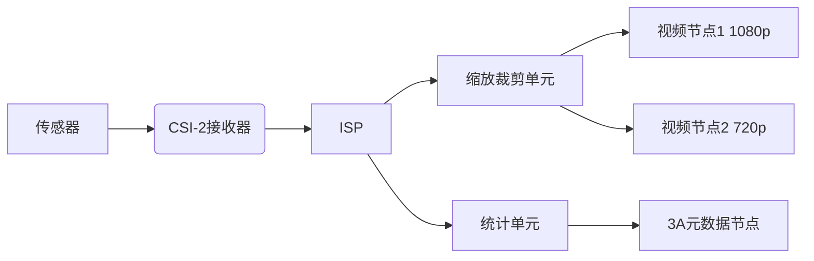

#嵌入式 #Linux驱动开发 #V4L2

## 1 目录

```toc
```

## 2 V4L2基础概述 ^dyadtz

尽管普通的用户态的开发不需要对V4L2有总体上的理解，但是本笔记的目的在于内核态开发。对于各种设备(例如 `video_device` 等)的用户态开发可直接详见对应子笔记的用户态开发章节。

因此，本章节必须拥有如下的知识基础：
- [[Linux驱动开发笔记#^ygjg2l|总线、设备和驱动程序]]

### 2.1 V4L2设备层级结构 ^5ppocs

通过上述用户态编程，可以明显地发现如下的基本需求：
1. <font color="#c00000">一个设备可能同时具有多个V4L2能力</font>( `capability` )
2. 一个设备可能不止有V4L2能力，还有其他功能
	- 不过即使强制一个设备只能有V4L2能力，其设备层级依旧不会发生改变，无非是成员 `v4l2_device.dev` 的命名会变成 `v4l2_device.parent` 

那么V4L2在设计时就有了如下的设备层级结构：
- Linux
	- Bus
		- 若干层级...
			- 物理设备对象(某个 `struct device` 的子类) ^3lh4de
				- V4L2根设备( `v4l2_device` )
					- `video_device` 暴露给用户空间的接口( `/dev/video0` )
						- 属性(成员)有：
							- `name`
							- `cdev`
					- `v4l2_subdev` 图像传感器
					- `v4l2_subdev` ISP设备
					- ...
				- 其他功能...
注：
1. V4L2的子设备名称与V4L2根设备不同，且各子设备之间的名称也需要尽可能不同
2. `v4l2_device` 根设备是一个平级容器，记录了一个物理设备下的所有子设备，但是其并不能表述子设备之间的拓扑关系，例如手机摄像头通常拓扑为：
	```mermaid
	graph LR
	 A[传感器] --> B(CSI-2接收器)
	 B --> C[ISP]
	 C --> D[缩放裁剪单元]
	 D --> E[视频节点1 1080p]
	 D --> F[视频节点2 720p]
	 C --> G[统计单元] --> H[3A元数据节点]
	```
3. 当内核开启了[[V4L2概述#^6dfn0t|媒体控制器]]特性后，上述结构就可以被媒体控制器所描述和管理。


### 2.2 V4L2设备模型概述

V4L2主要包含如下几种设备类型：
1. 顶层容器( `struct v4l2_device` )
2. [[V4L2概述#^4783s6|基础设备模型]]
3. 设备功能模型及设备组件
	- 通常包含专有设备功能模型(如m2m)和通用设备功能模型等(如vb2)


#### 2.2.1 基础设备模型 ^4783s6

V4L2基础设备按照设备总体功能划分为如下几类：
1. 视频设备类： `struct video_device` 
	- 其包含子设备类型：
		- 视频设备： `/dev/video*` 
		- 收音机设备： `/dev/radio*` 
		- 垂直消隐期设备： `/dev/vbi*`
		- 软件无线电： `/dev/swradio*`
2. 音频设备类： `struct snd_pcm` 
	- 其包含子设备模型：
		- PCM设备： `/dev/pcmC*D*` 
		- Control设备： `/dev/snd/controlC*` 
		- Timer设备： `/dev/snd/timer` 
		- Sequencer设备： `/dev/snd/seq` 
		- Raw MIDI设备： `/dev/snd/midiC*D*` 
		- HWDEP设备： `/dev/snd/hwC*D*` 
3. 显示设备： `struct drm_device` 
	- 其包含子设备模型：
		- 主设备： `/dev/dri/card*` 
		- Render设备： `/dev/dri/renderD*` 
4. 输入设备： `struct input_dev` 
	- 其包含设备模型：
		- 事件设备： `/dev/input/event*` 
		- 鼠标设备： `/dev/input/mouse*` (已过时，通常只用事件设备)
		- 操纵杆设备： `/dev/input/js*` 
		- 触摸屏设备： 通常通过事件设备处理
5. 媒体控制器： `struct media_device`
	- 媒体控制器只包含其自身： `/dev/media*` 


## 3 V4L2内核态开发

学习本章节必须先学习Linux的[[Linux驱动开发笔记#^ygjg2l|总线、设备和驱动程序]]模型。

### 3.1 V4L2设备模型

V4L2设备模型可以分为如下几个类别：
1. <font color="#c00000">核心设备模型</font>：
	1. 视频设备： `video_device` 
		- 设备节点： `/dev/video*` 
	2. 音频设备： `snd_pcm` 
		- 设备节点： `/dev/snd/pcmC*D*` 
	3. 显示设备： `drm_device` 
		- 设备节点： `/dev/dri/card*`
	4. 输入设备： `input_dev` 
		- 设备节点： `/dev/input/event*`
	5. 媒体控制器： `media_device`
		- 设备节点： `/dev/media*` 
	6. RF设备：特殊化的 `video_device` 
		- 设备节点： `/dev/swradio*` 
2. 功能类型抽象出的设备模型：
	1. 视频捕获(Video Capture)
	2. 视频输出(Video Output)
	3. 内存捕获
	4. 视频输出覆盖
	5. 内存-内存设备([[V4L2概述#^vvh0h5|v4l2_m2m_dev]])
3. 核心设备模型
4. 描述设备拓扑的[[V4L2概述#3 1 5 媒体控制器 6dfn0t|媒体控制器]]，其又有如下几个子模型：
	1. 媒体控制器([[V4L2概述#^elqnrp|media_device]])
	2. 实体([[V4L2概述#^xup1xx|media_entity]])
	3. 焊盘([[V4L2概述#^ouhrtb|media_pad]])
	4. 链路([[V4L2概述#^hcefzg|media_link]])


#### 3.1.1 v4l2_device

正如上方V4L2层级结构所示，`v4l2_device` 是<font color="#c00000">所有</font>V4L2设备的顶层容器，是V4L2驱动所管理的设备的根对象。

该对象会挂载到其所依赖的父设备挂载点的 `v4l2-device` 处。

##### 3.1.1.1 数据结构定义

其数据结构定义如下：

```C
/**
 * struct v4l2_device - main struct to for V4L2 device drivers
 *
 * @dev: pointer to struct device.
 * @mdev: pointer to struct media_device, may be NULL.
 * @subdevs: used to keep track of the registered subdevs
 * @lock: lock this struct; can be used by the driver as well
 *	if this struct is embedded into a larger struct.
 * @name: unique device name, by default the driver name + bus ID
 * @notify: notify operation called by some sub-devices.
 * @ctrl_handler: The control handler. May be %NULL.
 * @prio: Device's priority state
 * @ref: Keep track of the references to this struct.
 * @release: Release function that is called when the ref count
 *	goes to 0.
 *
 * Each instance of a V4L2 device should create the v4l2_device struct,
 * either stand-alone or embedded in a larger struct.
 *
 * It allows easy access to sub-devices (see v4l2-subdev.h) and provides
 * basic V4L2 device-level support.
 *
 * .. note::
 *
 *    #) @dev->driver_data points to this struct.
 *    #) @dev might be %NULL if there is no parent device
 */
struct v4l2_device {
	struct device *dev;
	struct media_device *mdev;
	struct list_head subdevs;
	spinlock_t lock;
	char name[36];
	void (*notify)(struct v4l2_subdev *sd,
			unsigned int notification, void *arg);
	struct v4l2_ctrl_handler *ctrl_handler;
	struct v4l2_prio_state prio;
	struct kref ref;
	void (*release)(struct v4l2_device *v4l2_dev);
};
```

在上述数据结构中：
- `struct device *dev` ：
	- 功能含义：指向[[V4L2概述#^3lh4de|物理父设备]]实例(可能是PCI设备、USB设备等)
	- 维护方：<font color="#c00000">驱动必须如实设置</font>
		- 若无父设备(例如虚拟设备)可以设置为NULL，其他情况如实设置
	- 关于 `dev->driver_data` ：
		- 当该物理父设备只有V4L2一个子功能时，驱动可以直接将 `dev->driver_data` 指向该 `v4l2_device` 实例，实现反向查找。
		- 当该物理父设备还支持其他子功能时，无非是再创建一个容器，存放多个子设备的实例，然后将 `dev->driver_data` 指向对应容器。
		- 总之V4L2框架不会强制或帮助驱动设置 `dev->driver_data` ，其需要驱动开发者手动完成。
- `struct media_device *mdev` ：
	- 功能含义：指向媒体控制器的成员。
	- 维护方：<font color="#c00000">驱动条件设置</font>(取决于内核是否开启[[V4L2概述#3 1 5 媒体控制器 6dfn0t|媒体控制器]])
- `struct list_head subdevs` ：
	- 功能含义：维护注册到该 `v4l2_device` 的子设备(`v4l2_subdev`)链表，指向其所有所支持的 `v4l2_subdev` 。
	- 维护方：由V4L2框架设置，禁止驱动直接操作该链表。
- `spinlock_t lock` ：
	- 功能含义：自旋锁
- `name` ：
	- 功能含义：<font color="#c00000">总线内唯一</font>的设备名称，默认格式为 `${驱动名称}-${总线ID}` 。
	  可以不设置，设置了驱动也可以更改，但是和驱动联动之后该成员也可以用于传递标识信息。
	- 默认值为 `${驱动名}-${总线ID}`
	- 注意这是V4L2的设备名，并非Linux设备模型的设备名，不参与驱动匹配。
- `notify` ：
	- V4L2子设备向主设备发送通知的接收函数。
- `ctrl_handler` ：管理视频设备控制项(例如曝光时间、ISO等)的数据结构
- `prio` ：设备优先级状态数组： ^3rx2nr
	- 其是一个长度为4的 `atomic` 数组
	- 优先级一共分为四类：
		1. `V4L2_PRIORITY_UNSET = 0` ：未设置优先级类别
		2. `V4L2_PRIORITY_BACKGROUND = 1` ：后台任务优先级类别
		3. `V4L2_PRIORITY_INTERACTIVE = 2` ：交互式任务优先级类别
		4. `V4L2_PRIORITY_RECORD = 3` ：高优先级录制类别
	- 上述四个优先级类别为枚举类型，用作访问 `prio` 数组的index。而数组元素表示以对应优先级访问设备的数量。
- `ref` ：引用计数器。
- `release` ：释放函数。

##### 3.1.1.2 注册设备

```C
/**
 * v4l2_device_register - Initialize v4l2_dev and make @dev->driver_data
 *	point to @v4l2_dev.
 *
 * @dev: pointer to struct &device
 * @v4l2_dev: pointer to struct &v4l2_device
 *
 * .. note::
 *	@dev may be %NULL in rare cases (ISA devices).
 *	In such case the caller must fill in the @v4l2_dev->name field
 *	before calling this function.
 */
int __must_check v4l2_device_register(struct device *dev,
				      struct v4l2_device *v4l2_dev);
```

函数功能：初始化 `v4l2_dev` 并让 `dev->driver_data` 指向 `v4l2_dev` 。具体包含：
1. 依次初始化如下的关键数据结构：
	1. `v4l2_dev->subdevs` 链表
	2. `v4l2_dev->lock` 自旋锁
	3. `v4l2_dev->prio` 优先级状态数组
	4. `v4l2_dev->ref` 引用计数器
2. 增加 `dev` 的引用计数器
3. 把 `dev->driver_data` 指向 `v4l2_dev` 
4. 为 `v4l2_dev` 设置 `name` ，默认为 `${驱动名} ${设备名}`
5. 当 `dev->driver_data` 为 `NULL` 时，将 `dev->driver_data` 指向 `v4l2_dev` 

#### 3.1.2 video_device


##### 3.1.2.1 数据结构定义


##### 3.1.2.2 相关API

###### 3.1.2.2.1 注册video_device设备


###### 3.1.2.2.2 向video_device中添加/获取驱动私有数据


###### 3.1.2.2.3 获取file结构体中的video_device指针


##### 3.1.2.3 设备类型

##### 3.1.2.4 基础机制模型

###### 3.1.2.4.1 设备注册


注意点：
- `video_device` 依旧为一个字符设备，且有如下性质：
	1. 字符设备的 `ops` 成员会被直接赋值为V4L2内部的竞态变量 `struct file_operations v4l2_fops` 

###### 3.1.2.4.2 上下文实例


###### 3.1.2.4.3 VFS open请求


#### 3.1.3 内存到内存设备(v4l2_m2m_dev) ^vvh0h5

V4L2的内存到内存设备模型<span style="background:#fff88f"><font color="#c00000">适用于一进一出或多进多出</font></span>的<font color="#c00000">视频转换设备</font>，例如：
- 视频编解码器
- 视频格式转换
- 图像处理设备
等，此类设备通常涉及视频编解码、图像缩放、色彩空间转换等。<span style="background:#fff88f"><font color="#c00000">不适用于</font></span>视频输出设备、视频生成设备等。

因此，V4L2的基本模型包含了一进一出两个数据队列，并为该模型提供了若干通用机制。

##### 3.1.3.1 M2M设备模型及机制

V4L2 M2M设备的基本模型如下图([[V4L2_M2M设备.drawio.svg]])所示：
	![[V4L2_M2M设备.drawio.svg]]

M2M设备模型主要提供了如下的机制及支持：
1. 完成了设备的异步处理机制
2. 提供缓冲区管理机制
3. 提供作业调度和同步服务

上述许多机制具有不错的泛用性。但是对于物理摄像头等，应当使用对应的 `videobuf2` 等专用机制。

###### 3.1.3.1.1 队列初始化机制


在程序实现方面，M2M基本特性有：
- M2M模型中，驱动需要提供如下接口：
	- `deice_run` \[<font color="#c00000">必须</font>\]：当队列中有需要处理的数据时，V4L2框架会调用该回调。
	- `job_ready` ：
	具体可见[[V4L2概述#3 1 4 3 m2m设备操作回调 v4l2_m2m_ops r39fw1|M2M设备操作回调]]。
- 每一个V4L2 M2M设备可以被多个用户空间实例打开(多个进程或多个线程)，具体使用[[V4L2概述#^eienff|多实例成员]]进行实现。

##### 3.1.3.2 数据结构定义

```C
/**
 * struct v4l2_m2m_dev - per-device context
 * @source:		&struct media_entity pointer with the source entity
 *				Used only when the M2M device is registered via
 *				v4l2_m2m_register_media_controller().
 * @source_pad:		&struct media_pad with the source pad.
 *				Used only when the M2M device is registered via
 *				v4l2_m2m_register_media_controller().
 * @sink:		&struct media_entity pointer with the sink entity
 *				Used only when the M2M device is registered via
 *				v4l2_m2m_register_media_controller().
 * @sink_pad:	&struct media_pad with the sink pad.
 *				Used only when the M2M device is registered via
 *				v4l2_m2m_register_media_controller().
 * @proc:		&struct media_entity pointer with the M2M device itself.
 * @proc_pads:	&struct media_pad with the @proc pads.
 *				Used only when the M2M device is registered via
 *				v4l2_m2m_unregister_media_controller().
 * @intf_devnode:	&struct media_intf devnode pointer with the interface
 *					with controls the M2M device.
 * @curr_ctx:		currently running instance
 * @job_queue:		instances queued to run
 * @job_spinlock:	protects job_queue
 * @job_work:		worker to run queued jobs.
 * @job_queue_flags:	flags of the queue status, %QUEUE_PAUSED.
 * @m2m_ops:		driver callbacks
 */
struct v4l2_m2m_dev {
	struct v4l2_m2m_ctx	*curr_ctx;
#ifdef CONFIG_MEDIA_CONTROLLER
	struct media_entity	*source;
	struct media_pad	source_pad;
	struct media_entity	sink;
	struct media_pad	sink_pad;
	struct media_entity	proc;
	struct media_pad	proc_pads[2];
	struct media_intf_devnode *intf_devnode;
#endif

	struct list_head	job_queue;
	spinlock_t		job_spinlock;
	struct work_struct	job_work;
	unsigned long		job_queue_flags;

	const struct v4l2_m2m_ops *m2m_ops;
};
```

其成员：
- 与当前运行实例相关的成员： ^eienff
	- `struct v4l2_m2m_ctx *curr_ctx` 
		- 功能含义：当前正在运行的实例信息，其包含文件句柄、输出队列、捕获队列、驱动私有指针等数据。
		- 维护方：由V4L2框架管理
	- `struct list_head job_queue` 
		- 功能含义：正在等待处理的实例信息链表，先进先出。
			- 通常驱动不需要手动操作该数据结构。当需要操作时，V4L2也有专用的辅助函数而不需要手动操作(例如 `v4l2_m2m_cleanup_queue` )。
		- 维护方：由V4L2框架管理
	- `spinlock_t job_spinlock` 
		- 功能含义：任务队列的自旋锁。
			- 通常驱动不需要手动操作该数据结构，操作时也通常直接使用辅助函数。
		- 维护方：由V4L2框架管理
	- `struct work_struct job_work` 
		- 功能含义：工作队列的工作项。当有任务需要处理时，V4L2框架会调度这个工作项，它最终会调用驱动提供的操作来响应任务。
		- 维护方：由V4L2框架管理
	- `unsigned long job_queue_flags` 
		- 功能含义：标记任务队列的状态，目前只有 `QUEUE_PAUSED` 这一种状态，表示队列被暂停，不再处理新任务。
		- 维护方：由V4L2框架管理，驱动可以通过 `v4l2_m2m_job_finish` 等函数间接影响状态。
- 操作回调成员：
	- `const struct v4l2_m2m_ops *m2m_ops`
		- 功能含义：指向驱动实现的操作回调函数集的指针。
			- 具体可见[[V4L2概述#^r39fw1|m2m设备操作回调]]。
			- 至少提供 `device_run` 回调。
		- 维护方：<font color="#c00000">必须由驱动设置</font>。
- 媒体控制器相关成员：
	- `struct media_entity *source` 
		- 功能含义：输入数据源媒体的实例
		- 维护方：使用媒体控制器功能时由驱动设置
	- `struct media_pad source_pad`
		- 功能含义：输入数据源的媒体接口
		- 维护方：使用媒体控制器功能时由驱动设置
	- `struct media_entity sink`
		- 功能含义：输出目标的媒体实体
		- 维护方：与sink配对使用
	- `struct media_pad sink_pad`
		- 功能含义：输出目标的媒体接口
		- 维护方：使用媒体控制器功能时由驱动设置
	- `struct media_entity proc`
		- 功能含义：M2M设备自身的处理实体
		- 维护方：使用媒体控制器功能时由驱动设置
	- `struct media_pad proc_pads[2]`
		- 功能含义：处理实体的接口
		- 维护方：与proc配对使用
	- `struct media_intf_devnode *intf_devnode`
		- 功能含义：控制M2M设备的接口节点
		- 维护方：使用媒体控制器功能时由驱动设置

##### 3.1.3.3 M2M设备操作回调(v4l2_m2m_ops) ^r39fw1

该数据结构定义为：

```C
/**
 * struct v4l2_m2m_ops - mem-to-mem device driver callbacks
 * @device_run:	required. Begin the actual job (transaction) inside this
 *		callback.
 *		The job does NOT have to end before this callback returns
 *		(and it will be the usual case). When the job finishes,
 *		v4l2_m2m_job_finish() or v4l2_m2m_buf_done_and_job_finish()
 *		has to be called.
 * @job_ready:	optional. Should return 0 if the driver does not have a job
 *		fully prepared to run yet (i.e. it will not be able to finish a
 *		transaction without sleeping). If not provided, it will be
 *		assumed that one source and one destination buffer are all
 *		that is required for the driver to perform one full transaction.
 *		This method may not sleep.
 * @job_abort:	optional. Informs the driver that it has to abort the currently
 *		running transaction as soon as possible (i.e. as soon as it can
 *		stop the device safely; e.g. in the next interrupt handler),
 *		even if the transaction would not have been finished by then.
 *		After the driver performs the necessary steps, it has to call
 *		v4l2_m2m_job_finish() or v4l2_m2m_buf_done_and_job_finish() as
 *		if the transaction ended normally.
 *		This function does not have to (and will usually not) wait
 *		until the device enters a state when it can be stopped.
 */
struct v4l2_m2m_ops {
	void (*device_run)(void *priv);
	int (*job_ready)(void *priv);
	void (*job_abort)(void *priv);
};
```

其成员：
- `void (*device_run)(void *priv)`
	- 功能含义：驱动处理实际具体M2M任务的<font color="#c00000">入口</font>(也就是说通常不把实际的任务放到这里)。
		- 该函数需要从 `void *priv` 中找到 `v4l2_m2m_dev->curr_ctx` ，并从中找到当前实例正在处理的队列，并执行对应方法。
	- 被执行时机(条件)，需要同时满足：
		1. 已调用 `VIDIOC_STREAMON` 启动 `OUTPUT` 和 `CAPTURE` 队列
		2. 两个队列中都有可用缓冲区(除非 `job_ready` 自定义条件)
		3. 设备当前空闲(无运行中任务)
		4. (如果实现) `job_ready` 返回 `true`
	- 维护方：<span style="background:#fff88f"><font color="#c00000">必须实现</font></span>
	- <span style="background:#fff88f"><font color="#c00000">关键规则</font></span>：
		- <span style="background:#fff88f"><font color="#c00000">该函数禁止阻塞、休眠</font></span>
		- <font color="#c00000">任务完成后通过中断通知</font>(异步，这也是为什么说该函数是入口的原因)，需要调用 `v4l2_m2m_job_finish` 或 ` v4l2_m2m_buf_done_and_job_finish ` 来通知V4L2框架对应任务已经执行完毕。
		- 若任务失败，则调用 `v4l2_m2m_buf_done_and_job_finish(..., VB2_BUF_STATE_ERROR)` 来通知V4L2任务失败。
- `int (*job_ready)(void *priv)`
	- 功能含义：询驱动(设备)当前能否<font color="#c00000">立即</font>开启新任务
	- 维护方：可选
	- <span style="background:#fff88f"><font color="#c00000">关键规则</font></span>：
		- <span style="background:#fff88f"><font color="#c00000">该函数禁止阻塞、休眠</font></span>
		- 该函数应当快速返回
- `void (*job_abort)(void *priv)`
	- 功能含义：任务紧急终止
	- 被执行时机(下列之一)：
		- 用户空间调用 `VIDIOC_STREAMOFF` 停止流
		- 设备文件描述符关闭( `close(fd)` )
		- 模块卸载/设备移除
		- 严重错误发生(如DMA错误)
	- 维护方：可选
	- 关键规则：
		- 该函数禁止等待，必须立即返回，无须等待设备停止(类似于设置 `exit_flag` )：
			- 通常需要通知硬件停止，并将缓冲区标记为错误状态。
		- <font color="#c00000">运行完成后必须调用</font>`v4l2_m2m_job_finish()` <font color="#c00000">或变体</font>
		- 该操作需要注意和保证硬件安全
		- 在该函数调用时，`device_run` 可能还在运行，需要注意并发问题。

##### 3.1.3.4 相关API


#### 3.1.4 媒体控制器 ^6dfn0t

正如章节[[V4L2概述#^5ppocs|V4L2设备层级结构]]所述，一个V4L2设备的物理拓扑关系会很复杂，使用简单的扁平容器( `v4l2_device` )难以表达类似于下方的复杂拓扑结构：


此外，媒体控制器还支持动态修改数据链路的特性(命令行中也可以使用 `media-ctl` 工具)，例如：
1. HDR模式切换：
	```mermaid
	graph LR
     S[Sensor] -->|原始数据| HDR[HDR合成器]
     HDR -->|合成数据| ISP[标准ISP]
     S -->|旁路| ISP
     
     ISP --> VIDEO[输出]
	```
2. ISP切换：
	```mermaid
	graph LR
     S[Sensor] --> N[正常ISP]
     S --> L[低光ISP]
     
     N --> MUX[输出选择器]
     L --> MUX
     MUX --> VIDEO[视频输出]
	```
不过媒体管理器不支持跨 `v4l2_device` 的拓扑描述或链路更改。

##### 3.1.4.1 基本模型定义

为了描述上述拓扑关系，支持动态链路等功能，其设计了如下三种基础类型：
- 媒体设备：
	- 代表整个物理设备的实体、端口、链路等，
- 实体：
	- 每个实体都代表该物理设备的一个软硬件模块或功能
	- 其拥有多个焊盘(端口)和属性
- 焊盘：
	- 为每个实体的输入、输出端口，其每个焊盘有如下属性(特性)
		1. 引脚号
		2. 每个引脚所连接的链路数
		3. 该焊盘传递的信号类型(模拟、DV、AUDIO等)
		4. 引脚类型：
			- 输入焊盘(与输出互斥)
			- 输出焊盘(与输入互斥)
			- 是否必须连接(可与上方二者之一结合使用)
- 链路：
	- 提供数据流动以及数据结构的拓扑查询
		- 可选的动态链路变更
		- 链路正向数据传递和反向控制指令传递，以及双向的拓扑连接

学习时建议按照焊盘->链接->实体->媒体设备的顺序学习。

###### 3.1.4.1.1 焊盘(media_pad) ^ouhrtb

焊盘表示该模块的数入输出"引脚"，如上文所述，该焊盘有引脚号、引脚所连链路数、引脚传递的信号类型、数据方向等属性。

其数据结构定义为：

```C
/**
 * struct media_pad - A media pad graph object.
 *
 * @graph_obj:	Embedded structure containing the media object common data
 * @entity:	Entity this pad belongs to
 * @index:	Pad index in the entity pads array, numbered from 0 to n
 * @num_links:	Number of links connected to this pad
 * @sig_type:	Type of the signal inside a media pad
 * @flags:	Pad flags, as defined in
 *		:ref:`include/uapi/linux/media.h <media_header>`
 *		(seek for ``MEDIA_PAD_FL_*``)
 * @pipe:	Pipeline this pad belongs to. Use media_entity_pipeline() to
 *		access this field.
 */
struct media_pad {
	struct media_gobj graph_obj;	/* must be first field in struct */
	struct media_entity *entity;
	u16 index;
	u16 num_links;
	enum media_pad_signal_type sig_type;
	unsigned long flags;

	/*
	 * The fields below are private, and should only be accessed via
	 * appropriate functions.
	 */
	struct media_pipeline *pipe;
};
```

其成员：
- `struct media_gobj graph_obj`
	- 功能含义：`media_entity` 、` media_pad` 和 `media_link` 的共同基类，用于数据结构管理
		- 放在第一个元素作为元素头，和该对象享有同样的内存地址，方便索引
		- `graph_obj.type = MEDIA_GRAPH_PAD`
		- `graph_obj.id` 、`graph_obj.mdev` 由框架设置
	- 维护方：V4L2框架自动管理
- `struct media_entity *entity` 
	- 功能含义：焊盘所属的媒体实体
	- 维护方：<font color="#c00000">驱动必须配置</font>
	- 规则：
		- 必须在注册焊盘前配置
		- 不可为NULL
		- 实体的生命周期必须长于焊盘
- `u16 index`
	- 功能含义：焊盘引脚号
	- 维护方：<font color="#c00000">驱动必须配置</font>
	- 规则：
		- 从0开始顺序编号，且在实体范围内唯一
- `u16 num_links`
	- 功能含义：此焊盘连接到的链路数量
	- 维护方：V4L2框架自动管理
	- 规则：
		- 对驱动来说是<font color="#c00000">只读字段</font>，<font color="#c00000">禁止驱动直接修改</font>
- `enum media_pad_signal_type sig_type`
	- 功能含义：该焊盘传递的信号类型
	- 维护方：驱动可选配置，缺省时为 `MEDIA_PAD_SIGNAL_DEFAULT`
- `unsigned long flags`
	- 功能含义：定义焊盘的属性和行为
	- 维护方：<font color="#c00000">驱动必须配置</font>
	- 规则：
		- 输入( `MEDIA_PAD_FL_SINK` )和输出( ` MEDIA_PAD_FL_SOURCE ` )只能选择一个
		- 上述两个可以追加必须连接属性 `MEDIA_PAD_FL_MUST_CONNECT`
- `struct media_pipeline *pipe`
	- 功能含义：指向焊盘所属的数据流管道
	- 维护方：V4L2框架自动管理
	- 规则：
		- 禁止驱动直接访问，应当使用其访问器( `media_entity_pipeline` )访问

###### 3.1.4.1.2 链路(media_link) ^hcefzg

如上述章节所述，链路主要承担如下特性的实现：
- 可选的动态链路变更
- 链路正向数据传递和反向控制指令传递，以及双向的拓扑连接

其数据结构定义为：

```C
/**
 * struct media_link - A link object part of a media graph.
 *
 * @graph_obj:	Embedded structure containing the media object common data
 * @list:	Linked list associated with an entity or an interface that
 *		owns the link.
 * @gobj0:	Part of a union. Used to get the pointer for the first
 *		graph_object of the link.
 * @source:	Part of a union. Used only if the first object (gobj0) is
 *		a pad. In that case, it represents the source pad.
 * @intf:	Part of a union. Used only if the first object (gobj0) is
 *		an interface.
 * @gobj1:	Part of a union. Used to get the pointer for the second
 *		graph_object of the link.
 * @sink:	Part of a union. Used only if the second object (gobj1) is
 *		a pad. In that case, it represents the sink pad.
 * @entity:	Part of a union. Used only if the second object (gobj1) is
 *		an entity.
 * @reverse:	Pointer to the link for the reverse direction of a pad to pad
 *		link.
 * @flags:	Link flags, as defined in uapi/media.h (MEDIA_LNK_FL_*)
 * @is_backlink: Indicate if the link is a backlink.
 */
struct media_link {
	struct media_gobj graph_obj;
	struct list_head list;
	union {
		struct media_gobj *gobj0;
		struct media_pad *source;
		struct media_interface *intf;
	};
	union {
		struct media_gobj *gobj1;
		struct media_pad *sink;
		struct media_entity *entity;
	};
	struct media_link *reverse;
	unsigned long flags;
	bool is_backlink;
};
```

其成员：
- `struct media_gobj graph_obj`
	- 功能含义：`media_entity` 、` media_pad` 和 `media_link` 的共同基类，用于数据结构管理
		- `graph_obj.type = MEDIA_GRAPH_LINK`
	- 维护方：V4L2框架自动管理
- `struct list_head list` 
	- 功能含义：
- `gobj0` 、`source` 、`intf` 
	- 功能含义：连接起点(数据输出端)的基类对象、焊盘或端口的指针
	- 维护方：驱动或用户态触发后由V4L2进行配置
- `gobj1` 、`sink` 、`entity` 
	- 功能含义：连接终点(数据接收端)的基类对象、焊盘或端口的指针
	- 维护方：驱动或用户态触发后由V4L2进行配置
- `struct media_link *reverse`
	- 功能含义：指向反向链接对象，由于每个焊盘只有单向数据流动，因此反向数据连接用于查询/控制功能，以及方便进行拓扑和遍历。
	- 维护方：驱动或用户态触发后由V4L2进行配置
- `unsigned long flags`
	- 功能含义：定义连接的属性和状态，例如：
		- `MEDIA_LNK_FL_ENABLED` 表示连接已启用
		- `MEDIA_LNK_FL_IMMUTABLE` 表示连接不可修改
		- `MEDIA_LNK_FL_DYNAMIC` 表示可动态变更
	- 维护方：<font color="#c00000">驱动设置初始标志</font>，V4L2运行时动态设置 `ENABLE` 位
- `bool is_backlink`
	- 功能含义：当该连接为反向连接时为 `true`
	- 维护方：V4L2框架自动管理

###### 3.1.4.1.3 实体(media_entity) ^xup1xx

实体可以代表该物理设备的任何V4L2的软硬件模块，一个设备、节点或模块只对应一个实体。

其数据结构定义为：

```C
/**
 * struct media_entity - A media entity graph object.
 *
 * @graph_obj:	Embedded structure containing the media object common data.
 * @name:	Entity name.
 * @obj_type:	Type of the object that implements the media_entity.
 * @function:	Entity main function, as defined in
 *		:ref:`include/uapi/linux/media.h <media_header>`
 *		(seek for ``MEDIA_ENT_F_*``)
 * @flags:	Entity flags, as defined in
 *		:ref:`include/uapi/linux/media.h <media_header>`
 *		(seek for ``MEDIA_ENT_FL_*``)
 * @num_pads:	Number of sink and source pads.
 * @num_links:	Total number of links, forward and back, enabled and disabled.
 * @num_backlinks: Number of backlinks
 * @internal_idx: An unique internal entity specific number. The numbers are
 *		re-used if entities are unregistered or registered again.
 * @pads:	Pads array with the size defined by @num_pads.
 * @links:	List of data links.
 * @ops:	Entity operations.
 * @use_count:	Use count for the entity.
 * @info:	Union with devnode information.  Kept just for backward
 *		compatibility.
 * @info.dev:	Contains device major and minor info.
 * @info.dev.major: device node major, if the device is a devnode.
 * @info.dev.minor: device node minor, if the device is a devnode.
 *
 * .. note::
 *
 *    The @use_count reference count must never be negative, but is a signed
 *    integer on purpose: a simple ``WARN_ON(<0)`` check can be used to detect
 *    reference count bugs that would make it negative.
 */
struct media_entity {
	struct media_gobj graph_obj;	/* must be first field in struct */
	const char *name;
	enum media_entity_type obj_type;
	u32 function;
	unsigned long flags;

	u16 num_pads;
	u16 num_links;
	u16 num_backlinks;
	int internal_idx;

	struct media_pad *pads;
	struct list_head links;

	const struct media_entity_operations *ops;

	int use_count;

	union {
		struct {
			u32 major;
			u32 minor;
		} dev;
	} info;
};
```

其成员：
- `struct media_gobj graph_obj` 
	- 功能含义：`media_entity` 、` media_pad` 和 `media_link` 的共同基类，用于数据结构管理
	- 维护方：V4L2框架自动管理
- `const char *name` 
	- 功能含义：为用户提供的可读名称，例如 `ov5640-sensor`
	- 维护方：<font color="#c00000">驱动必须配置</font>
- `enum media_entity_type obj_type`
	- 功能含义：实体类型，V4L2框架仅定义了下述三种：
		- `MEDIA_ENTITY_TYPE_BASE` ：不嵌入在其他子系统结构中的独立媒体实体，例如：
			- 纯软件实体
			- 非V4L2硬件实体
		- `MEDIA_ENTITY_TYPE_VIDEO_DEVICE` ：嵌入在 `video_device` 中的实体，即`/dev/videoX`，例如：
			- V4L2视频节点
			- 摄像头采集设备
			- 视频输出设备
		- `MEDIA_ENTITY_TYPE_V4L2_SUBDEV` ：嵌入在 `v4l2_subdev` 中的实体，即 `/dev/v4l-subdevX` ，例如：
			- 摄像头传感器
			- ISP
	- 维护方：<font color="#c00000">驱动必须指定</font>
- `u32 function` 
	- 功能含义：实体功能标识，在 `uapi/linux/media.h` 中定义的有
		- DVB实体功能类
		- IO实体功能类
		- Sensor实体功能类等
	- 维护方：<font color="#c00000">驱动必须配置</font>
- `unsigned long flags` 
	- 功能含义：实体行为标志，其有如下两种：
		- `MEDIA_ENT_FL_DEFAULT` ：当前实体为首选设备，例如多摄像头中的主摄、多信号源的默认信号源。
		- `MEDIA_ENT_FL_CONNECTOR` ：标记实体为物理连接器，例如：
			- HDMI接口、3.5mm接口...
	- 维护方：驱动按需可选配置，默认为0
- `u16 num_pads` 
	- 功能含义：焊盘总数，需要与 `pads` 成员的内存大小相等
	- 维护方：<font color="#c00000">驱动必须配置</font>
- `u16 num_links`
	- 功能含义：总链接数(<font color="#c00000">包含正反向链接</font>)
	- 维护方：V4L2框架负责维护
- `u16 num_backlinks`
	- 功能含义：指向该实体的反向链接数(实体作为接收端)
	- 维护方：V4L2框架负责维护
- `int internal_idx`
	- 功能含义：实体在媒体设备中的唯一标识符
	- 维护方：V4L2自动配置，驱动禁止更改
- `struct media_pad *pads`
	- 功能含义：焊盘所用的数组
	- 维护方：<font color="#c00000">驱动必须分配和维护对应内存区域</font>
- `struct list_head links` 
	- 功能含义：存储与该实体相关的所有链接的链表
	- 维护方：<font color="#c00000">驱动需要初始化表头</font>(因为V4L2框架无法识别哪些实体是动态创建，哪些是静态创建；且允许驱动在注册实体之前预先创建链接)
- `const struct media_entity_operations *ops` 
	- 功能含义：实体的操作回调(并非文件操作)，例如链接状态变更、链接验证、设备树或ACPI解析回调等：
		- `get_fwnode_pad` 
			- 功能含义：将 `fwnode` 端点映射到实体 `pad` 编号的回调函数
			- 执行时机：在通过设备树或ACPI解析阶段
			- 可选性：可选实现
		- `link_setup` 
			- 功能含义：响应链接状态变更的回调函数
			- 执行时机：在链接状态改变时
			- 可选性：推荐实现
		- `link_validate` 
			- 功能含义：验证链接是否合法
			- 执行时机：在启动流( `STREAMON` )时
			- 可选性：推荐实现
		- `has_pad_interdep` 
			- 功能含义：声明两个pad是否相互依赖
			- 可选性：可选，且大多设备不需要
	- 维护方：驱动可选设置
- `union info` 
	- 功能含义：设备节点信息(已不再使用，保留是为了兼容旧驱动)
	- 维护方：不再使用

###### 3.1.4.1.4 媒体设备(media_device) ^elqnrp

在Linux中，媒体设备被挂载于 `/dev/mediaX` 下，其抽象的是整个多媒体系统。一个 `v4l2_device` 只能有一个媒体设备。而该模型是更高级拓扑结构的抽象表示，其支持动态链路等功能。

数据结构定义为：

```C
/**
 * struct media_device - Media device
 * @dev:	Parent device
 * @devnode:	Media device node
 * @driver_name: Optional device driver name. If not set, calls to
 *		%MEDIA_IOC_DEVICE_INFO will return ``dev->driver->name``.
 *		This is needed for USB drivers for example, as otherwise
 *		they'll all appear as if the driver name was "usb".
 * @model:	Device model name
 * @serial:	Device serial number (optional)
 * @bus_info:	Unique and stable device location identifier
 * @hw_revision: Hardware device revision
 * @topology_version: Monotonic counter for storing the version of the graph
 *		topology. Should be incremented each time the topology changes.
 * @id:		Unique ID used on the last registered graph object
 * @entity_internal_idx: Unique internal entity ID used by the graph traversal
 *		algorithms
 * @entity_internal_idx_max: Allocated internal entity indices
 * @entities:	List of registered entities
 * @interfaces:	List of registered interfaces
 * @pads:	List of registered pads
 * @links:	List of registered links
 * @entity_notify: List of registered entity_notify callbacks
 * @graph_mutex: Protects access to struct media_device data
 * @pm_count_walk: Graph walk for power state walk. Access serialised using
 *		   graph_mutex.
 *
 * @source_priv: Driver Private data for enable/disable source handlers
 * @enable_source: Enable Source Handler function pointer
 * @disable_source: Disable Source Handler function pointer
 *
 * @ops:	Operation handler callbacks
 * @req_queue_mutex: Serialise the MEDIA_REQUEST_IOC_QUEUE ioctl w.r.t.
 *		     other operations that stop or start streaming.
 * @request_id: Used to generate unique request IDs
 *
 * This structure represents an abstract high-level media device. It allows easy
 * access to entities and provides basic media device-level support. The
 * structure can be allocated directly or embedded in a larger structure.
 *
 * The parent @dev is a physical device. It must be set before registering the
 * media device.
 *
 * @model is a descriptive model name exported through sysfs. It doesn't have to
 * be unique.
 *
 * @enable_source is a handler to find source entity for the
 * sink entity  and activate the link between them if source
 * entity is free. Drivers should call this handler before
 * accessing the source.
 *
 * @disable_source is a handler to find source entity for the
 * sink entity  and deactivate the link between them. Drivers
 * should call this handler to release the source.
 *
 * Use-case: find tuner entity connected to the decoder
 * entity and check if it is available, and activate the
 * link between them from @enable_source and deactivate
 * from @disable_source.
 *
 * .. note::
 *
 *    Bridge driver is expected to implement and set the
 *    handler when &media_device is registered or when
 *    bridge driver finds the media_device during probe.
 *    Bridge driver sets source_priv with information
 *    necessary to run @enable_source and @disable_source handlers.
 *    Callers should hold graph_mutex to access and call @enable_source
 *    and @disable_source handlers.
 */
struct media_device {
	/* dev->driver_data points to this struct. */
	struct device *dev;
	struct media_devnode *devnode;

	char model[32];
	char driver_name[32];
	char serial[40];
	char bus_info[32];
	u32 hw_revision;

	u64 topology_version;

	u32 id;
	struct ida entity_internal_idx;
	int entity_internal_idx_max;

	struct list_head entities;
	struct list_head interfaces;
	struct list_head pads;
	struct list_head links;

	/* notify callback list invoked when a new entity is registered */
	struct list_head entity_notify;

	/* Serializes graph operations. */
	struct mutex graph_mutex;
	struct media_graph pm_count_walk;

	void *source_priv;
	int (*enable_source)(struct media_entity *entity,
			     struct media_pipeline *pipe);
	void (*disable_source)(struct media_entity *entity);

	const struct media_device_ops *ops;

	struct mutex req_queue_mutex;
	atomic_t request_id;
};
```

其成员：
- `struct device *dev`
	- 功能含义：指向物理设备的指针
	- 维护方：<font color="#c00000">驱动必须设置</font>(在注册前)
- `struct media_devnode *devnode`
	- 功能含义：代表 `/dev/mediaX` 节点
	- 维护方：V4L2负责维护
- `char model[32]`
	- 功能含义：设备型号名，例如 `vim2m` ，会在用户空间中暴露
	- 维护方：<font color="#c00000">驱动推荐设置</font>
- `char driver_name[32]`
	- 功能含义：用于覆盖驱动名，如不设置则使用 `dev->driver->name`
	- 维护方：驱动可选设置
- `char serial[40]`
	- 功能含义：序列号，除了向用户表述设备ID外，还可以帮助用户区分同型号设备
	- 维护方：驱动可选设置
- `char bus_info[32]`
	- 功能含义：设备位置标识，例如 `platform:vim2m` 或 `usb-0000:00:14.0-4`
	- 维护方：<font color="#c00000">驱动必须设置</font>
- `u32 hw_revision`
	- 功能含义：硬件版本号，可用于兼容性检查
	- 维护方：驱动可选设置
- `u64 topology_version`
	- 功能含义：拓扑变更计数器
	- 维护方：V4L2框架自动维护
- `u32 id`
	- 功能含义：最后注册的图形对象(实体、焊盘、链接)的ID
	- 维护方：V4L2框架自动维护
- `struct ida entity_internal_idx`
	- 功能含义：实例内部的ID分配器
	- 维护方：V4L2框架自动维护
- `int entity_internal_idx_max`
	- 功能含义：媒体设备内部的最大实体索引
	- 维护方：V4L2框架自动维护
- `struct list_head entities`
	- 功能含义：已注册实体的链表
	- 维护方：V4L2框架自动维护
- `struct list_head interfaces`
	- 功能含义：媒体接口链表
	- 维护方：V4L2框架自动维护
- `struct list_head pads`
	- 功能含义：焊盘链表
	- 维护方：V4L2框架自动维护
- `struct list_head links`
	- 功能含义：链接链表
	- 维护方：V4L2框架自动维护
- `struct list_head entity_notify`
	- 功能含义：实体注册通知回调
	- 维护方：驱动可选配置
- `struct mutex graph_mutex`
	- 功能含义：拓扑操作互斥锁
	- 维护方：由V4L2初始化，<font color="#c00000">驱动必须配合使用</font>
- `struct media_graph pm_count_walk`
	- 功能含义：电源状态遍历器
	- 维护方：V4L2框架自动维护
- `void *source_priv`
	- 功能含义：源控制私有数据
	- 维护方：驱动按需设置
- `int (*enable_source)(struct media_entity *entity, struct media_pipeline *pipe) `
	- 功能含义：激活源实体的回调函数
	- 维护方：<font color="#c00000">需要使用</font>[[V4L2概述#^8230im|源控制]]<font color="#c00000">的驱动必须实现</font>
- `void (*disable_source)(struct media_entity *entity)`
	- 功能含义：停用源实体的回调函数
	- 维护方：<font color="#c00000">需要使用源控制的驱动必须实现</font>
- `const struct media_device_ops *ops`
	- 功能含义：媒体请求的操作回调。具体可见[[V4L2概述#^xvploq|媒体请求]]。
	- 维护方：驱动可选实现
- `struct mutex req_queue_mutex`
	- 功能含义：请求队列的互斥锁
	- 维护方：V4L2自动管理
- `atomic_t request_id`
	- 功能含义：请求ID生成器
	- 维护方：V4L2自动管理

##### 3.1.4.2 相关API

###### 3.1.4.2.1 初始化media_device

`media_device` 在构造时需要分为两步：
1. 使用 `media_device_init` 初始化 `media_device` 结构
2. 使用 `media_device_register` 注册 `media_device` 
该设计主要是为了避免竞态。

```C
#include <media/media-device.h>

/**
 * media_device_init() - Initializes a media device element
 *
 * @mdev:	pointer to struct &media_device
 *
 * This function initializes the media device prior to its registration.
 * The media device initialization and registration is split in two functions
 * to avoid race conditions and make the media device available to user-space
 * before the media graph has been completed.
 *
 * So drivers need to first initialize the media device, register any entity
 * within the media device, create pad to pad links and then finally register
 * the media device by calling media_device_register() as a final step.
 *
 * The caller is responsible for initializing the media device before
 * registration. The following fields must be set:
 *
 * - dev must point to the parent device
 * - model must be filled with the device model name
 *
 * The bus_info field is set by media_device_init() for PCI and platform devices
 * if the field begins with '\0'.
 */
void media_device_init(struct media_device *mdev);
```

该函数主要会初始化 `media_device` 结构体中的数据结构，需要注意：
1. <font color="#c00000">在调用本函数前必须将</font> `media_device.dev` <font color="#c00000">指向其父设备</font>
2. <font color="#c00000">在调用本函数前必须配置设备型号</font> `media_device.model`

###### 3.1.4.2.2 注册media_device


### 3.2 V4L2机制模型

#### 3.2.1 视频缓冲区队列(struct vb2_queue)


#### 3.2.2 源控制 ^8230im

#### 3.2.3 媒体请求(media_request) ^dhev4l

在用户态章节编程中已经提到，用户可以使用 `ioctl` 进行媒体设备配置，例如：

```C
ioctl(fd, VIDIOC_S_FMT, &fmt);       // 设置分辨率
ioctl(fd, VIDIOC_S_CTRL, &exposure); // 设置曝光
ioctl(fd, VIDIOC_QBUF, &buffer);     // 提交缓冲区
```

但是考虑如下的需求与情景：
1. 上述demo中，如果分辨率设置成功，曝光设置失败，如何fallback
2. 部分硬件要求分辨率与帧率同时设置(例如不能同时高分辨率和高帧率)
3. 当用户要求两个ioctl指令同时生效时应当如何实现

因此在保留原有ioctl机制的基础上，V4L2又设计了媒体请求机制，其允许将一系列请求按顺序包装为一个媒体请求对象，<font color="#c00000">原子地执行更改</font>：

```C
// 创建媒体请求对象
struct media_request request = create_request();

// 将操作绑定至请求（尚未生效）
request_add_operation(request, VIDIOC_S_FMT, &fmt);      
request_add_operation(request, VIDIOC_S_CTRL, &exposure);
request_add_operation(request, VIDIOC_QBUF, &buffer);

// 原子提交（全成功或全回滚）
ioctl(fd, MEDIA_REQUEST_IOC_QUEUE, &request); 
```

##### 3.2.3.1 媒体请求操作回调(media_device_ops) ^xvploq

媒体请求回调( `media_device_ops` )的数据结构定义如下：

```C
/**
 * struct media_device_ops - Media device operations
 * @link_notify: Link state change notification callback. This callback is
 *		 called with the graph_mutex held.
 * @req_alloc: Allocate a request. Set this if you need to allocate a struct
 *	       larger then struct media_request. @req_alloc and @req_free must
 *	       either both be set or both be NULL.
 * @req_free: Free a request. Set this if @req_alloc was set as well, leave
 *	      to NULL otherwise.
 * @req_validate: Validate a request, but do not queue yet. The req_queue_mutex
 *	          lock is held when this op is called.
 * @req_queue: Queue a validated request, cannot fail. If something goes
 *	       wrong when queueing this request then it should be marked
 *	       as such internally in the driver and any related buffers
 *	       must eventually return to vb2 with state VB2_BUF_STATE_ERROR.
 *	       The req_queue_mutex lock is held when this op is called.
 *	       It is important that vb2 buffer objects are queued last after
 *	       all other object types are queued: queueing a buffer kickstarts
 *	       the request processing, so all other objects related to the
 *	       request (and thus the buffer) must be available to the driver.
 *	       And once a buffer is queued, then the driver can complete
 *	       or delete objects from the request before req_queue exits.
 */
struct media_device_ops {
	int (*link_notify)(struct media_link *link, u32 flags,
			   unsigned int notification);
	struct media_request *(*req_alloc)(struct media_device *mdev);
	void (*req_free)(struct media_request *req);
	int (*req_validate)(struct media_request *req);
	void (*req_queue)(struct media_request *req);
};
```

该结构体有如下的成员：
- `int (*link_notify)(struct media_link *link, u32 flags, unsigned int notification)`
	- 功能含义：媒体链路变更通知回调
	- 标准语义：
		- 返回0时表示成功，其他值表示失败并组织非法配置
	- 维护方：驱动可选实现
- `struct media_request *(*req_alloc)(struct media_device *mdev)`
	- 功能含义：更高级的自定义的 `media_request` 对象内存实现
		- "更高级"指：
			- 使用DMA内存(则此时无法使用 `kmalloc` 的默认实现)
			- 分配比标准 `media_device` 更大的内存，例如驱动定义了一个继承自 `media_device` 的更大的对象时
	- 必须和 `req_free` 同时定义或缺省
	- 维护方：驱动可选实现
- `void (*req_free)(struct media_request *req)`
	- 功能含义：`req_alloc` 对应的资源回收函数
	- 维护方：驱动可选实现
- `int (*req_validate)(struct media_request *req)`
	- 功能含义：验证媒体请求( `media_request` )的合法性
	- 标准语义：
		- 返回0时表示请求合法，非0非法
- `void (*req_queue)(struct media_request *req)`
	- 功能含义：提交已经验证的媒体请求到硬件执行
	- 标准语义：
		- 该函数不能失败(因为已经被 `req_validate` 验证)

#### 3.2.4 通用文件句柄管理(v4l2_fh) ^kyd4a1


#### 3.2.5 v4l2-ioctl


##### 3.2.5.1 v4l2_ioctl_ops ^r8lfyg


其中：
- 设备能力和基本信息查询：
	- `int (*vidioc_querycap)(struct file *file, void *fh, struct v4l2_capability *cap)` ：
		- 功能含义：用户空间调用 `VIDIOC_QUERYCAP` 时触发回调
		- 标准语义：
			- 需要在 `cap` 中存放设备的基本信息，通常包含：
				- 驱动名(例如 `bttv` )
				- 板卡名(例如 `Hauppauge WinTV` )
				- 总线名(例如 `"PCI:" + pci_name(pci_dev)` )
			- 当成功时返回0
- 格式枚举类回调( `vidioc_enum_fmt_*` )：
	- `int (*vidioc_enum_fmt_vid_cap)(...)` ：
		- 功能含义：视频捕获( `VideoCapture` )所支持的<font color="#c00000">像素格式</font>枚举回调
		- 注：
			1. 本类别回调函数的参数均为 `struct file *file, void *fh, struct v4l2_fmtdesc *f` 
			2. V4L2将设备能力的枚举拆分主要是为了兼容历史代码和方便驱动实现。
			3. 后续类似枚举回调与本回调类似。
		- 标准语义：
			- 参数 `struct v4l2_fmtdesc *f` 的 `f->index` 成员为用户空间枚举的引索。
		- 维护方：驱动按需维护
	- `int (*vidioc_enum_fmt_vid_overlay)(...)` ：
		- 功能含义：视频覆盖所支持的像素格式枚举回调
	- `int (*vidioc_enum_fmt_vid_out)(...)` ：
		- 功能含义：视频输出所支持的像素格式枚举回调
	- `int (*vidioc_enum_fmt_sdr_cap)(...)` ：
		- 功能含义：SDR捕获所支持的像素格式枚举回调
	- `int (*vidioc_enum_fmt_sdr_out)(...)` ：
		- 功能含义：SDR输出所支持的格式枚举回调
	- `int (*vidioc_enum_fmt_meta_cap)(...)` ：
		- 功能含义：元数据捕获所支持的格式枚举回调
	- `int (*vidioc_enum_fmt_meta_out)(...)` ：
		- 功能含义：元数据输出所支持的格式枚举回调
- 获取/设置格式类回调( `vidioc_s_fmt_*` / `vidioc_g_fmt_*` )：
	- `int (*vidioc_g_fmt_vid_cap)(...)`
		- <span style="background:#fff88f"><font color="#c00000">注意</font></span>：
			1. 在<span style="background:#fff88f"><font color="#c00000">所有</font></span><font color="#c00000">获取/设置格式类</font>回调的标准行为定义中，<span style="background:#fff88f"><font color="#c00000">当且仅当</font></span> `v4l2_format.type` <font color="#c00000">非法时才可以返回错误值</font>，<font color="#c00000">其他情况下应当由驱动修改到可接受的格式类型</font><span style="background:#fff88f"><font color="#c00000">并返回成功</font></span>。
				- 原文(`Documentation/userspace-api/media/v4l/vidioc-g-fmt.rst`)： `Drivers should not return an error code unless the type field is invalid`
			2. 获取/设置格式类回调文档可见 `Documentation/userspace-api/media/v4l/vidioc-g-fmt.rst`
	- `int (*vidioc_g_fmt_vid_overlay)(...)`
	- `int (*vidioc_g_fmt_vid_out)(...)`
	- 
- 缓冲区管理：
- 分辨率枚举：
	- `int (*vidioc_enum_framesizes)(struct file *file, void *fh, struct v4l2_frmsizeenum *fsize)` ：
		- 功能含义：用户态的分辨率枚举功能 `ioctl(VIDIOC_ENUM_FRAMESIZES)` 的回调
		- 注：
			1. 分辨率枚举文档可见 `Documentation/userspace-api/media/v4l/vidioc-enum-framesizes.rst`
- 帧率枚举：


### 3.3 V4L2驱动实例分析

为了方便分析，本章节选用 `/drivers/media/test-drivers/vim2m.c` 进行分析。

在该驱动中同时实现了一个设备( `vim2m_pdev` )和一个驱动( `vim2m_pdrv` )，并使用对应API进行了注册：

```C
static struct platform_driver vim2m_pdrv = {
	.probe		= vim2m_probe,
	.remove_new	= vim2m_remove,
	.driver		= {
		.name	= MEM2MEM_NAME,
	},
};

static struct platform_device vim2m_pdev = {
	.name		= MEM2MEM_NAME,
	.dev.release	= vim2m_dev_release,
};

static int __init vim2m_init(void)
{
	int ret;

	ret = platform_device_register(&vim2m_pdev);
	if (ret)
		return ret;

	ret = platform_driver_register(&vim2m_pdrv);
	if (ret)
		platform_device_unregister(&vim2m_pdev);

	return ret;
}
```

其所实现的设备为平台设备，平台设备会在设备或驱动注册时触发[[Linux设备模型#^76yg8m|平台设备驱动匹配机制]]。在本例中，通过将平台设备和平台驱动的 `name` 字段设置为同一个字符串从而进行匹配。

在上述驱动及设备实现的方法中，仅需要关注 `probe` 函数的实现，剩下的 `remove` 和 `release` 则是水到渠成的析构方法。

```C
static int vim2m_probe(struct platform_device *pdev)
{
	struct vim2m_dev *dev;
	struct video_device *vfd;
	int ret;

	dev = kzalloc(sizeof(*dev), GFP_KERNEL);
	if (!dev)
		return -ENOMEM;

	ret = v4l2_device_register(&pdev->dev, &dev->v4l2_dev);
	if (ret)
		goto error_free;

	atomic_set(&dev->num_inst, 0);
	mutex_init(&dev->dev_mutex);

	dev->vfd = vim2m_videodev;
	vfd = &dev->vfd;
	vfd->lock = &dev->dev_mutex;
	vfd->v4l2_dev = &dev->v4l2_dev;

	video_set_drvdata(vfd, dev);
	v4l2_info(&dev->v4l2_dev,
		  "Device registered as /dev/video%d\n", vfd->num);

	platform_set_drvdata(pdev, dev);

	dev->m2m_dev = v4l2_m2m_init(&m2m_ops);
	if (IS_ERR(dev->m2m_dev)) {
		v4l2_err(&dev->v4l2_dev, "Failed to init mem2mem device\n");
		ret = PTR_ERR(dev->m2m_dev);
		dev->m2m_dev = NULL;
		goto error_dev;
	}

#ifdef CONFIG_MEDIA_CONTROLLER
	dev->mdev.dev = &pdev->dev;
	strscpy(dev->mdev.model, "vim2m", sizeof(dev->mdev.model));
	strscpy(dev->mdev.bus_info, "platform:vim2m",
		sizeof(dev->mdev.bus_info));
	media_device_init(&dev->mdev);
	dev->mdev.ops = &m2m_media_ops;
	dev->v4l2_dev.mdev = &dev->mdev;
#endif

	ret = video_register_device(vfd, VFL_TYPE_VIDEO, 0);
	if (ret) {
		v4l2_err(&dev->v4l2_dev, "Failed to register video device\n");
		goto error_m2m;
	}

#ifdef CONFIG_MEDIA_CONTROLLER
	ret = v4l2_m2m_register_media_controller(dev->m2m_dev, vfd,
						 MEDIA_ENT_F_PROC_VIDEO_SCALER);
	if (ret) {
		v4l2_err(&dev->v4l2_dev, "Failed to init mem2mem media controller\n");
		goto error_v4l2;
	}

	ret = media_device_register(&dev->mdev);
	if (ret) {
		v4l2_err(&dev->v4l2_dev, "Failed to register mem2mem media device\n");
		goto error_m2m_mc;
	}
#endif
	return 0;

#ifdef CONFIG_MEDIA_CONTROLLER
error_m2m_mc:
	v4l2_m2m_unregister_media_controller(dev->m2m_dev);
#endif
error_v4l2:
	video_unregister_device(&dev->vfd);
	/* vim2m_device_release called by video_unregister_device to release various objects */
	return ret;
error_m2m:
	v4l2_m2m_release(dev->m2m_dev);
error_dev:
	v4l2_device_unregister(&dev->v4l2_dev);
error_free:
	kfree(dev);

	return ret;
}
```

注：
- 上述 `vim2m_probe` 函数第24行 `v4l2_info(&dev->v4l2_dev, "Device registered as /dev/video%d\n", vfd->num);` 应当移动到第47行 `video_register_device` 之后。该bug已经在Linux 6.16被修复。

忽略其错误及垃圾清理，其流程如下：
1. 初始化私有结构体
2. 调用 `v4l2_device_register` 完成：
	1. 初始化指定的 `v4l2_device` 对象
	2. 将 `v4l2_device` 记录到 `device.driver_data`
3. 初始化互斥锁和实例计数器
4. 初始化并配置video设备：
	1. 
5. 初始化内存到内存框架(m2m)
6. 注册video设备到内核

### 3.4 简易虚拟摄像头实现(类v4l2_loopback)


