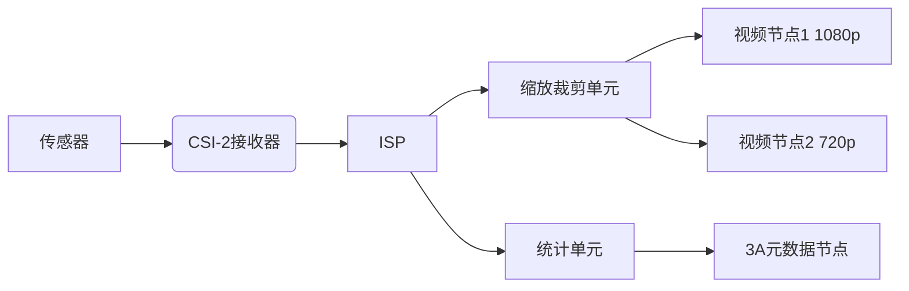

## 1 目录

```toc
```

## 2 媒体控制器

正如章节[[V4L2概述#^5ppocs|V4L2设备层级结构]]所述，一个V4L2设备的物理拓扑关系会很复杂，使用简单的扁平容器( `v4l2_device` )难以表达类似于下方的复杂拓扑结构：


此外，媒体控制器还支持动态修改数据链路的特性(命令行中也可以使用 `media-ctl` 工具)，例如：
1. HDR模式切换：
	```mermaid
	graph LR
     S[Sensor] -->|原始数据| HDR[HDR合成器]
     HDR -->|合成数据| ISP[标准ISP]
     S -->|旁路| ISP
     
     ISP --> VIDEO[输出]
	```
2. ISP切换：
	```mermaid
	graph LR
     S[Sensor] --> N[正常ISP]
     S --> L[低光ISP]
     
     N --> MUX[输出选择器]
     L --> MUX
     MUX --> VIDEO[视频输出]
	```
不过媒体管理器不支持跨 `v4l2_device` 的拓扑描述或链路更改。

### 2.1 基本模型定义

为了描述上述拓扑关系，支持动态链路等功能，其设计了如下三种基础类型：
- 媒体设备：
	- 代表整个物理设备的实体、端口、链路等，
- 实体：
	- 每个实体都代表该物理设备的一个软硬件模块或功能
	- 其拥有多个焊盘(端口)和属性
- 焊盘：
	- 为每个实体的输入、输出端口，其每个焊盘有如下属性(特性)
		1. 引脚号
		2. 每个引脚所连接的链路数
		3. 该焊盘传递的信号类型(模拟、DV、AUDIO等)
		4. 引脚类型：
			- 输入焊盘(与输出互斥)
			- 输出焊盘(与输入互斥)
			- 是否必须连接(可与上方二者之一结合使用)
- 链路：
	- 提供数据流动以及数据结构的拓扑查询
		- 可选的动态链路变更
		- 链路正向数据传递和反向控制指令传递，以及双向的拓扑连接

学习时建议按照焊盘->链接->实体->媒体设备的顺序学习。

#### 2.1.1 焊盘(media_pad) ^ouhrtb

焊盘表示该模块的数入输出"引脚"，如上文所述，该焊盘有引脚号、引脚所连链路数、引脚传递的信号类型、数据方向等属性。

其数据结构定义为：

```C
/**
 * struct media_pad - A media pad graph object.
 *
 * @graph_obj:	Embedded structure containing the media object common data
 * @entity:	Entity this pad belongs to
 * @index:	Pad index in the entity pads array, numbered from 0 to n
 * @num_links:	Number of links connected to this pad
 * @sig_type:	Type of the signal inside a media pad
 * @flags:	Pad flags, as defined in
 *		:ref:`include/uapi/linux/media.h <media_header>`
 *		(seek for ``MEDIA_PAD_FL_*``)
 * @pipe:	Pipeline this pad belongs to. Use media_entity_pipeline() to
 *		access this field.
 */
struct media_pad {
	struct media_gobj graph_obj;	/* must be first field in struct */
	struct media_entity *entity;
	u16 index;
	u16 num_links;
	enum media_pad_signal_type sig_type;
	unsigned long flags;

	/*
	 * The fields below are private, and should only be accessed via
	 * appropriate functions.
	 */
	struct media_pipeline *pipe;
};
```

其成员：
- `struct media_gobj graph_obj`
	- 功能含义：`media_entity` 、` media_pad` 和 `media_link` 的共同基类，用于数据结构管理
		- 放在第一个元素作为元素头，和该对象享有同样的内存地址，方便索引
		- `graph_obj.type = MEDIA_GRAPH_PAD`
		- `graph_obj.id` 、`graph_obj.mdev` 由框架设置
	- 维护方：V4L2框架自动管理
- `struct media_entity *entity` 
	- 功能含义：焊盘所属的媒体实体
	- 维护方：<font color="#c00000">驱动必须配置</font>
	- 规则：
		- 必须在注册焊盘前配置
		- 不可为NULL
		- 实体的生命周期必须长于焊盘
- `u16 index`
	- 功能含义：焊盘引脚号
	- 维护方：<font color="#c00000">驱动必须配置</font>
	- 规则：
		- 从0开始顺序编号，且在实体范围内唯一
- `u16 num_links`
	- 功能含义：此焊盘连接到的链路数量
	- 维护方：V4L2框架自动管理
	- 规则：
		- 对驱动来说是<font color="#c00000">只读字段</font>，<font color="#c00000">禁止驱动直接修改</font>
- `enum media_pad_signal_type sig_type`
	- 功能含义：该焊盘传递的信号类型
	- 维护方：驱动可选配置，缺省时为 `MEDIA_PAD_SIGNAL_DEFAULT`
- `unsigned long flags`
	- 功能含义：定义焊盘的属性和行为
	- 维护方：<font color="#c00000">驱动必须配置</font>
	- 规则：
		- 输入( `MEDIA_PAD_FL_SINK` )和输出( ` MEDIA_PAD_FL_SOURCE ` )只能选择一个
		- 上述两个可以追加必须连接属性 `MEDIA_PAD_FL_MUST_CONNECT`
- `struct media_pipeline *pipe`
	- 功能含义：指向焊盘所属的数据流管道
	- 维护方：V4L2框架自动管理
	- 规则：
		- 禁止驱动直接访问，应当使用其访问器( `media_entity_pipeline` )访问

#### 2.1.2 链路(media_link) ^hcefzg

如上述章节所述，链路主要承担如下特性的实现：
- 可选的动态链路变更
- 链路正向数据传递和反向控制指令传递，以及双向的拓扑连接

其数据结构定义为：

```C
/**
 * struct media_link - A link object part of a media graph.
 *
 * @graph_obj:	Embedded structure containing the media object common data
 * @list:	Linked list associated with an entity or an interface that
 *		owns the link.
 * @gobj0:	Part of a union. Used to get the pointer for the first
 *		graph_object of the link.
 * @source:	Part of a union. Used only if the first object (gobj0) is
 *		a pad. In that case, it represents the source pad.
 * @intf:	Part of a union. Used only if the first object (gobj0) is
 *		an interface.
 * @gobj1:	Part of a union. Used to get the pointer for the second
 *		graph_object of the link.
 * @sink:	Part of a union. Used only if the second object (gobj1) is
 *		a pad. In that case, it represents the sink pad.
 * @entity:	Part of a union. Used only if the second object (gobj1) is
 *		an entity.
 * @reverse:	Pointer to the link for the reverse direction of a pad to pad
 *		link.
 * @flags:	Link flags, as defined in uapi/media.h (MEDIA_LNK_FL_*)
 * @is_backlink: Indicate if the link is a backlink.
 */
struct media_link {
	struct media_gobj graph_obj;
	struct list_head list;
	union {
		struct media_gobj *gobj0;
		struct media_pad *source;
		struct media_interface *intf;
	};
	union {
		struct media_gobj *gobj1;
		struct media_pad *sink;
		struct media_entity *entity;
	};
	struct media_link *reverse;
	unsigned long flags;
	bool is_backlink;
};
```

其成员：
- `struct media_gobj graph_obj`
	- 功能含义：`media_entity` 、` media_pad` 和 `media_link` 的共同基类，用于数据结构管理
		- `graph_obj.type = MEDIA_GRAPH_LINK`
	- 维护方：V4L2框架自动管理
- `struct list_head list` 
	- 功能含义：
- `gobj0` 、`source` 、`intf` 
	- 功能含义：连接起点(数据输出端)的基类对象、焊盘或端口的指针
	- 维护方：驱动或用户态触发后由V4L2进行配置
- `gobj1` 、`sink` 、`entity` 
	- 功能含义：连接终点(数据接收端)的基类对象、焊盘或端口的指针
	- 维护方：驱动或用户态触发后由V4L2进行配置
- `struct media_link *reverse`
	- 功能含义：指向反向链接对象，由于每个焊盘只有单向数据流动，因此反向数据连接用于查询/控制功能，以及方便进行拓扑和遍历。
	- 维护方：驱动或用户态触发后由V4L2进行配置
- `unsigned long flags`
	- 功能含义：定义连接的属性和状态，例如：
		- `MEDIA_LNK_FL_ENABLED` 表示连接已启用
		- `MEDIA_LNK_FL_IMMUTABLE` 表示连接不可修改
		- `MEDIA_LNK_FL_DYNAMIC` 表示可动态变更
	- 维护方：<font color="#c00000">驱动设置初始标志</font>，V4L2运行时动态设置 `ENABLE` 位
- `bool is_backlink`
	- 功能含义：当该连接为反向连接时为 `true`
	- 维护方：V4L2框架自动管理

#### 2.1.3 实体(media_entity) ^xup1xx

实体可以代表该物理设备的任何V4L2的软硬件模块，一个设备、节点或模块只对应一个实体。

其数据结构定义为：

```C
/**
 * struct media_entity - A media entity graph object.
 *
 * @graph_obj:	Embedded structure containing the media object common data.
 * @name:	Entity name.
 * @obj_type:	Type of the object that implements the media_entity.
 * @function:	Entity main function, as defined in
 *		:ref:`include/uapi/linux/media.h <media_header>`
 *		(seek for ``MEDIA_ENT_F_*``)
 * @flags:	Entity flags, as defined in
 *		:ref:`include/uapi/linux/media.h <media_header>`
 *		(seek for ``MEDIA_ENT_FL_*``)
 * @num_pads:	Number of sink and source pads.
 * @num_links:	Total number of links, forward and back, enabled and disabled.
 * @num_backlinks: Number of backlinks
 * @internal_idx: An unique internal entity specific number. The numbers are
 *		re-used if entities are unregistered or registered again.
 * @pads:	Pads array with the size defined by @num_pads.
 * @links:	List of data links.
 * @ops:	Entity operations.
 * @use_count:	Use count for the entity.
 * @info:	Union with devnode information.  Kept just for backward
 *		compatibility.
 * @info.dev:	Contains device major and minor info.
 * @info.dev.major: device node major, if the device is a devnode.
 * @info.dev.minor: device node minor, if the device is a devnode.
 *
 * .. note::
 *
 *    The @use_count reference count must never be negative, but is a signed
 *    integer on purpose: a simple ``WARN_ON(<0)`` check can be used to detect
 *    reference count bugs that would make it negative.
 */
struct media_entity {
	struct media_gobj graph_obj;	/* must be first field in struct */
	const char *name;
	enum media_entity_type obj_type;
	u32 function;
	unsigned long flags;

	u16 num_pads;
	u16 num_links;
	u16 num_backlinks;
	int internal_idx;

	struct media_pad *pads;
	struct list_head links;

	const struct media_entity_operations *ops;

	int use_count;

	union {
		struct {
			u32 major;
			u32 minor;
		} dev;
	} info;
};
```

其成员：
- `struct media_gobj graph_obj` 
	- 功能含义：`media_entity` 、` media_pad` 和 `media_link` 的共同基类，用于数据结构管理
	- 维护方：V4L2框架自动管理
- `const char *name` 
	- 功能含义：为用户提供的可读名称，例如 `ov5640-sensor`
	- 维护方：<font color="#c00000">驱动必须配置</font>
- `enum media_entity_type obj_type`
	- 功能含义：实体类型，V4L2框架仅定义了下述三种：
		- `MEDIA_ENTITY_TYPE_BASE` ：不嵌入在其他子系统结构中的独立媒体实体，例如：
			- 纯软件实体
			- 非V4L2硬件实体
		- `MEDIA_ENTITY_TYPE_VIDEO_DEVICE` ：嵌入在 `video_device` 中的实体，即 `/dev/videoX`，例如：
			- V4L2视频节点
			- 摄像头采集设备
			- 视频输出设备
		- `MEDIA_ENTITY_TYPE_V4L2_SUBDEV` ：嵌入在 `v4l2_subdev` 中的实体，即 `/dev/v4l-subdevX` ，例如：
			- 摄像头传感器
			- ISP
	- 维护方：<font color="#c00000">驱动必须指定</font>
- `u32 function` 
	- 功能含义：实体功能标识，在 `uapi/linux/media.h` 中定义的有
		- DVB实体功能类
		- IO实体功能类
		- Sensor实体功能类等
	- 维护方：<font color="#c00000">驱动必须配置</font>
- `unsigned long flags` 
	- 功能含义：实体行为标志，其有如下两种：
		- `MEDIA_ENT_FL_DEFAULT` ：当前实体为首选设备，例如多摄像头中的主摄、多信号源的默认信号源。
		- `MEDIA_ENT_FL_CONNECTOR` ：标记实体为物理连接器，例如：
			- HDMI接口、3.5mm接口...
	- 维护方：驱动按需可选配置，默认为0
- `u16 num_pads` 
	- 功能含义：焊盘总数，需要与 `pads` 成员的内存大小相等
	- 维护方：<font color="#c00000">驱动必须配置</font>
- `u16 num_links`
	- 功能含义：总链接数(<font color="#c00000">包含正反向链接</font>)
	- 维护方：V4L2框架负责维护
- `u16 num_backlinks`
	- 功能含义：指向该实体的反向链接数(实体作为接收端)
	- 维护方：V4L2框架负责维护
- `int internal_idx`
	- 功能含义：实体在媒体设备中的唯一标识符
	- 维护方：V4L2自动配置，驱动禁止更改
- `struct media_pad *pads`
	- 功能含义：焊盘所用的数组
	- 维护方：<font color="#c00000">驱动必须分配和维护对应内存区域</font>
- `struct list_head links` 
	- 功能含义：存储与该实体相关的所有链接的链表
	- 维护方：<font color="#c00000">驱动需要初始化表头</font>(因为V4L2框架无法识别哪些实体是动态创建，哪些是静态创建；且允许驱动在注册实体之前预先创建链接)
- `const struct media_entity_operations *ops` 
	- 功能含义：实体的操作回调(并非文件操作)，例如链接状态变更、链接验证、设备树或ACPI解析回调等：
		- `get_fwnode_pad` 
			- 功能含义：将 `fwnode` 端点映射到实体 `pad` 编号的回调函数
			- 执行时机：在通过设备树或ACPI解析阶段
			- 可选性：可选实现
		- `link_setup` 
			- 功能含义：响应链接状态变更的回调函数
			- 执行时机：在链接状态改变时
			- 可选性：推荐实现
		- `link_validate` 
			- 功能含义：验证链接是否合法
			- 执行时机：在启动流( `STREAMON` )时
			- 可选性：推荐实现
		- `has_pad_interdep` 
			- 功能含义：声明两个pad是否相互依赖
			- 可选性：可选，且大多设备不需要
	- 维护方：驱动可选设置
- `union info` 
	- 功能含义：设备节点信息(已不再使用，保留是为了兼容旧驱动)
	- 维护方：不再使用

#### 2.1.4 媒体设备(media_device) ^elqnrp

在Linux中，媒体设备被挂载于 `/dev/mediaX` 下，其抽象的是整个多媒体系统。一个 `v4l2_device` 只能有一个媒体设备。而该模型是更高级拓扑结构的抽象表示，其支持动态链路等功能。

数据结构定义为：

```C
/**
 * struct media_device - Media device
 * @dev:	Parent device
 * @devnode:	Media device node
 * @driver_name: Optional device driver name. If not set, calls to
 *		%MEDIA_IOC_DEVICE_INFO will return ``dev->driver->name``.
 *		This is needed for USB drivers for example, as otherwise
 *		they'll all appear as if the driver name was "usb".
 * @model:	Device model name
 * @serial:	Device serial number (optional)
 * @bus_info:	Unique and stable device location identifier
 * @hw_revision: Hardware device revision
 * @topology_version: Monotonic counter for storing the version of the graph
 *		topology. Should be incremented each time the topology changes.
 * @id:		Unique ID used on the last registered graph object
 * @entity_internal_idx: Unique internal entity ID used by the graph traversal
 *		algorithms
 * @entity_internal_idx_max: Allocated internal entity indices
 * @entities:	List of registered entities
 * @interfaces:	List of registered interfaces
 * @pads:	List of registered pads
 * @links:	List of registered links
 * @entity_notify: List of registered entity_notify callbacks
 * @graph_mutex: Protects access to struct media_device data
 * @pm_count_walk: Graph walk for power state walk. Access serialised using
 *		   graph_mutex.
 *
 * @source_priv: Driver Private data for enable/disable source handlers
 * @enable_source: Enable Source Handler function pointer
 * @disable_source: Disable Source Handler function pointer
 *
 * @ops:	Operation handler callbacks
 * @req_queue_mutex: Serialise the MEDIA_REQUEST_IOC_QUEUE ioctl w.r.t.
 *		     other operations that stop or start streaming.
 * @request_id: Used to generate unique request IDs
 *
 * This structure represents an abstract high-level media device. It allows easy
 * access to entities and provides basic media device-level support. The
 * structure can be allocated directly or embedded in a larger structure.
 *
 * The parent @dev is a physical device. It must be set before registering the
 * media device.
 *
 * @model is a descriptive model name exported through sysfs. It doesn't have to
 * be unique.
 *
 * @enable_source is a handler to find source entity for the
 * sink entity  and activate the link between them if source
 * entity is free. Drivers should call this handler before
 * accessing the source.
 *
 * @disable_source is a handler to find source entity for the
 * sink entity  and deactivate the link between them. Drivers
 * should call this handler to release the source.
 *
 * Use-case: find tuner entity connected to the decoder
 * entity and check if it is available, and activate the
 * link between them from @enable_source and deactivate
 * from @disable_source.
 *
 * .. note::
 *
 *    Bridge driver is expected to implement and set the
 *    handler when &media_device is registered or when
 *    bridge driver finds the media_device during probe.
 *    Bridge driver sets source_priv with information
 *    necessary to run @enable_source and @disable_source handlers.
 *    Callers should hold graph_mutex to access and call @enable_source
 *    and @disable_source handlers.
 */
struct media_device {
	/* dev->driver_data points to this struct. */
	struct device *dev;
	struct media_devnode *devnode;

	char model[32];
	char driver_name[32];
	char serial[40];
	char bus_info[32];
	u32 hw_revision;

	u64 topology_version;

	u32 id;
	struct ida entity_internal_idx;
	int entity_internal_idx_max;

	struct list_head entities;
	struct list_head interfaces;
	struct list_head pads;
	struct list_head links;

	/* notify callback list invoked when a new entity is registered */
	struct list_head entity_notify;

	/* Serializes graph operations. */
	struct mutex graph_mutex;
	struct media_graph pm_count_walk;

	void *source_priv;
	int (*enable_source)(struct media_entity *entity,
			     struct media_pipeline *pipe);
	void (*disable_source)(struct media_entity *entity);

	const struct media_device_ops *ops;

	struct mutex req_queue_mutex;
	atomic_t request_id;
};
```

其成员：
- `struct device *dev`
	- 功能含义：指向物理设备的指针
	- 维护方：<font color="#c00000">驱动必须设置</font>(在注册前)
- `struct media_devnode *devnode`
	- 功能含义：代表 `/dev/mediaX` 节点
	- 维护方：V4L2负责维护
- `char model[32]`
	- 功能含义：设备型号名，例如 `vim2m` ，会在用户空间中暴露
	- 维护方：<font color="#c00000">驱动推荐设置</font>
- `char driver_name[32]`
	- 功能含义：用于覆盖驱动名，如不设置则使用 `dev->driver->name`
	- 维护方：驱动可选设置
- `char serial[40]`
	- 功能含义：序列号，除了向用户表述设备ID外，还可以帮助用户区分同型号设备
	- 维护方：驱动可选设置
- `char bus_info[32]`
	- 功能含义：设备位置标识，例如 `platform:vim2m` 或 `usb-0000:00:14.0-4`
	- 维护方：<font color="#c00000">驱动必须设置</font>
- `u32 hw_revision`
	- 功能含义：硬件版本号，可用于兼容性检查
	- 维护方：驱动可选设置
- `u64 topology_version`
	- 功能含义：拓扑变更计数器
	- 维护方：V4L2框架自动维护
- `u32 id`
	- 功能含义：最后注册的图形对象(实体、焊盘、链接)的ID
	- 维护方：V4L2框架自动维护
- `struct ida entity_internal_idx`
	- 功能含义：实例内部的ID分配器
	- 维护方：V4L2框架自动维护
- `int entity_internal_idx_max`
	- 功能含义：媒体设备内部的最大实体索引
	- 维护方：V4L2框架自动维护
- `struct list_head entities`
	- 功能含义：已注册实体的链表
	- 维护方：V4L2框架自动维护
- `struct list_head interfaces`
	- 功能含义：媒体接口链表
	- 维护方：V4L2框架自动维护
- `struct list_head pads`
	- 功能含义：焊盘链表
	- 维护方：V4L2框架自动维护
- `struct list_head links`
	- 功能含义：链接链表
	- 维护方：V4L2框架自动维护
- `struct list_head entity_notify`
	- 功能含义：实体注册通知回调
	- 维护方：驱动可选配置
- `struct mutex graph_mutex`
	- 功能含义：拓扑操作互斥锁
	- 维护方：由V4L2初始化，<font color="#c00000">驱动必须配合使用</font>
- `struct media_graph pm_count_walk`
	- 功能含义：电源状态遍历器
	- 维护方：V4L2框架自动维护
- `void *source_priv`
	- 功能含义：源控制私有数据
	- 维护方：驱动按需设置
- `int (*enable_source)(struct media_entity *entity, struct media_pipeline *pipe) `
	- 功能含义：激活源实体的回调函数
	- 维护方：<font color="#c00000">需要使用</font>[[V4L2概述#^8230im|源控制]]<font color="#c00000">的驱动必须实现</font>
- `void (*disable_source)(struct media_entity *entity)`
	- 功能含义：停用源实体的回调函数
	- 维护方：<font color="#c00000">需要使用源控制的驱动必须实现</font>
- `const struct media_device_ops *ops`
	- 功能含义：媒体请求的操作回调。具体可见[[V4L2概述#^xvploq|媒体请求]]。
	- 维护方：驱动可选实现
- `struct mutex req_queue_mutex`
	- 功能含义：请求队列的互斥锁
	- 维护方：V4L2自动管理
- `atomic_t request_id`
	- 功能含义：请求ID生成器
	- 维护方：V4L2自动管理

### 2.2 相关API

#### 2.2.1 初始化media_device

`media_device` 在构造时需要分为两步：
1. 使用 `media_device_init` 初始化 `media_device` 结构
2. 使用 `media_device_register` 注册 `media_device` 
该设计主要是为了避免竞态。

```C
#include <media/media-device.h>

/**
 * media_device_init() - Initializes a media device element
 *
 * @mdev:	pointer to struct &media_device
 *
 * This function initializes the media device prior to its registration.
 * The media device initialization and registration is split in two functions
 * to avoid race conditions and make the media device available to user-space
 * before the media graph has been completed.
 *
 * So drivers need to first initialize the media device, register any entity
 * within the media device, create pad to pad links and then finally register
 * the media device by calling media_device_register() as a final step.
 *
 * The caller is responsible for initializing the media device before
 * registration. The following fields must be set:
 *
 * - dev must point to the parent device
 * - model must be filled with the device model name
 *
 * The bus_info field is set by media_device_init() for PCI and platform devices
 * if the field begins with '\0'.
 */
void media_device_init(struct media_device *mdev);
```

该函数主要会初始化 `media_device` 结构体中的数据结构，需要注意：
1. <font color="#c00000">在调用本函数前必须将</font> `media_device.dev` <font color="#c00000">指向其父设备</font>
2. <font color="#c00000">在调用本函数前必须配置设备型号</font> `media_device.model`

#### 2.2.2 注册media_device


### 2.3 V4L2机制模型

#### 2.3.1 视频缓冲区队列(struct vb2_queue)


#### 2.3.2 源控制 ^8230im

#### 2.3.3 媒体请求(media_request) ^dhev4l

在用户态章节编程中已经提到，用户可以使用 `ioctl` 进行媒体设备配置，例如：

```C
ioctl(fd, VIDIOC_S_FMT, &fmt);       // 设置分辨率
ioctl(fd, VIDIOC_S_CTRL, &exposure); // 设置曝光
ioctl(fd, VIDIOC_QBUF, &buffer);     // 提交缓冲区
```

但是考虑如下的需求与情景：
1. 上述demo中，如果分辨率设置成功，曝光设置失败，如何fallback
2. 部分硬件要求分辨率与帧率同时设置(例如不能同时高分辨率和高帧率)
3. 当用户要求两个ioctl指令同时生效时应当如何实现

因此在保留原有ioctl机制的基础上，V4L2又设计了媒体请求机制，其允许将一系列请求按顺序包装为一个媒体请求对象，<font color="#c00000">原子地执行更改</font>：

```C
// 创建媒体请求对象
struct media_request request = create_request();

// 将操作绑定至请求（尚未生效）
request_add_operation(request, VIDIOC_S_FMT, &fmt);      
request_add_operation(request, VIDIOC_S_CTRL, &exposure);
request_add_operation(request, VIDIOC_QBUF, &buffer);

// 原子提交（全成功或全回滚）
ioctl(fd, MEDIA_REQUEST_IOC_QUEUE, &request); 
```

##### 2.3.3.1 媒体请求操作回调(media_device_ops) ^xvploq

媒体请求回调( `media_device_ops` )的数据结构定义如下：

```C
/**
 * struct media_device_ops - Media device operations
 * @link_notify: Link state change notification callback. This callback is
 *		 called with the graph_mutex held.
 * @req_alloc: Allocate a request. Set this if you need to allocate a struct
 *	       larger then struct media_request. @req_alloc and @req_free must
 *	       either both be set or both be NULL.
 * @req_free: Free a request. Set this if @req_alloc was set as well, leave
 *	      to NULL otherwise.
 * @req_validate: Validate a request, but do not queue yet. The req_queue_mutex
 *	          lock is held when this op is called.
 * @req_queue: Queue a validated request, cannot fail. If something goes
 *	       wrong when queueing this request then it should be marked
 *	       as such internally in the driver and any related buffers
 *	       must eventually return to vb2 with state VB2_BUF_STATE_ERROR.
 *	       The req_queue_mutex lock is held when this op is called.
 *	       It is important that vb2 buffer objects are queued last after
 *	       all other object types are queued: queueing a buffer kickstarts
 *	       the request processing, so all other objects related to the
 *	       request (and thus the buffer) must be available to the driver.
 *	       And once a buffer is queued, then the driver can complete
 *	       or delete objects from the request before req_queue exits.
 */
struct media_device_ops {
	int (*link_notify)(struct media_link *link, u32 flags,
			   unsigned int notification);
	struct media_request *(*req_alloc)(struct media_device *mdev);
	void (*req_free)(struct media_request *req);
	int (*req_validate)(struct media_request *req);
	void (*req_queue)(struct media_request *req);
};
```

该结构体有如下的成员：
- `int (*link_notify)(struct media_link *link, u32 flags, unsigned int notification)`
	- 功能含义：媒体链路变更通知回调
	- 标准语义：
		- 返回0时表示成功，其他值表示失败并组织非法配置
	- 维护方：驱动可选实现
- `struct media_request *(*req_alloc)(struct media_device *mdev)`
	- 功能含义：更高级的自定义的 `media_request` 对象内存实现
		- "更高级"指：
			- 使用DMA内存(则此时无法使用 `kmalloc` 的默认实现)
			- 分配比标准 `media_device` 更大的内存，例如驱动定义了一个继承自 `media_device` 的更大的对象时
	- 必须和 `req_free` 同时定义或缺省
	- 维护方：驱动可选实现
- `void (*req_free)(struct media_request *req)`
	- 功能含义：`req_alloc` 对应的资源回收函数
	- 维护方：驱动可选实现
- `int (*req_validate)(struct media_request *req)`
	- 功能含义：验证媒体请求( `media_request` )的合法性
	- 标准语义：
		- 返回0时表示请求合法，非0非法
- `void (*req_queue)(struct media_request *req)`
	- 功能含义：提交已经验证的媒体请求到硬件执行
	- 标准语义：
		- 该函数不能失败(因为已经被 `req_validate` 验证)

