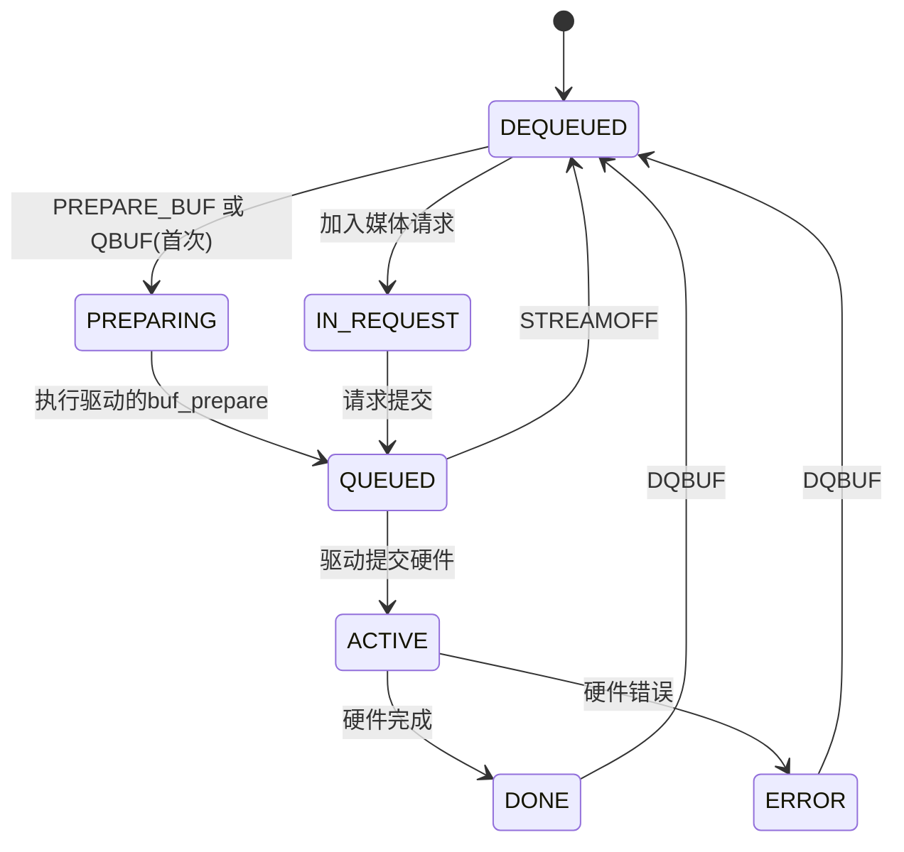

#嵌入式 #Linux驱动开发 #操作系统 

# 1 目录

```toc
```

# 2 缓冲区队列(vb2_queue) ^muxpzy

vb2_queue(视频缓冲区队列)提供了远超普通队列的功能特性，例如：
- V4L2所支持的ioctl操作(例如缓冲区申请、流控制等)
- 多路复用机制(poll/select)
- 时间戳处理
- 同步机制
- 内存管理
- DMA支持
等。

## 2.1 数据结构(struct vb2_queue)

其数据结构具体、成员功能可见章节[[Linux内核原理及其开发/内核源码探析/内核源码分析/include/media/videobuf2-core.h#^xxcufl|vb2_queue]]：
![[Linux内核原理及其开发/内核源码探析/内核源码分析/include/media/videobuf2-core.h#vb2_queue xxcufl]]

需要着重注意：
1. <font color="#c00000">建议预先学习</font>[[VB2概述#^nijdvg|VB2缓冲区状态与生命周期]]。
2. <font color="#c00000">实际上</font> `vb2_queue` <span style="background:#fff88f"><font color="#c00000">维护了两个队列</font></span>，一个是用户对缓冲区处理完后，塞回 `vb2_queue` 后驱动还没来得及取出的 `QUEUED` 队列，一个是驱动已经处理完毕但是用户态还没取出的 `DONE` 队列。

## 2.2 vb2相关回调函数(struct vb2_ops) ^tqizjf

> [!attention]
> - 本结构体中的所有回调均<font color="#c00000">均未拥有</font> `struct video_device.lock`
 ，<font color="#c00000">因此需要按需加锁</font>(不难理解，因为vb2框架并不管video设备)，但需要注意：
> 	 - `queue_setup` 在video设备中会被 `vidioc_reqbufs` 调用从而间接得锁，不需要重复加锁
> - 而[[video_device]]中的[[video_device#^r8lfyg|struct v4l2_ioctl_ops]]中所有回调已拥有该锁，不需要额外加锁

视频缓冲区队列有如下的回调函数：

```C
/**
 * struct vb2_ops - driver-specific callbacks.
 *
 * These operations are not called from interrupt context except where
 * mentioned specifically.
 *
 * @queue_setup:	called from VIDIOC_REQBUFS() and VIDIOC_CREATE_BUFS()
 *			handlers before memory allocation. It can be called
 *			twice: if the original number of requested buffers
 *			could not be allocated, then it will be called a
 *			second time with the actually allocated number of
 *			buffers to verify if that is OK.
 *			The driver should return the required number of buffers
 *			in \*num_buffers, the required number of planes per
 *			buffer in \*num_planes, the size of each plane should be
 *			set in the sizes\[\] array and optional per-plane
 *			allocator specific device in the alloc_devs\[\] array.
 *			When called from VIDIOC_REQBUFS(), \*num_planes == 0,
 *			the driver has to use the currently configured format to
 *			determine the plane sizes and \*num_buffers is the total
 *			number of buffers that are being allocated. When called
 *			from VIDIOC_CREATE_BUFS(), \*	num_planes != 0 and it
 *			describes the requested number of planes and sizes\[\]
 *			contains the requested plane sizes. In this case
 *			\*num_buffers are being allocated additionally to
 *			the buffers already allocated. If either \*num_planes
 *			or the requested sizes are invalid callback must return %-EINVAL.
 * @wait_prepare:	release any locks taken while calling vb2 functions;
 *			it is called before an ioctl needs to wait for a new
 *			buffer to arrive; required to avoid a deadlock in
 *			blocking access type.
 * @wait_finish:	reacquire all locks released in the previous callback;
 *			required to continue operation after sleeping while
 *			waiting for a new buffer to arrive.
 * @buf_out_validate:	called when the output buffer is prepared or queued
 *			to a request; drivers can use this to validate
 *			userspace-provided information; this is required only
 *			for OUTPUT queues.
 * @buf_init:		called once after allocating a buffer (in MMAP case)
 *			or after acquiring a new USERPTR buffer; drivers may
 *			perform additional buffer-related initialization;
 *			initialization failure (return != 0) will prevent
 *			queue setup from completing successfully; optional.
 * @buf_prepare:	called every time the buffer is queued from userspace
 *			and from the VIDIOC_PREPARE_BUF() ioctl; drivers may
 *			perform any initialization required before each
 *			hardware operation in this callback; drivers can
 *			access/modify the buffer here as it is still synced for
 *			the CPU; drivers that support VIDIOC_CREATE_BUFS() must
 *			also validate the buffer size; if an error is returned,
 *			the buffer will not be queued in driver; optional.
 * @buf_finish:		called before every dequeue of the buffer back to
 *			userspace; the buffer is synced for the CPU, so drivers
 *			can access/modify the buffer contents; drivers may
 *			perform any operations required before userspace
 *			accesses the buffer; optional. The buffer state can be
 *			one of the following: %DONE and %ERROR occur while
 *			streaming is in progress, and the %PREPARED state occurs
 *			when the queue has been canceled and all pending
 *			buffers are being returned to their default %DEQUEUED
 *			state. Typically you only have to do something if the
 *			state is %VB2_BUF_STATE_DONE, since in all other cases
 *			the buffer contents will be ignored anyway.
 * @buf_cleanup:	called once before the buffer is freed; drivers may
 *			perform any additional cleanup; optional.
 * @prepare_streaming:	called once to prepare for 'streaming' state; this is
 *			where validation can be done to verify everything is
 *			okay and streaming resources can be claimed. It is
 *			called when the VIDIOC_STREAMON ioctl is called. The
 *			actual streaming starts when @start_streaming is called.
 *			Optional.
 * @start_streaming:	called once to enter 'streaming' state; the driver may
 *			receive buffers with @buf_queue callback
 *			before @start_streaming is called; the driver gets the
 *			number of already queued buffers in count parameter;
 *			driver can return an error if hardware fails, in that
 *			case all buffers that have been already given by
 *			the @buf_queue callback are to be returned by the driver
 *			by calling vb2_buffer_done() with %VB2_BUF_STATE_QUEUED.
 *			If you need a minimum number of buffers before you can
 *			start streaming, then set
 *			&vb2_queue->min_queued_buffers. If that is non-zero
 *			then @start_streaming won't be called until at least
 *			that many buffers have been queued up by userspace.
 * @stop_streaming:	called when 'streaming' state must be disabled; driver
 *			should stop any DMA transactions or wait until they
 *			finish and give back all buffers it got from &buf_queue
 *			callback by calling vb2_buffer_done() with either
 *			%VB2_BUF_STATE_DONE or %VB2_BUF_STATE_ERROR; may use
 *			vb2_wait_for_all_buffers() function
 * @unprepare_streaming:called as counterpart to @prepare_streaming; any claimed
 *			streaming resources can be released here. It is
 *			called when the VIDIOC_STREAMOFF ioctls is called or
 *			when the streaming filehandle is closed. Optional.
 * @buf_queue:		passes buffer vb to the driver; driver may start
 *			hardware operation on this buffer; driver should give
 *			the buffer back by calling vb2_buffer_done() function;
 *			it is always called after calling VIDIOC_STREAMON()
 *			ioctl; might be called before @start_streaming callback
 *			if user pre-queued buffers before calling
 *			VIDIOC_STREAMON().
 * @buf_request_complete: a buffer that was never queued to the driver but is
 *			associated with a queued request was canceled.
 *			The driver will have to mark associated objects in the
 *			request as completed; required if requests are
 *			supported.
 */
struct vb2_ops {
	int (*queue_setup)(struct vb2_queue *q,
			   unsigned int *num_buffers, unsigned int *num_planes,
			   unsigned int sizes[], struct device *alloc_devs[]);

	void (*wait_prepare)(struct vb2_queue *q);
	void (*wait_finish)(struct vb2_queue *q);

	int (*buf_out_validate)(struct vb2_buffer *vb);
	int (*buf_init)(struct vb2_buffer *vb);
	int (*buf_prepare)(struct vb2_buffer *vb);
	void (*buf_finish)(struct vb2_buffer *vb);
	void (*buf_cleanup)(struct vb2_buffer *vb);

	int (*prepare_streaming)(struct vb2_queue *q);
	int (*start_streaming)(struct vb2_queue *q, unsigned int count);
	void (*stop_streaming)(struct vb2_queue *q);
	void (*unprepare_streaming)(struct vb2_queue *q);

	void (*buf_queue)(struct vb2_buffer *vb);

	void (*buf_request_complete)(struct vb2_buffer *vb);
};
```

其成员：
- `int (*queue_setup)(...)` 
	- 功能含义：队列配置回调，在 `VIDIOC_REQBUFS` 或 `VIDIOC_CREATE_BUFS` 的内存分配前被调用。
	- 被调用时机：
		- 在 `VIDIOC_REQBUFS` 中会被调用两次：
			1. 第一次调用：由驱动计算所需缓冲区数量( `num_buffers` )和平面数量( `num_planes` )，并指定每个平面的总字节数( `sizes` 参数)。
			2. 第二次调用：<font color="#c00000">若实际分配下来的缓冲区数量小于第一次调用指定的数量</font>，则会再次调用从而交由驱动校验是否满足期望。
		- 在 `VIDIOC_CREATE_BUFS` 中只会被调用一次，且晚于 `VIDIOC_REQBUFS` 。
		- 也就是说当且仅当 `num_planes=0` 时为第一次调用，此时驱动应当指定若干参数；<font color="#c00000">后续调用中</font> `num_planes!=0` <font color="#c00000">且只能做参数校验</font>。
	- 可选性：<font color="#c00000">驱动必须实现</font>
	- 参数：
		- `struct vb2_queue *q` ：需要配置的vb2缓冲区指针
		- `unsigned int *num_buffers` ：驱动所需的缓冲区数量
		- `unsigned int *num_planes` ：驱动所需的[[音视频开发/音视频开发入门#^29c6mw|平面]]数量，其：
			- 当其在 `VIDIOC_REQBUFS` 调用时， `num_planes` 为0，需要驱动根据 `q->format` 配置所需平面数
			- 在 `VIDIOC_CREATE_BUFS` 调用时， `num_planes` 为用户所请求的平面数，
		- `unsigned int sizes[]` ：存储每个平面的总字节数，由驱动指定；数组由V4L2提前分配，数组长度为 `VIDEO_MAX_PLANES` (通常为8)。
			- 维护方：V4L2框架
		- `struct device *alloc_devs[]` ：存储每个平面所分配的设备，尺寸与 `sizes` 一致，通常在分配特殊内存时使用。
- `void (*wait_prepare)(struct vb2_queue *q)` 
	- 功能含义：在即将让用户态线程进入等待事件和阻塞之前，驱动所需要完成的准备的处理回调。
		- 在该回调中：
			- 驱动<font color="#c00000">通常需要</font>对 `vb2_queue.lock` 进行解锁
			- 驱动可能需要同步解除I2C等子系统的互斥锁，并让硬件恢复到一个安全状态
	- 等待事件举例：
		- 当用户已经把队列中所有缓冲区都读取了，并且请求下一个缓冲区时，用户态进入等待事件
		- 当队列已经填满，且用户申请入队下一个缓冲区时，用户态进入等待事件
		- 在 `streamon` 时，如果设置了 `min_buffers` 并且当前入队的缓冲区数量不足，可能会等待
	- 被调用时机：
		- 在触发等待事件后，即将阻塞用户态进程之前
	- <span style="background:#fff88f"><font color="#c00000">机制及触发流程</font></span>：
		1. 用户申请入队/出队操作
		2. <font color="#c00000">V4L2框架获取设备的锁</font>( `vb2_queue.lock` 中指定的互斥锁)，从而进行设备状态的互斥管理，并进入驱动回调
		3. 在驱动的入队/出队回调中，若：
			1. 不满足出入队条件(队满入队、队空出队)时返回 `-EAGAIN` ：
				1. 对于不满足出入队条件的分支，则V4L2会调用 `wait_prepare` 完成用户即将进入等待事件的一些准备(具体见功能含义)
				2. V4L2框架休眠用户线程
				3. 中断等事件处理完毕，满足入队/出队需求，驱动调用 `vb2_buffer_done` 等告知V4L2框架等待结束
				4. V4L2框架唤醒用户线程，并调用 `wait_finish` 
				5. V4L2框架进行后续处理
			2. 满足出入队条件时将缓冲区填入参数的指针中，并返回 `0` ：
				1. 对于满足出入队条件的分支，则不会调用 `wait_prepare/finish` 操作，并且立即释放 `vb2_queue.lock` 并进行后处理
		4. 目的：<font color="#c00000">该设计确保等待期间</font>，<font color="#c00000">新的中断事件中不会等待</font> `wait_prepare/finish` <font color="#c00000">操作组中操作的互斥锁</font>(避免了死锁)，并且设备可以安全处理中断事件。
	- 可选性：驱动可选实现，若不实现则使用默认行为(解锁 `vb2_queue.lock` )
- `void (*wait_finish)(struct vb2_queue *q)` 
	- 功能含义：用户态线程完成等待事件之后的回调。
	- 被调用时机：
		- 在等待事件完成后，用户态线程被唤醒之后，V4L2后续处理事件之前
	- 可选性：同上。
- `int (*buf_out_validate)(struct vb2_buffer *vb)` 
	- 功能含义：<span style="background:#fff88f"><font color="#c00000">专用于输出设备(用户->设备)</font></span><font color="#c00000">的校验回调函数</font>，校验输出缓冲区的数据是否有效(例如校验缓冲区长度是否足够、元数据格式、DMA地址、时间戳等)
	- 被调用时机：用户态使用 `VIDEOC_QBUF` 输出数据之后
	- 可选性：输出设备驱动可选实现
- `int (*buf_init)(struct vb2_buffer *vb)` 
	- 功能含义：在缓冲区初始化时被调用，用于驱动对缓冲区进行额外的初始化
	- 被调用时机： `REQBUFS` 或 `CREATE_BUFS` 时调用
	- 可选性：驱动可选实现
- `int (*buf_prepare)(struct vb2_buffer *vb)` 
	- 功能含义：在每次将缓冲区加入队列( `QBUF` )前调用，用于验证和准备缓冲区(如检查大小、填充数据等)
	- 可选性：驱动可选实现
- `void (*buf_finish)(struct vb2_buffer *vb)` 
	- 功能含义：驱动完成某个缓冲区后的后处理回调，用于在返回缓冲区给用户空间之前做后处理(如更新元数据)
	- 可选性：驱动可选实现
	- 被调用时机：在驱动处理完某个缓冲区后，调用 `vb2_buffer_done` 前，<font color="#c00000">由驱动手动调用</font>。
- `void (*buf_cleanup)(struct vb2_buffer *vb)` 
	- 功能含义：当缓冲区被释放( `REQBUFS(0)` 或关闭)时调用，用于清理驱动私有的缓冲区资源
	- 可选性：驱动可选实现
- `int (*prepare_streaming)(struct vb2_queue *q)` 
	- 功能含义：在进入流状态前调用，用于检查硬件和配置是否就绪
	- 可选性：驱动可选实现
- `int (*start_streaming)(struct vb2_queue *q, unsigned int count)` 
	- 功能含义：启动流传输的回调：
		- 仅需一次成功的调用就可以使设备进入流式传输状态。
		- 在调用 `start_streaming` 前，驱动程序可能已经通过 `buf_queue` 回调接收了用户态<font color="#c00000">预入队</font>的缓冲区，且参数 `count` 为已入队的数量。
		- 若硬件故障，则驱动可以返回错误，并且：
			1. 此前通过 `buf_queue` <font color="#c00000">预入队</font>的缓冲区<font color="#c00000">都应当</font>通过 `vb2_buffer_done(vb, VB2_BUF_STATE_QUEUED)` <font color="#c00000">归还到框架中</font>。
			2. 预入队的缓冲区应当由驱动程序管理。
		- 驱动应当：
			1. 确保硬件有足够的缓冲区开始工作
			2. 初始化硬件并启动数据流
	- 返回值：0表示可启动流传输，否则返回负的错误码
	- 被调用时机：在用户态调用 `STREAMON` 且队列至少有满足驱动要求的缓冲区数量( `min_queued_buffers` )时被调用。
		- `count` 参数为当前已排队的缓冲区数量
	- 可选性：<font color="#c00000">驱动必须实现</font>
- `void (*stop_streaming)(struct vb2_queue *q)` 
	- 功能含义：终止流传输的回调，驱动应当：
		1. 停止所有硬件传输(关闭相关中断和DMA)，从而确保不再访问所有缓冲区
		2. 返回<font color="#c00000">已留给驱动的</font>缓冲区到 `DEQUEUED` 状态从而方便内核和用户态安全释放：
			- 具体而言，此时缓冲区可能有如下几种状态：
				- `QUEUED` ：已经入队但还未被驱动处理的缓冲区
				- `ACTIVE` ：硬件正在处理的缓冲区
				- `DONE` ：已经被驱动处理完成但还未被用户态取走的缓冲区
				- `DEQUEUED` ：已经被用户态取走的缓冲区
			- 上述若干状态中，<font color="#c00000">需要处理的缓冲区状态为</font> `ACTIVE` ，其均需要通过 `vb2_buffer_done` 返回到 `DEQUEUED` ，<span style="background:#fff88f"><font color="#c00000">且需要注意</font></span>：
				- `ACTIVE` <span style="background:#fff88f"><font color="#c00000">状态<b>必须</b>返回为</font></span> `ERROR` <span style="background:#fff88f"><font color="#c00000">状态</font></span>，<font color="#c00000">因为实际上该缓冲区并未正确填充</font>，即：
					- `vb2_buffer_done(vb, VB2_BUF_STATE_ERROR);` 
			- 可参阅：[[VB2概述#^nijdvg|VB2缓冲区状态与生命周期]]
		3. 驱动手动调用 `vb2_ops.buf_finish` 进行后处理(如果实现的话)
	- 被调用时机：
		- 当用户态调用 `STREAMOFF` 时被调用，用于停止流传输
		- 文件句柄被关闭且流还在运行时被调用
		- 发生不可恢复的错误时由驱动触发调用
	- 可选性：<font color="#c00000">驱动必须实现</font>
- `void (*unprepare_streaming)(struct vb2_queue *q)` 
	- 功能含义：
	- 可选性：驱动可选实现
- `void (*buf_queue)(struct vb2_buffer *vb)` 
	- 功能含义<font color="#c00000">[重要]</font>：用户态将缓冲区添加到队列后的回调
		- 驱动应当在此启动硬件操作。
		- 当硬件操作完毕后：
			1. 驱动手动调用 `vb2_ops.buf_finish` 进行后处理(如果实现的话)
			2. 驱动必须调用 `vb2_buffer_done` 通知V4L2缓冲区已处理完成(状态为 `DONE` 或 `ERROR` )
	- 被调用时机：用户空间使用 `VIDIOC_QBUF` 将缓冲区放会队列后框架会调用该函数。
	- 可选性：<font color="#c00000">驱动必须实现</font>
- `void (*buf_request_complete)(struct vb2_buffer *vb)` 
	- 功能含义：
	- 可选性：当需要支持请求API(request)时驱动需要实现

## 2.3 vb2内存操作函数(struct vb2_mem_ops) ^6l340x

```C
/**
 * struct vb2_mem_ops - memory handling/memory allocator operations.
 * @alloc:	allocate video memory and, optionally, allocator private data,
 *		return ERR_PTR() on failure or a pointer to allocator private,
 *		per-buffer data on success; the returned private structure
 *		will then be passed as @buf_priv argument to other ops in this
 *		structure. The size argument to this function shall be
 *		*page aligned*.
 * @put:	inform the allocator that the buffer will no longer be used;
 *		usually will result in the allocator freeing the buffer (if
 *		no other users of this buffer are present); the @buf_priv
 *		argument is the allocator private per-buffer structure
 *		previously returned from the alloc callback.
 * @get_dmabuf: acquire userspace memory for a hardware operation; used for
 *		 DMABUF memory types.
 * @get_userptr: acquire userspace memory for a hardware operation; used for
 *		 USERPTR memory types; vaddr is the address passed to the
 *		 videobuf2 layer when queuing a video buffer of USERPTR type;
 *		 should return an allocator private per-buffer structure
 *		 associated with the buffer on success, ERR_PTR() on failure;
 *		 the returned private structure will then be passed as @buf_priv
 *		 argument to other ops in this structure.
 * @put_userptr: inform the allocator that a USERPTR buffer will no longer
 *		 be used.
 * @prepare:	called every time the buffer is passed from userspace to the
 *		driver, useful for cache synchronisation, optional.
 * @finish:	called every time the buffer is passed back from the driver
 *		to the userspace, also optional.
 * @attach_dmabuf: attach a shared &struct dma_buf for a hardware operation;
 *		   used for DMABUF memory types; dev is the alloc device
 *		   dbuf is the shared dma_buf; returns ERR_PTR() on failure;
 *		   allocator private per-buffer structure on success;
 *		   this needs to be used for further accesses to the buffer.
 * @detach_dmabuf: inform the exporter of the buffer that the current DMABUF
 *		   buffer is no longer used; the @buf_priv argument is the
 *		   allocator private per-buffer structure previously returned
 *		   from the attach_dmabuf callback.
 * @map_dmabuf: request for access to the dmabuf from allocator; the allocator
 *		of dmabuf is informed that this driver is going to use the
 *		dmabuf.
 * @unmap_dmabuf: releases access control to the dmabuf - allocator is notified
 *		  that this driver is done using the dmabuf for now.
 * @vaddr:	return a kernel virtual address to a given memory buffer
 *		associated with the passed private structure or NULL if no
 *		such mapping exists.
 * @cookie:	return allocator specific cookie for a given memory buffer
 *		associated with the passed private structure or NULL if not
 *		available.
 * @num_users:	return the current number of users of a memory buffer;
 *		return 1 if the videobuf2 layer (or actually the driver using
 *		it) is the only user.
 * @mmap:	setup a userspace mapping for a given memory buffer under
 *		the provided virtual memory region.
 *
 * Those operations are used by the videobuf2 core to implement the memory
 * handling/memory allocators for each type of supported streaming I/O method.
 *
 * .. note::
 *    #) Required ops for USERPTR types: get_userptr, put_userptr.
 *
 *    #) Required ops for MMAP types: alloc, put, num_users, mmap.
 *
 *    #) Required ops for read/write access types: alloc, put, num_users, vaddr.
 *
 *    #) Required ops for DMABUF types: attach_dmabuf, detach_dmabuf,
 *       map_dmabuf, unmap_dmabuf.
 */
struct vb2_mem_ops {
	void		*(*alloc)(struct vb2_buffer *vb,
				  struct device *dev,
				  unsigned long size);
	void		(*put)(void *buf_priv);
	struct dma_buf *(*get_dmabuf)(struct vb2_buffer *vb,
				      void *buf_priv,
				      unsigned long flags);

	void		*(*get_userptr)(struct vb2_buffer *vb,
					struct device *dev,
					unsigned long vaddr,
					unsigned long size);
	void		(*put_userptr)(void *buf_priv);

	void		(*prepare)(void *buf_priv);
	void		(*finish)(void *buf_priv);

	void		*(*attach_dmabuf)(struct vb2_buffer *vb,
					  struct device *dev,
					  struct dma_buf *dbuf,
					  unsigned long size);
	void		(*detach_dmabuf)(void *buf_priv);
	int		(*map_dmabuf)(void *buf_priv);
	void		(*unmap_dmabuf)(void *buf_priv);

	void		*(*vaddr)(struct vb2_buffer *vb, void *buf_priv);
	void		*(*cookie)(struct vb2_buffer *vb, void *buf_priv);

	unsigned int	(*num_users)(void *buf_priv);

	int		(*mmap)(void *buf_priv, struct vm_area_struct *vma);
};
```

其成员：
- `alloc` ：
	- 功能含义：分配视频内存，并可选择分配器私有数据
	- 返回值：
		- 成功时返回分配器私有且指向缓冲区数据的指针
		- 失败时返回 `ERR_PTR()` 
- 


## 2.4 缓冲区操作函数(struct vb2_buf_ops) ^6o1wj3


## 2.5 相关API

### 2.5.1 队列初始化函数(vb2_queue_init)

```C
#include <media/videobuf2-v4l2.h>

/**
 * vb2_queue_init() - initialize a videobuf2 queue
 * @q:		pointer to &struct vb2_queue with videobuf2 queue.
 *
 * The vb2_queue structure should be allocated by the driver. The driver is
 * responsible of clearing it's content and setting initial values for some
 * required entries before calling this function.
 * q->ops, q->mem_ops, q->type and q->io_modes are mandatory. Please refer
 * to the struct vb2_queue description in include/media/videobuf2-core.h
 * for more information.
 */
int __must_check vb2_queue_init(struct vb2_queue *q);
```

该函数通常在 `probe` 或打开设备回调时被驱动调用。当函数执行成功时返回 `0` 。
注意：
- 该函数<span style="background:#fff88f"><font color="#c00000">仅初始化了静态结构</font></span>，也未向框架进行注册，<font color="#c00000">因此在probe等初始化过程中发生错误时</font><span style="background:#fff88f"><font color="#c00000">不需要调用</font></span> `vb2_queue_release` <span style="background:#fff88f"><font color="#c00000">回收队列!!!</font></span>(尽管回收了也不会怎么样)

### 2.5.2 设置名称并初始化队列(vb2_queue_init_name)

```C
/**
 * vb2_queue_init_name() - initialize a videobuf2 queue with a name
 * @q:		pointer to &struct vb2_queue with videobuf2 queue.
 * @name:	the queue name
 *
 * This function initializes the vb2_queue exactly like vb2_queue_init(),
 * and additionally sets the queue name. The queue name is used for logging
 * purpose, and should uniquely identify the queue within the context of the
 * device it belongs to. This is useful to attribute kernel log messages to the
 * right queue for m2m devices or other devices that handle multiple queues.
 */
int __must_check vb2_queue_init_name(struct vb2_queue *q, const char *name);
```

本方法会比上一子章节的初始化队列多一个设置名称的方法，对于多queue设备(如M2M)会有助于通过日志定位具体的队列实例。

### 2.5.3 停止流传输并释放缓冲区(vb2_queue_release)

```C
/**
 * vb2_queue_release() - stop streaming, release the queue and free memory
 * @q:		pointer to &struct vb2_queue with videobuf2 queue.
 *
 * This function stops streaming and performs necessary clean ups, including
 * freeing video buffer memory. The driver is responsible for freeing
 * the vb2_queue structure itself.
 */
void vb2_queue_release(struct vb2_queue *q);
```

- 功能含义：<font color="#c00000">停止流传输并释放缓冲区</font>，<span style="background:#fff88f"><font color="#c00000">通常用于在用户态打开计数归0时停止流传输并释放缓冲区</font></span>
- 注意：
	- <span style="background:#fff88f"><font color="#c00000">该函数并不用于销毁</font></span> `vb2_queue_init` <span style="background:#fff88f"><font color="#c00000">的资源!!!</font></span> `vb2_queue_init` <font color="#c00000">并不会注册任何动态资源!!!</font>
	- 因此，<font color="#c00000">被</font> `vb2_queue_release` <font color="#c00000">的队列不需要重新init即可重新使用!!!</font>

## 2.6 提供的机制


# 3 缓冲区(vb2_buffer)

## 3.1 缓冲区状态与生命周期 ^nijdvg
	
对于VB2缓冲区对象，无论其为输入设备还是输出设备，其均有如下的状态转换图：

上述各个状态的定义分别为：
- `DEQUEUED` ：处于用户空间控制下的缓冲区
- `PREPARING` ：缓冲区在VB2中做准备：
	- 当用户空间将某个缓冲区首次加入队列后，该缓冲区需要经过V4L2和驱动的 `buf_prepare()` 初始化的过程中的状态，完成后会自动转化为 `QUEUED` 状态。
- `IN_REQUEST` ：缓冲区正在媒体请求中排队
- `QUEUED` ：缓冲区在队列中等待驱动填充数据的状态，此状态有单独的 `DONE` 队列
- `ACTIVE` ：正在被驱动操作的状态(通常在填充数据)
- `DONE` ：驱动数据填充完毕，返回给VB2框架，但是还未被用户出队的缓冲区状态
- `ERROR` ：驱动数据填充发生错误，返回给VB2框架，但是还未被用户出队的缓冲区状态

需要注意：
1. 如章节[[VB2概述#^muxpzy|缓冲区队列(vb2_queue)]]所述，<span style="background:#fff88f"><font color="#c00000">其维护了两个队列</font></span>，其中：
	1. 缓冲区状态为 `QUEUED` 为一个队列，用户等待驱动处理。
	2. 缓冲区状态为 `DONE` 的也有一个队列，用于等待用户态申请出队。
2. 用户态可访问的缓冲区有且仅有 `DEQUEUED` 状态
3. <span style="background:#fff88f"><font color="#c00000">只有状态为</font></span> `ACTIVE` <span style="background:#fff88f"><font color="#c00000">的缓冲区才可以转变为</font></span> `DONE` 
4. 在用户态开启流传输前，<font color="#c00000">首次初始化缓冲区并入队时</font>，<span style="background:#fff88f"><font color="#c00000">并不会触发入队回调</font></span>。当用户开启流传输时，<font color="#c00000">流传输开启回调中会告诉驱动当前队列中缓冲区数量</font>，驱动需要从中

对应的枚举为：

```C
/**
 * enum vb2_buffer_state - current video buffer state.
 * @VB2_BUF_STATE_DEQUEUED:	buffer under userspace control.
 * @VB2_BUF_STATE_IN_REQUEST:	buffer is queued in media request.
 * @VB2_BUF_STATE_PREPARING:	buffer is being prepared in videobuf2.
 * @VB2_BUF_STATE_QUEUED:	buffer queued in videobuf2, but not in driver.
 * @VB2_BUF_STATE_ACTIVE:	buffer queued in driver and possibly used
 *				in a hardware operation.
 * @VB2_BUF_STATE_DONE:		buffer returned from driver to videobuf2, but
 *				not yet dequeued to userspace.
 * @VB2_BUF_STATE_ERROR:	same as above, but the operation on the buffer
 *				has ended with an error, which will be reported
 *				to the userspace when it is dequeued.
 */
enum vb2_buffer_state {
	VB2_BUF_STATE_DEQUEUED,
	VB2_BUF_STATE_IN_REQUEST,
	VB2_BUF_STATE_PREPARING,
	VB2_BUF_STATE_QUEUED,
	VB2_BUF_STATE_ACTIVE,
	VB2_BUF_STATE_DONE,
	VB2_BUF_STATE_ERROR,
};
```

## 3.2 数据结构

```C
/**
 * struct vb2_buffer - represents a video buffer.
 * @vb2_queue:		pointer to &struct vb2_queue with the queue to
 *			which this driver belongs.
 * @index:		id number of the buffer.
 * @type:		buffer type.
 * @memory:		the method, in which the actual data is passed.
 * @num_planes:		number of planes in the buffer
 *			on an internal driver queue.
 * @timestamp:		frame timestamp in ns.
 * @request:		the request this buffer is associated with.
 * @req_obj:		used to bind this buffer to a request. This
 *			request object has a refcount.
 */
struct vb2_buffer {
	struct vb2_queue	*vb2_queue;
	unsigned int		index;
	unsigned int		type;
	unsigned int		memory;
	unsigned int		num_planes;
	u64			timestamp;
	struct media_request	*request;
	struct media_request_object	req_obj;

	/* private: internal use only
	 *
	 * state:		current buffer state; do not change
	 * synced:		this buffer has been synced for DMA, i.e. the
	 *			'prepare' memop was called. It is cleared again
	 *			after the 'finish' memop is called.
	 * prepared:		this buffer has been prepared, i.e. the
	 *			buf_prepare op was called. It is cleared again
	 *			after the 'buf_finish' op is called.
	 * copied_timestamp:	the timestamp of this capture buffer was copied
	 *			from an output buffer.
	 * skip_cache_sync_on_prepare: when set buffer's ->prepare() function
	 *			skips cache sync/invalidation.
	 * skip_cache_sync_on_finish: when set buffer's ->finish() function
	 *			skips cache sync/invalidation.
	 * planes:		per-plane information; do not change
	 * queued_entry:	entry on the queued buffers list, which holds
	 *			all buffers queued from userspace
	 * done_entry:		entry on the list that stores all buffers ready
	 *			to be dequeued to userspace
	 */
	enum vb2_buffer_state	state;
	unsigned int		synced:1;
	unsigned int		prepared:1;
	unsigned int		copied_timestamp:1;
	unsigned int		skip_cache_sync_on_prepare:1;
	unsigned int		skip_cache_sync_on_finish:1;

	struct vb2_plane	planes[VB2_MAX_PLANES];
	struct list_head	queued_entry;
	struct list_head	done_entry;
#ifdef CONFIG_VIDEO_ADV_DEBUG
	/*
	 * Counters for how often these buffer-related ops are
	 * called. Used to check for unbalanced ops.
	 */
	u32		cnt_mem_alloc;
	u32		cnt_mem_put;
	u32		cnt_mem_get_dmabuf;
	u32		cnt_mem_get_userptr;
	u32		cnt_mem_put_userptr;
	u32		cnt_mem_prepare;
	u32		cnt_mem_finish;
	u32		cnt_mem_attach_dmabuf;
	u32		cnt_mem_detach_dmabuf;
	u32		cnt_mem_map_dmabuf;
	u32		cnt_mem_unmap_dmabuf;
	u32		cnt_mem_vaddr;
	u32		cnt_mem_cookie;
	u32		cnt_mem_num_users;
	u32		cnt_mem_mmap;

	u32		cnt_buf_out_validate;
	u32		cnt_buf_init;
	u32		cnt_buf_prepare;
	u32		cnt_buf_finish;
	u32		cnt_buf_cleanup;
	u32		cnt_buf_queue;
	u32		cnt_buf_request_complete;

	/* This counts the number of calls to vb2_buffer_done() */
	u32		cnt_buf_done;
#endif
};
```

其公开成员：
- `struct vb2_queue *vb2_queue` ：
	- 功能含义：该buffer所属的队列
	- 维护方：VB2框架维护，驱动只读访问
- `unsigned int index` ：
	- 功能含义：buffer在队列内的唯一ID，值域为 `[0, num_buffer - 1]` 
	- 维护方：VB2框架维护，驱动只读访问
- `unsigned int type` ：
	- 功能含义：缓冲区类型，与 `vb2_queue` 中定义相同
	- 维护方：VB2在 `REQBUFS` 时设置，驱动只读访问
- `unsigned int memory` ：
	- 功能含义：缓冲区内存模型
- `unsigned int num_planes` ：
	- 功能含义：缓冲区的平面数量
	- 维护方：VB2根据队列信息进行设置，驱动只读
- `u64 timestamp` ：
	- 功能含义：时间戳，单位为纳秒
	- 维护方：
		- 对于输入设备，驱动在填充数据后应当设置时间戳
		- 对于输出设备，通常由用户空间设置，驱动读取
- `struct media_request *request` ：
	- 功能含义：相关联的媒体请求
	- 维护方：VB2框架自动管理，驱动只读
- `struct media_request_object req_obj` ：
	- 功能含义：绑定缓冲区到媒体请求的对象
	- 维护方：VB2框架自动管理，驱动只读
其私有成员：
- `enum vb2_buffer_state state` ：
	- 功能含义：当前缓冲区状态
	- 驱动访问：驱动<font color="#c00000">禁止直接修改</font>，可用 `vb2_buffer_done` 间接修改
- `unsigned int synced:1` ：
	- 功能含义：DMA同步已完成的标志位
	- 驱动访问：驱动可访问该成员以了解时间戳来源，但禁止修改
- `unsigned int prepared:1` ：
	- 功能含义：`buf_perpared` 操作已完成的标志位
- `unsigned int copied_timestamp:1` ：
	- 功能含义：表示该捕获缓冲区的时间戳是从关联的输出缓冲区复制而来，而非由硬件生成
- `unsigned int skip_cache_sync_on_prepare:1` ：
	- 功能含义：在 `prepare()` 操作期间跳过缓存同步
- `unsigned int skip_cache_sync_on_finish:1` ：
	- 功能含义：在 `finish()` 操作期间跳过缓存同步
- `struct vb2_plane planes[VB2_MAX_PLANES]` ：
	- 功能含义：存储每个平面的信息
- `struct list_head queued_entry` ：
	- 功能含义：缓冲区在 `queued_entry` 队列中的节点
- `struct list_head done_entry` ：
	- 功能含义：缓冲区在 `done_entry` 队列中的节点
调试成员：


## 3.3 相关API

### 3.3.1 获得buffer指定平面的虚拟地址

```C
#include <media/videobuf2-core.h>

/**
 * vb2_plane_vaddr() - Return a kernel virtual address of a given plane.
 * @vb:		pointer to &struct vb2_buffer to which the plane in
 *		question belongs to.
 * @plane_no:	plane number for which the address is to be returned.
 *
 * This function returns a kernel virtual address of a given plane if
 * such a mapping exist, NULL otherwise.
 */
void *vb2_plane_vaddr(struct vb2_buffer *vb, unsigned int plane_no);
```

该函数中：
- 返回值：
	- 当映射存在是，返回指定平面的虚拟地址
	- 否则返回NULL

### 3.3.2 获取buffer指定平面的大小

```C
#include <media/videobuf2-core.h>

/**
 * vb2_plane_size() - return plane size in bytes.
 * @vb:		pointer to &struct vb2_buffer to which the plane in
 *		question belongs to.
 * @plane_no:	plane number for which size should be returned.
 */
static inline unsigned long
vb2_plane_size(struct vb2_buffer *vb, unsigned int plane_no)
```

### 3.3.3 设置实际使用字节数(通常用于告诉用户空间)

```C
#include <media/videobuf2-core.h>

/**
 * vb2_set_plane_payload() - set bytesused for the plane @plane_no.
 * @vb:		pointer to &struct vb2_buffer to which the plane in
 *		question belongs to.
 * @plane_no:	plane number for which payload should be set.
 * @size:	payload in bytes.
 */
static inline void vb2_set_plane_payload(struct vb2_buffer *vb,
				 unsigned int plane_no, unsigned long size);
```

### 3.3.4 (vb2_buffer_done)


# 4 平面信息(vb2_plane)


