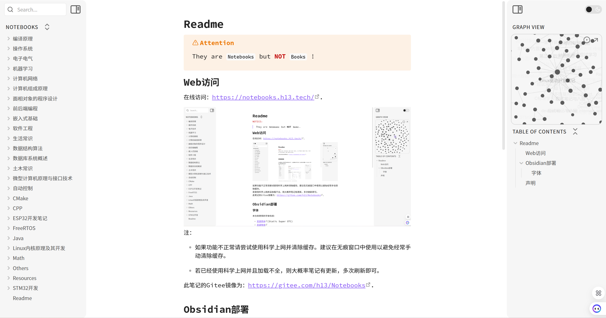

> [!attention]
> They are `Notebooks` but **NOT** `Books` !

## Web访问

在线访问：[https://notebooks.h13.tech/](https://notebooks.h13.tech/).

  

此笔记的Gitee镜像为：[https://gitee.com/h13/Notebooks](https://gitee.com/h13/Notebooks).  

## Obsidian部署

### 字体

本仓库使用的字体包括：
- [思源黑体](https://github.com/adobe-fonts/source-han-sans)(Static Super OTC)
- [思源等宽](https://github.com/adobe-fonts/source-han-mono)

## 声明

自用笔记，如有错误请提issue。  
<!--菜鸡的一个小笔记-->
