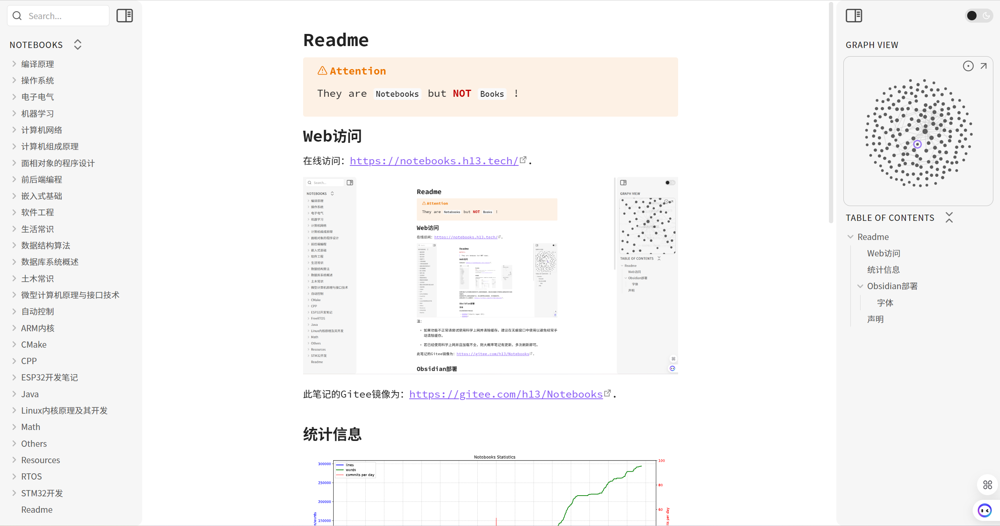

> [!attention]
> They are `Notebooks` but **NOT** `Books` !

# Web访问

在线访问：[http://notebooks.h13.tech/](http://notebooks.h13.tech/).

[订阅RSS](http://notebooks.h13.tech/site-lib/rss.xml)： `http://notebooks.h13.tech/site-lib/rss.xml`

# 统计信息

# 笔记仓库

笔记仓库：
- Github：[h13-0/Notebooks](https://github.com/h13-0/Notebooks) 
- Gitee：[https://gitee.com/h13/Notebooks](https://gitee.com/h13/Notebooks) 

# Obsidian部署

## 字体

本仓库使用的字体包括：
- [思源黑体](https://github.com/adobe-fonts/source-han-sans)(Static Super OTC)
- [思源等宽](https://github.com/adobe-fonts/source-han-mono)

# 声明

自用笔记，错误反馈渠道：
- [Github issue](https://github.com/h13-0/Notebooks/issues)
- [Web端](http://notebooks.h13.tech/)对应页面评论区
<!--菜鸡的一个小笔记-->
