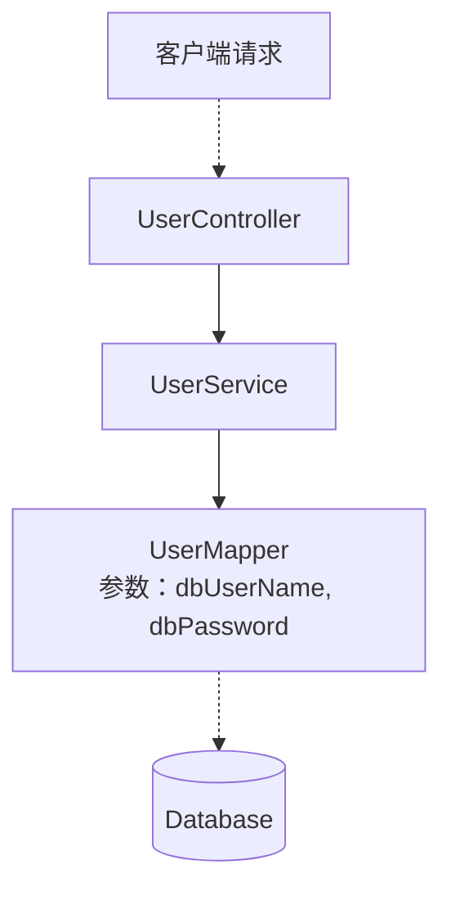

#后端 #Java #SSM框架

## 1 目录

```toc
```

## 2 Spring Framework框架简介

![[SSM框架概述#4 1 Spring Framework框架简介]]

## 3 Spring Framework的IoC容器

正如上一章节所述，Spring Framework提供了如下的功能：
- 自动创建、保存组件对象(即组件对象实例化)
- 自动进行组件对象的生命周期管理
- 自动进行组件的组装(DI依赖注入)
- 自动进行事务管理(TX)
- 与Spring全家桶的其他框架进行整合交互
而Spring要求的组件称为 `Spring Bean` ，其是在[[Java Bean]]要求的基础上进行规定的。
在Spring文档中， `Spring Bean` 被如下定义：

	In Spring, the objects that form the backbone of your application and that are managed by the Spring IoC container are called beans. A bean is an object that is instantiated, assembled, and otherwise managed by a Spring IoC container.

即：<font color="#c00000">构成应用程序主干并由Spring IoC容器管理的对象称为bean</font>。

|     | <center>[[Java Bean]]</center> | <center>Spring Bean</center>                                                                                                                                        |
| --- | ------------------------------ | ------------------------------------------------------------------------------------------------------------------------------------------------------------------- |
| 要求  | 任何符合要求的类都可以称之为Java Bean。       | <font color="#c00000">Spring Bean是在Spring IoC容器中被实例化、管理和维护的对象</font>。<br><font color="#c00000">一个Bean可以是任何普通的Java对象</font>，例如 POJO、Service、Respository、Controller等。 |

### 3.1 IoC容器与组件

通常来说Spring项目由如下三层组成：

![[Pasted image 20241008172108.png]]

通常来说：
- 控制层通常被命名为 `XxController` 。
- 业务逻辑层通常被命名为 `XxService` 。
- 持久化层通常被命名为 `XxMapper` 或者 `XxDao` 。

每一层都由组件构成，并且这些组件必须被放入Spring容器中才能使用一些由Spring提供的特性。而各层之间存在的有依赖关系，例如控制层在接收到请求后，会逐层调用业务逻辑层、持久化层后才能响应该请求。

而Spring可以管理并负责这些组件之间的依赖并完成装配。但是依赖信息需要由程序员按照如下三种方式之一来配置：
1. [[Spring Framework基础#3 3 1 使用xml配置组件及其依赖信息|xml配置方式]]
2. 注解配置方式
3. java类配置方式
具体的方式可见[[Spring Framework基础#3 3 IoC控制反转与DI依赖注入]]。

### 3.2 Spring IoC容器接口及其实现类介绍

在Spring中， `org.springframework.beans.factory` 包中定义了Spring IoC容器接口 `BeanFactory` 。在这个接口的定义下，Spring还提供了：

| <center>类型名</center>                 | <center>简介</center>                                                                          |
| ------------------------------------ | -------------------------------------------------------------------------------------------- |
| `ClassPathXmlApplicationContext`     | 通过读取类路径下(src下)的xml格式的配置文件创建IoC容器对象，即：<br>1. 配置方式为xml<br>2. xml文件在类路径下<br>时使用此接口。             |
| `FileSystemXmlApplicationContext`    | \[不常用\]通过文件系统路径下(其他路径)读取xml格式的配置文件创建IoC容器对象，即：<br>1. 配置方式为xml<br>2.xml文件在系统中的其他路径<br>时使用此接口。 |
| `AnnotationConfigApplicationContext` | 通过读取Java配置类创建IoC容器对象，即：<br>1. 配置文件使用的是Java类<br>时使用此接口。                                       |
| `WebApplicationContext`              | 专门为Web应用准备，基于Web环境创建IoC容器对象，<br>并将对象引入存入ServletContext域中，即：<br>1. 当前项目为Web项目<br>时使用此接口。      |

等常用接口，这些接口都是 `BeanFactory` 的拓展，提供了更多的特性和功能(即上述表格中"简介"的功能)。
本章节只做简单介绍，具体实现可见章节[[Spring Framework基础#3.4 Spring IoC容器创建和使用|Spring IoC容器创建和使用]]。

### 3.3 IoC控制反转、IoC容器，以及DI依赖注入

基本概念：
- <font color="#9bbb59">IoC</font>、<font color="#9bbb59">Inversion of Control</font>、<font color="#9bbb59">控制反转</font>：
	控制反转指的是在Spring中，类的控制权不再由开发者所编写的代码所有，而是直接归Spring IoC容器所有。在IoC容器中，
- <font color="#9bbb59">DI</font>、<font color="#9bbb59">Dependency injection</font>、<font color="#9bbb59">依赖注入</font>：
	在使用容器创建或使用组件时，往往会遇到依赖和参数传递的问题。而依赖注入就提供了将依赖关系在容器内部进行处理的解决方式。

而在使用IoC容器管理组件时，需要执行如下的步骤：
1. 通过 配置文件 <font color="#c00000">或</font> 注解 <font color="#c00000">或</font> 配置类 的方式表述需要容器管理的组件，以及组件之间的依赖关系。
2. 通过IoC容器接口实例化一个IoC容器对象(使用[[Spring Framework基础#3 2 Spring IoC容器接口及其实现类|IoC容器接口及其实现类]])。
3. 在Java代码中获取IoC容器中的组件并使用。

#### 3.3.1 IoC容器中组件的实例化
##### 3.3.1.1 使用xml完成IoC容器中组件的实例化

在工程中引入Spring相关的组件后，非社区板的IDEA就可以直接在 `resource` 目录下创建IoC组件的配置模板：

![[idea64_CfddUw9WFr.png]]

若没有该选项，则可以直接使用如下的基本模板：

```xml
<?xml version="1.0" encoding="UTF-8"?>  
<beans xmlns="http://www.springframework.org/schema/beans"  
       xmlns:xsi="http://www.w3.org/2001/XMLSchema-instance"  
       xsi:schemaLocation="http://www.springframework.org/schema/beans http://www.springframework.org/schema/beans/spring-beans.xsd">  

</beans>
```

xml文件放置于resources文件夹后，经过编译后均会出现在 `target/classes` 文件夹下。
<font color="#c00000">xml文件名可以随意命名</font>，因为<font color="#c00000">还需要调用对应的接口指定xml路径</font>才能让Spring完成IoC组件实例化。具体见章节[[Spring Framework基础#3 4 Spring IoC容器创建和使用|Spring IoC容器创建和使用]]。

随后在 `beans` 块中完成各bean的实例化配置即可。
实例化配置有如下几种方法：
1. 使用无参构造函数实例化
2. 使用静态工厂类(静态方法)实例化
3. 基于实例工厂方法(非静态方法)实例化

对应的实例化demo如下：

```xml
<?xml version="1.0" encoding="UTF-8"?>  
<beans xmlns="http://www.springframework.org/schema/beans"  
       xmlns:xsi="http://www.w3.org/2001/XMLSchema-instance"  
       xsi:schemaLocation="http://www.springframework.org/schema/beans http://www.springframework.org/schema/beans/spring-beans.xsd">  
  
    <!--  
        1. 使用无参构造函数实例化组件  
            等效伪代码为：  
                UserMapper userMapper1 = UserMapper();  
            id为组件标识，要求唯一  
            class为组价的全限定符  
    -->  
    <bean id="userMapper1" class="indi.h13.mappers.UserMapper"/>  
  
    <!--  
        一个类可以被实例化为多个不同id的组件  
    -->  
    <bean id="userMapper2" class="indi.h13.mappers.UserMapper"/>  
  
    <!--  
        2. 使用静态工厂类(静态方法)实例化组件  
            等效伪代码为：  
                UserService userService1 = UserService.createUserService();  
            id为组件标识，要求唯一  
            class为组价的全限定符  
            factory-method为静态实例化方法  
    -->  
    <bean id="userService1" class="indi.h13.services.UserService" factory-method="createUserService"/>  
  
    <!--  
        3. 基于实例工厂方法(非静态方法)实例化  
            需要先创建一个能生成该类的对象，随后用该对象生成目标对象。            等效伪代码为：  
                ServiceLocator serviceLocator = new ServiceLocator();                UserService userService2 = serviceLocator.createUserService();  
            id为Bean标识，要求唯一  
            factory-bean为生成该方法的Bean的id  
            factory-method为实例化该类的方法  
    -->  
    <bean id="serviceLocator" class="indi.h13.ServiceLocator" />  
    <bean id="userService2" factory-bean="serviceLocator" factory-method="createUserService" />  
  
</beans>
```

#### 3.3.2 IoC容器中的DI依赖注入

仿照Spring框架中的组件分层，可以先假设一个如下的组件依赖情况：



则上图的依赖关系为上一级依赖下一级，即：
- `UserController` 依赖 `UserService`
- `UserService` 依赖 `UserMapper`
- `UserMapper` 需要指定若干参数

而上述的依赖关系可以通过DI依赖注入完成，依赖注入有如下几种方法：
1. 构造函数传参
2. `setter` 方法传参

在后续子章节中，均假设：
1. `UserMapper` 注入到 `UserService` 时使用的是构造函数传参。
2. `UserService` 注入到 `UserController` 时使用的是 `setter` 接口。

并且给定Java代码如下：

UserMapper：

```Java
package indi.h13.mappers;  
  
public class UserMapper {  
	public UserMapper(String dbUserName, String dbPassword) {  
	    System.out.println("Created a UserMapper using a constructor with dbUserName " + dbUserName + ", dbPassword " + dbPassword);  
	}
}
```

UserService：

```Java
package indi.h13.services;  
import indi.h13.mappers.UserMapper; 
  
public class UserService {  
	private UserMapper mapper;
    public UserService(UserMapper mapper){ 
	    this.mapper = mapper;
    }  
}
```

UserController：

```Java
package indi.h13.controllers;  
import indi.h13.services.UserService;  
import lombok.Setter;  
  
@Setter  
public class UserController {  
    private UserService service;  
    public UserController() {}  
}
```

##### 3.3.2.1 使用xml完成DI依赖注入

在章节[[Spring Framework基础#3 3 1 1 使用xml完成IoC容器中组件的实例化|使用IoC完成容器中组件的实例化]]中给出了实例化的若干方法。在这些方法的基础之上完成了如下的两种DI依赖注入方式及其若干实现方法：

```xml
<?xml version="1.0" encoding="UTF-8"?>  
<beans xmlns="http://www.springframework.org/schema/beans"  
       xmlns:xsi="http://www.w3.org/2001/XMLSchema-instance"  
       xsi:schemaLocation="http://www.springframework.org/schema/beans http://www.springframework.org/schema/beans/spring-beans.xsd">  
  
    <bean id="userMapper" class="indi.h13.mappers.UserMapper">  
        <!--  
            构造函数注入，方式一：直接顺序填写参数  
            value为直接引用值。不管实际使用的是什么类型，在xml中均要配置为字符串。  
            ref为引用其他的spring bean。  
        -->  
        <constructor-arg value="root"/> <!-- dbUserName = "root" -->  
        <constructor-arg value="pswd"/> <!-- dbPassword = "pswd" -->  
    </bean>  
  
    <bean id="userService" class="indi.h13.services.UserService">  
        <!--  
            构造函数注入，方式二[推荐]：指定参数名称并给定值  
            value为直接引用值。不管实际使用的是什么类型，在xml中均要配置为字符串。  
            ref为引用其他的spring bean。  
        -->  
        <constructor-arg name="mapper" ref="userMapper"/>  
    </bean>  

    <bean id="userMapper2" class="indi.h13.mappers.UserMapper">  
        <!--  
            构造函数注入，方式三：指定参数角标并赋值
        -->  
        <constructor-arg index="0" value="root"/> <!-- dbUserName = "root" -->  
        <constructor-arg index="1" value="pswd"/> <!-- dbPassword = "pswd" --> 
    </bean>  

    <bean id="userController" class="indi.h13.controllers.UserController">  
        <!--  
	        setter接口注入[重要]：使用setter接口注入。此时使用property标签  
            name为setter实际操作的私有变量的名称  
        -->  
        <property name="service" ref="userService"/>  
    </bean>
</beans>
```


### 3.4 Spring IoC容器创建和使用

上述章节介绍了在IoC中注册组件和管理组件的方式，本章节将具体讲解IoC容器的创建和使用。

#### 3.4.1 创建IoC容器

如章节3.2所述，Spring IoC容器提供了如下的实现类：

![[Spring Framework基础#3 2 Spring IoC容器接口及其实现类介绍]]

在本章主要给出如下几种实例化容器的方法：

```Java
// 1. [推荐]直接指定类路径下的xml文件名实例化
ApplicationContext context = new ClassPathXmlApplicationContext("spring-01.xml");

// 2. [了解]先创建容器，随后指定配置文件并刷新
// 在Spring框架中使用的是本方法
ApplicationContext context = new ClassPathXmlApplicationContext();
context.setConfigLocations("spring-01.xml");
context.refresh();
```

#### 3.4.2 操作IoC容器

##### 3.4.2.1 获取容器中的组件

```Java
// 方式1[不推荐]：使用 `beanId` 获取，返回值类型为Object，需要使用强制类型转换操作对象。  
Object userMapperBean = context.getBean("userMapper");  
UserMapper userMapper = (UserMapper)userMapperBean;  
  
// 方式2[推荐]：使用 `beanId` 获取，同时指定类型  
// 此时不需要强转  
userMapper = context.getBean("userMapper", UserMapper.class);  
  
// 方式3：只使用类型获取，此时注意：  
// 1. 此方法只支持单例，即同一个类型在容器中只有一个Bean。否则运行时出错(NoUniqueBeanDefinitionException)  
// 2. 当使用父类或接口作为类型去获取时，也可以正常获取(只要 bean instanceof A.class == true即可，且整个项目中该父类只有一个实例)  
userMapper = context.getBean(UserMapper.class);
```


