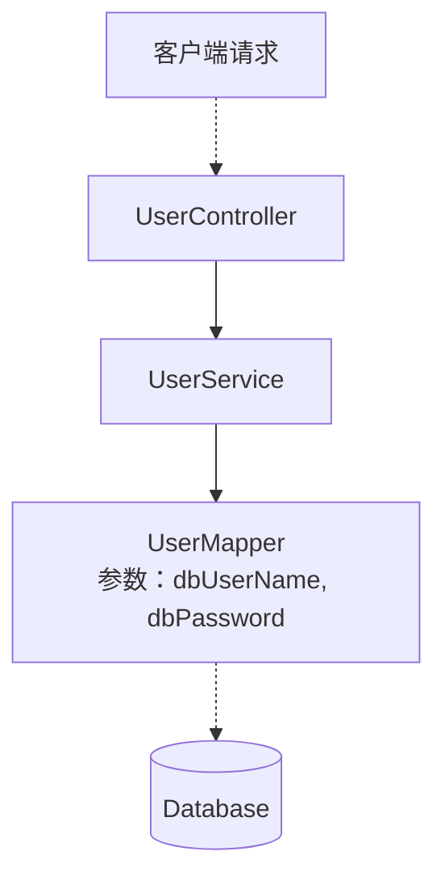
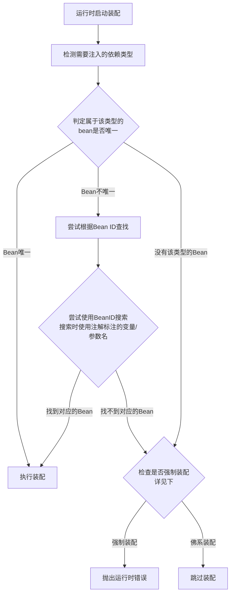

#后端 #Java #SSM框架

## 1 目录

```toc
```

## 2 Spring Framework框架简介

![[SSM框架概述#4 1 Spring Framework框架简介]]

## 3 Spring Framework的IoC容器

正如上一章节所述，Spring Framework提供了如下的功能：
- 自动创建、保存组件对象(即组件对象实例化)
- 自动进行组件对象的生命周期管理
- 自动进行组件的组装(DI依赖注入)
- 自动进行事务管理(TX)
- 与Spring全家桶的其他框架进行整合交互
而Spring要求的组件称为 `Spring Bean` ，其是在[[Java Bean]]要求的基础上进行规定的。
在Spring文档中， `Spring Bean` 被如下定义：

	In Spring, the objects that form the backbone of your application and that are managed by the Spring IoC container are called beans. A bean is an object that is instantiated, assembled, and otherwise managed by a Spring IoC container.

即：<font color="#c00000">构成应用程序主干并由Spring IoC容器管理的对象称为bean</font>。

|     | <center>[[Java Bean]]</center> | <center>Spring Bean</center>                                                                                                                                        |
| --- | ------------------------------ | ------------------------------------------------------------------------------------------------------------------------------------------------------------------- |
| 要求  | 任何符合要求的类都可以称之为Java Bean。       | <font color="#c00000">Spring Bean是在Spring IoC容器中被实例化、管理和维护的对象</font>。<br><font color="#c00000">一个Bean可以是任何普通的Java对象</font>，例如 POJO、Service、Respository、Controller等。 |

### 3.1 IoC容器与组件

通常来说Spring项目由如下三层组成：

![[Pasted image 20241008172108.png]]

通常来说：
- 控制层通常被命名为 `XxController` 。
- 业务逻辑层通常被命名为 `XxService` 。
- 持久化层通常被命名为 `XxMapper` 或者 `XxDao` 。

每一层都由组件构成，并且这些组件必须被放入Spring容器中才能使用一些由Spring提供的特性。而各层之间存在的有依赖关系，例如控制层在接收到请求后，会逐层调用业务逻辑层、持久化层后才能响应该请求。

而Spring可以管理并负责这些组件之间的依赖并完成装配。但是依赖信息需要由程序员按照如下三种方式之一来配置：
1. [[Spring Framework基础#3 3 1 使用xml配置组件及其依赖信息|xml配置方式]]
2. 注解配置方式
3. java类配置方式
具体的方式可见[[Spring Framework基础#3 3 IoC控制反转与DI依赖注入]]。

### 3.2 Spring IoC容器接口及其实现类介绍

在Spring中， `org.springframework.beans.factory` 包中定义了Spring IoC容器接口 `BeanFactory` 。在这个接口的定义下，Spring还提供了：

| <center>类型名</center>                 | <center>简介</center>                                                                          |
| ------------------------------------ | -------------------------------------------------------------------------------------------- |
| `ClassPathXmlApplicationContext`     | 通过读取类路径下(src下)的xml格式的配置文件创建IoC容器对象，即：<br>1. 配置方式为xml<br>2. xml文件在类路径下<br>时使用此接口。             |
| `FileSystemXmlApplicationContext`    | \[不常用\]通过文件系统路径下(其他路径)读取xml格式的配置文件创建IoC容器对象，即：<br>1. 配置方式为xml<br>2.xml文件在系统中的其他路径<br>时使用此接口。 |
| `AnnotationConfigApplicationContext` | 通过读取Java配置类创建IoC容器对象，即：<br>1. 配置文件使用的是Java类<br>时使用此接口。                                       |
| `WebApplicationContext`              | 专门为Web应用准备，基于Web环境创建IoC容器对象，<br>并将对象引入存入ServletContext域中，即：<br>1. 当前项目为Web项目<br>时使用此接口。      |

等常用接口，这些接口都是 `BeanFactory` 的拓展，提供了更多的特性和功能(即上述表格中"简介"的功能)。
本章节只做简单介绍，具体实现可见章节[[Spring Framework基础#3.4 Spring IoC容器创建和使用|Spring IoC容器创建和使用]]。

### 3.3 IoC控制反转、IoC容器，以及DI依赖注入

基本概念：
- <font color="#9bbb59">IoC</font>、<font color="#9bbb59">Inversion of Control</font>、<font color="#9bbb59">控制反转</font>：
	控制反转指的是在Spring中，类的控制权不再由开发者所编写的代码所有，而是直接归Spring IoC容器所有。在IoC容器中，
- <font color="#9bbb59">DI</font>、<font color="#9bbb59">Dependency injection</font>、<font color="#9bbb59">依赖注入</font>：
	在使用容器创建或使用组件时，往往会遇到依赖和参数传递的问题。而依赖注入就提供了将依赖关系在容器内部进行处理的解决方式。

而在使用IoC容器管理组件时，需要执行如下的步骤：
1. 通过 配置文件 <font color="#c00000">或</font> 注解 <font color="#c00000">或</font> 配置类 的方式表述需要容器管理的组件，以及组件之间的依赖关系。
2. 通过IoC容器接口实例化一个IoC容器对象(使用[[Spring Framework基础#3 2 Spring IoC容器接口及其实现类|IoC容器接口及其实现类]])。
3. 在Java代码中获取IoC容器中的组件并使用。

仿照Spring框架中的三层组件分层，可以先假设一个如下的组件依赖情况：



则上图的依赖关系为上一级依赖下一级，即：
- `UserController` 依赖 `UserService`
- `UserService` 依赖 `UserMapper`
- `UserMapper` 需要指定若干参数

而上述的依赖关系可以通过DI依赖注入完成，依赖注入有如下几种方法：
1. 构造函数传参
2. `setter` 方法传参
3. 使用注解自动装配

在后续子章节中，均假设：
1. `UserMapper` 注入到 `UserService` 时使用的是构造函数传参。
2. `UserService` 注入到 `UserController` 时：
	1. 在xml方式的示例中使用的是 `setter` 接口。
	2. 在注解方式的实例中使用的是注解自动装配。

并且给定Java代码如下：

`UserMapper.java`：

```Java
package indi.h13.mappers;  
  
public class UserMapper {  
	public UserMapper(String dbUserName, String dbPassword) {  
	    System.out.println("Created a UserMapper using a constructor with dbUserName " + dbUserName + ", dbPassword " + dbPassword);  
	}
}
```

`UserService.java`：

```Java
package indi.h13.services;  
import indi.h13.mappers.UserMapper; 
  
public class UserService {  
	private UserMapper mapper;
    public UserService(UserMapper mapper){ 
	    this.mapper = mapper;
    }  
}
```

`UserController.java`：

```Java
package indi.h13.controllers;  
import indi.h13.services.UserService;  
  
public class UserController {  
    private UserService service;  
    public UserController() {}  
}
```

#### 3.3.1 IoC容器中组件的实例化

##### 3.3.1.1 使用xml完成IoC容器中组件的实例化

在工程中引入Spring相关的组件后，非社区板的IDEA就可以直接在 `resource` 目录下创建IoC组件的配置模板：

![[idea64_CfddUw9WFr.png]]

若没有该选项，则可以直接使用如下的基本模板：

```xml
<?xml version="1.0" encoding="UTF-8"?>  
<beans xmlns="http://www.springframework.org/schema/beans"  
       xmlns:xsi="http://www.w3.org/2001/XMLSchema-instance"  
       xsi:schemaLocation="http://www.springframework.org/schema/beans http://www.springframework.org/schema/beans/spring-beans.xsd">  

</beans>
```

xml文件放置于resources文件夹后，经过编译后均会出现在 `target/classes` 文件夹下。
<font color="#c00000">xml文件名可以随意命名</font>，因为<font color="#c00000">还需要调用对应的接口指定xml路径</font>才能让Spring完成IoC组件实例化。具体见章节[[Spring Framework基础#3 4 Spring IoC容器创建和使用|Spring IoC容器创建和使用]]。

随后在 `beans` 块中完成各bean的实例化配置即可。
实例化配置有如下几种方法：
1. 使用无参构造函数实例化
2. 使用静态工厂类(静态方法)实例化
3. 基于实例工厂方法(非静态方法)实例化

对应的实例化demo如下：

```xml
<?xml version="1.0" encoding="UTF-8"?>  
<beans xmlns="http://www.springframework.org/schema/beans"  
       xmlns:xsi="http://www.w3.org/2001/XMLSchema-instance"  
       xsi:schemaLocation="http://www.springframework.org/schema/beans http://www.springframework.org/schema/beans/spring-beans.xsd">  
  
    <!--  
        1. 使用无参构造函数实例化组件  
            等效伪代码为：  
                UserMapper userMapper1 = UserMapper();  
            id为组件标识，要求唯一  
            class为组价的全限定符  
    -->  
    <bean id="userMapper1" class="indi.h13.mappers.UserMapper"/>  
  
    <!--  
        一个类可以被实例化为多个不同id的组件  
    -->  
    <bean id="userMapper2" class="indi.h13.mappers.UserMapper"/>  
  
    <!--  
        2. 使用静态工厂类(静态方法)实例化组件  
            等效伪代码为：  
                UserService userService1 = UserService.createUserService();  
            id为组件标识，要求唯一  
            class为组价的全限定符  
            factory-method为静态实例化方法  
    -->  
    <bean id="userService1" class="indi.h13.services.UserService" factory-method="createUserService"/>  
  
    <!--  
        3. 基于实例工厂方法(非静态方法)实例化  
            需要先创建一个能生成该类的对象，随后用该对象生成目标对象。            等效伪代码为：  
                ServiceLocator serviceLocator = new ServiceLocator();                UserService userService2 = serviceLocator.createUserService();  
            id为Bean标识，要求唯一  
            factory-bean为生成该方法的Bean的id  
            factory-method为实例化该类的方法  
    -->  
    <bean id="serviceLocator" class="indi.h13.ServiceLocator" />  
    <bean id="userService2" factory-bean="serviceLocator" factory-method="createUserService" />  
  
</beans>
```

##### 3.3.1.2 使用注解完成IoC容器中组件的实例化

使用注解完成IoC容器中组件的实例化步骤有：
1. 在类上添加IoC注解，IoC为组件提供的注解可见下方列表。
2. 向Spring IoC中容器添加需要扫描含有IoC注解的Package(即配置注解生效包)

IoC为组件提供的注解有：

| <center>注解</center> | <center>含义及用途</center>                                                                                                                                                   |
| ------------------- | ------------------------------------------------------------------------------------------------------------------------------------------------------------------------ |
| `@Component`        | 该注解用于描述Spring中的组件。<br><span style="background:#fff88f"><font color="#c00000">Spring中的任意组件均可使用该注解</font></span>，包括但不限于Spring三层架构中的任意一层。<br>在非三层架构的组件开发中常用。<br>该注解用于标注于类上。 |
| `@Repository`       | 功能与 `@Component` 没有任何区别。<br>但是在程序可读性上用于向程序员表示该组件属于数据访问层。                                                                                                                 |
| `@Service`          | 功能与 `@Component` 没有任何区别。<br>但是在程序可读性上用于向程序员表示该组件属于业务逻辑层。                                                                                                                 |
| `@Controller`       | 功能与 `@Component` 没有任何区别。<br>但是在程序可读性上用于向程序员表示该组件属于控制层。                                                                                                                   |

因此，上述三个实例Java类用注解实例化的示例为：

`UserController.java`：

```Java
package indi.h13.controllers;  
import indi.h13.services.UserService;  

@Controller
public class UserController {  
    private UserService service;  
    public UserController() {}  
}
```

注：
- 上述情况下的 `@Controller` 注解等效于xml配置 `<bean id="userController" class="indi.h13.controllers.UserController />"`
- 其<font color="#c00000">默认Bean id为类首字母小写的写法</font>，即 `userController` ，<font color="#c00000">修改方式可见下例</font>。

`UserMapper.java`：

```Java
package indi.h13.mappers;  

@Repository(value="userMapper01")
public class UserMapper {  
	public UserMapper(String dbUserName, String dbPassword) {  
	    System.out.println("Created a UserMapper using a constructor with dbUserName " + dbUserName + ", dbPassword " + dbPassword);  
	}
}
```

注：
- <span style="background:#fff88f"><font color="#c00000">注解中的value属性用于修改Bean id</font></span>，修改为 `userMapper01`
- 单参数时可以省略为 `@Repository("userMapper01")`

`UserService.java`：

```Java
package indi.h13.services;  
import indi.h13.mappers.UserMapper; 

@Service
public class UserService {  
	private UserMapper mapper;
    public UserService(UserMapper mapper){ 
	    this.mapper = mapper;
    }  
}
```

随后执行第二步，配置注解生效包。配置注解生效包需要在xml文件中进行。
和上一小节中使用xml完成实例化相同，通常在 `resources` 文件夹下创建一个Spring Config模板文件，并向其中添加若干可选配置语句即可。
可选的配置语句有：
1. 添加注解生效包
2. <font color="#c00000">添加</font>指定包下<font color="#c00000">除了指定注解以外的所有注解</font>
3. <font color="#c00000">只添加</font>指定包下的<font color="#c00000">指定注解</font>
Demo如下：

```xml
<?xml version="1.0" encoding="UTF-8"?>  
<beans xmlns="http://www.springframework.org/schema/beans"  
       xmlns:xsi="http://www.w3.org/2001/XMLSchema-instance"  
       xmlns:context="http://www.springframework.org/schema/context"  
       xsi:schemaLocation="http://www.springframework.org/schema/beans http://www.springframework.org/schema/beans/spring-beans.xsd http://www.springframework.org/schema/context https://www.springframework.org/schema/context/spring-context.xsd">  
  
    <!-- 以下Demo为独立Demo，根据需求选用一个即可 -->  
    <!-- Demo 1: 扫描包indi.h13下所有关于组件的注解 -->  
    <context:component-scan base-package="indi.h13"/>  
  
    <!-- Demo 2: 扫描包indi.h13下除了Service以外的注解 -->  
    <context:component-scan base-package="indi.h13">  
        <!-- 屏蔽Service注解 -->  
        <context:exclude-filter type="annotation" expression="org.springframework.stereotype.Service"/>  
    </context:component-scan>  
  
    <!-- Demo 3: 扫描包indi.h13下所有Controller注解(只要Controller) -->  
    <!-- 注意多了个 use-default-filters 属性!!! -->  
    <context:component-scan base-package="indi.h13" use-default-filters="false">  
        <!-- 只扫描(保留)Controller注解 -->  
        <context:include-filter type="annotation" expression="org.springframework.stereotype.Controller"/>  
    </context:component-scan>  
  
</beans>
```

#### 3.3.2 IoC容器中的DI依赖注入

##### 3.3.2.1 使用xml完成DI依赖注入

在章节[[Spring Framework基础#3 3 1 1 使用xml完成IoC容器中组件的实例化|使用IoC完成容器中组件的实例化]]中给出了实例化的若干方法。在这些方法的基础之上完成了如下的两种DI依赖注入方式及其若干实现方法：

```xml
<?xml version="1.0" encoding="UTF-8"?>  
<beans xmlns="http://www.springframework.org/schema/beans"  
       xmlns:xsi="http://www.w3.org/2001/XMLSchema-instance"  
       xsi:schemaLocation="http://www.springframework.org/schema/beans http://www.springframework.org/schema/beans/spring-beans.xsd">  
  
    <bean id="userMapper" class="indi.h13.mappers.UserMapper">  
        <!--  
            构造函数注入，方式一：直接顺序填写参数  
            value为直接引用值。不管实际使用的是什么类型，在xml中均要配置为字符串。  
            ref为引用其他的spring bean。  
        -->  
        <constructor-arg value="root"/> <!-- dbUserName = "root" -->  
        <constructor-arg value="pswd"/> <!-- dbPassword = "pswd" -->  
    </bean>  
  
    <bean id="userService" class="indi.h13.services.UserService">  
        <!--  
            构造函数注入，方式二[推荐]：指定参数名称并给定值  
            value为直接引用值。不管实际使用的是什么类型，在xml中均要配置为字符串。  
            ref为引用其他的spring bean。  
        -->  
        <constructor-arg name="mapper" ref="userMapper"/>  
    </bean>  

    <bean id="userMapper2" class="indi.h13.mappers.UserMapper">  
        <!--  
            构造函数注入，方式三：指定参数角标并赋值
        -->  
        <constructor-arg index="0" value="root"/> <!-- dbUserName = "root" -->  
        <constructor-arg index="1" value="pswd"/> <!-- dbPassword = "pswd" --> 
    </bean>  

    <bean id="userController" class="indi.h13.controllers.UserController">  
        <!--  
	        setter接口注入[重要]：使用setter接口注入。此时使用property标签  
            name为setter实际操作的私有变量的名称  
        -->  
        <property name="service" ref="userService"/>  
    </bean>
</beans>
```

需要注意的是，上述例子中的最后一种使用setter接口的方法需要实现setter方法：

`UserController.java`：

```Java
package indi.h13.controllers;  
import indi.h13.services.UserService;  
import lombok.Setter;  

@Setter
public class UserController {  
    private UserService service;  
    public UserController() {}  
}
```

##### 3.3.2.2 使用注解完成依赖注入

与xml配置中一样，使用注解的依赖注入也可以分为引用类型装配和值类型装配。
值类型的装配使用注解：
- `@Value`
使用注解完成依赖注入时，可以使用：
- `@Autowired` 注解
- `@Qualifier` 注解
- `@Resource` 注解
其各种特性如后续子章节所述。

###### 3.3.2.2.1 使用Value进行值类型装配

`@Autowired` 注解的特性有：
- 该注解可以被加到：
	- 类的一个字段上。
	- 类的某个方法上
	- 方法的形参上。<font color="#c00000">可直接完成setter方法的依赖注入</font>。
	- 注解上

在父章节中的例子中，`UserMapper.java` 需要指定数据库用户名和密码，在使用注解完成依赖注入时可以按照如下的方式处理：

方式一，直接给定值(不常用，和直接代码里面写死没太大差异)：

```Java
package indi.h13.mappers;  

@Repository(value="userMapper01")
public class UserMapper {  
	@Value("root")
	private String dbUserName;
	@Value("pswd")
	private String dbPassword;

	public UserMapper() {  
	    System.out.println("Created a UserMapper using a constructor with dbUserName " + this.dbUserName + ", dbPassword " + this.dbPassword);  
	}
}
```

<span style="background:#fff88f"><font color="#c00000">方式二，引用配置文件(推荐)</font></span>：

配置文件可以存放于 `resources` 文件夹下，在SpringConfig的xml配置文件中添加 `context:property-placeholder` 块即可完成配置，示例如下：

```xml
<?xml version="1.0" encoding="UTF-8"?>  
<beans xmlns="http://www.springframework.org/schema/beans"  
       xmlns:xsi="http://www.w3.org/2001/XMLSchema-instance"  
       xsi:schemaLocation="http://www.springframework.org/schema/beans http://www.springframework.org/schema/beans/spring-beans.xsd">  

	<context:property-placeholder location="classpath:jdbc.properties"/>
	
</beans>
```

上述示例中， `jdbc.properties` 为配置文件名，且通常使用此名称。
随后可以在上述文件中写入如下配置，即可使用 `Value` 注解读取并注入依赖：

```
jdbc.username=root
jdbc.password=pswd
```

随后使用如下的注解即可完成注入：

```Java
package indi.h13.mappers;  

@Repository(value="userMapper01")
public class UserMapper {  
	@Value("${jdbc.username:admin}")
	private String dbUserName;
	@Value("${jdbc.password}")
	private String dbPassword;

	public UserMapper() {  
	    System.out.println("Created a UserMapper using a constructor with dbUserName " + this.dbUserName + ", dbPassword " + this.dbPassword);  
	}
}
```

注：
- `@Value("${jdbc.username:admin}")` 表示若配置文件中不含 `jdbc.username` 项，则填入默认值 `admin` 。

###### 3.3.2.2.2 使用Autowired进行引用类型装配

`@Autowired` 注解的特性有：
- 该注解可以被加到：
	- 构造函数上。<font color="#c00000">可直接完成构造函数传参方式的依赖注入</font>。
	- 类的某个方法上
	- 方法的形参上。<font color="#c00000">可直接完成setter方法的依赖注入</font>。
	- 类的一个字段上。
	- 注解上
- <font color="#c00000">可以配置是否是佛系装配</font>。即找不到满足要求的组件时跳过装配。不过该方法不常用也不推荐使用。
- <font color="#c00000">注解实现依赖注入的工作流程</font>：

- <span style="background:#fff88f"><font color="#c00000">使用该注解不需要提供setter方法，并且在实际工程中应当使用此方法</font></span>

使用Demo为：

`UserService.java`：

```Java
package indi.h13.services;  
import indi.h13.mappers.UserMapper; 

@Service
public class UserService {  
	private UserMapper mapper;
	@Autowired
    public UserService(UserMapper userMapper){ 
	    this.mapper = mapper;
    }  
}
```

注：
- 上述例子直接根据 `UserMapper` 类型寻找组件并装配

`UserController.java`：

```Java
package indi.h13.controllers;  
import indi.h13.services.UserService;  

@Controller
public class UserController {  
	@Autowired(required=false)
    private UserService service;  
    public UserController() {}  
}
```

注：
- 上述例子中设置了 `required=false` ，<font color="#c00000">找不到满足要求的组件时可以跳过</font>。
- <span style="background:#fff88f"><font color="#c00000">如果不指定该属性，则默认为强制装配</font></span>。

###### 3.3.2.2.3 使用Qualifier指定BeanID进行引用类型装配

`@Qualifier` 注解的特性有：
- 直接使用BeanID进行查找装配
本注解可以用于多实例的容器，在多实例时可以指定Bean ID来进行装配。不过不常用。

假设组件 `UserMapper` 的Bean ID为 `userMapper1` 和 `userMapper2` ，则可以通过使用 `@Qualifier` 指定ID的方式来进行指定装配。

`UserService.java`：

```Java
package indi.h13.services;  
import indi.h13.mappers.UserMapper; 

@Service
public class UserService {  
	private UserMapper mapper;
	@Qualifier(value="userMapper1")
    public UserService(UserMapper userMapper){ 
	    this.mapper = mapper;
    }  
}
```

注：
- `@Autowired` 在多例模式下，也可以通过搜索属性/参数名的方式搜索对应的BeanID，即下方代码也可以实现上述效果：
	```Java
package indi.h13.services;  
import indi.h13.mappers.UserMapper; 

@Service
public class UserService {  
	private UserMapper mapper;
	// 下方注解会先搜索UserMapper类的组件
	// 若找到多例，则根据userMapper1这个参数名来搜索BeanID
	@Autowired
    public UserService(UserMapper userMapper1){ 
	    this.mapper = mapper;
    }  
}
	```

###### 3.3.2.2.4 使用Resource注解先匹配类型后尝试ID进行引用类型装配

`@Resource` 注解是由Java定义的一种规范，由Spring实现的注解。该注解的功能是先使用Autowire进行尝试装配，若失败后再尝试使用Qualifier装配的一种注解。
功能逻辑如下：

```mermaid
flowchart TB
	A["@Resource(name=xx)"] --> B{尝试使用@Autowired装配}
	B -- 匹配成功 --> C[装配成功]
	B -- 匹配失败 --> D{"尝试使用@Qualifier(name=xx)装配"}
	D -- 匹配成功 --> C[装配成功]
	D -- 匹配失败 --> E[装配失败、运行时错误]
```

#### 3.3.3 引入第三方Bean组件

引入第三方Bean组件也是开发中常用的一个需求或实现方式，而第三方的Bean组件在装配的时候也需要指定Bean ID，并且往往也需要DI依赖注入。
这里以引入druid连接池 `com.alibaba.druid` 为例，完成以下内容： 
1. 将 `com.alibaba.druid.pool.DruidDataSource` 实例化为Bean ID为 `dataSource` 的组件。
2. 将：
	- `url`：存放于 `jdbc.properties` 中的 `jdbc.url` 中。
	- `driverClassName`：存放于 `jdbc.properties` 中的 `jdbc.driver` 中。
	- `username`：存放于 `jdbc.properties` 中的 `jdbc.username` 中。
	- `password`：存放于 `jdbc.properties` 中的 `jdbc.password` 中。
	注入组件
则xml配置和注解配置方式分别如子章节所述。

##### 3.3.3.1 使用xml引入第三方Bean组件

在SpringConfig中完成如下内容：

```xml
<?xml version="1.0" encoding="UTF-8"?>  
<beans xmlns="http://www.springframework.org/schema/beans"  
       xmlns:xsi="http://www.w3.org/2001/XMLSchema-instance"  
       xsi:schemaLocation="http://www.springframework.org/schema/beans http://www.springframework.org/schema/beans/spring-beans.xsd">  

	<context:property-placeholder location="classpath:jdbc.properties"/>

    <bean id="dataSource" class="com.alibaba.druid.pool.DruidDataSource">  
	    <property name="url" value="{jdbc.url}" />
	    <property name="driverClassName" value="{jdbc.driver}" />
	    <property name="username" value="{jdbc.username}" />
	    <property name="password" value="{jdbc.password}" />
    </bean>  
    
</beans>
```

即可实现引入第三方组件。

##### 3.3.3.2 使用注解引入第三方Bean组件

本章节的方法涉及注解配置类，详见：
![[Spring Framework基础#3 3 4 2 使用注解配置类引入第三方Bean]]

#### 3.3.4 使用配置类代替注解开发中的xml操作

在上述使用注解进行组件实例化和依赖注入时，都需要对xml进行配置，指定组件扫描和设置外部配置文件。而配置类就是用于替代xml操作的一种方法。
通常的操作是创建一个 `config` 包，编写 `JavaConfiguration` 类(<font color="#c00000">类名包名随意，在IoC容器创建时引用即可</font>)，具体操作为：
1. 为 `JavaConfiguration` 类添加 `@Configuration` 注解、
2. 配置包扫描配置注解( `@ComponentScan` )
3. 配置外部配置文件注解( `@PropertySource` )
4. 声明依赖的第三方Bean组件

##### 3.3.4.1 使用注解配置类完成包扫描配置和外部配置文件配置

Demo如下：

```Java
// 配置包扫描注解，`value = ` 可以省略
@ComponentScan(value = { "indi.h13.package1", "indi.h13.package2", ...})
// 配置配置文件名注解，`value = ` 可以省略
@PropertySource(value = "classpath:jdbc.properties")
@Configuration
public class JavaConfiguration {
}
```

此时的配置类与如下的xml等效：

```xml
<?xml version="1.0" encoding="UTF-8"?>  
<beans xmlns="http://www.springframework.org/schema/beans"  
       xmlns:xsi="http://www.w3.org/2001/XMLSchema-instance"  
       xsi:schemaLocation="http://www.springframework.org/schema/beans http://www.springframework.org/schema/beans/spring-beans.xsd">  

    <context:component-scan base-package="indi.h13.package1"/>  
    <context:component-scan base-package="indi.h13.package2"/>  
	<context:property-placeholder location="classpath:jdbc.properties"/>
	
</beans>
```

##### 3.3.4.2 使用注解配置类引入第三方Bean

本章节中注解配置类的基本假设同[[Spring Framework基础#3 3 3 引入第三方Bean组件|引入第三方Bean组件]]。
为满足上述要求，则应在上一子章节的注解配置类中添加如下代码和 `@Bean` 注解：

```Java
// 配置包扫描注解，`value = ` 可以省略
@ComponentScan(value = { "indi.h13.package1", "indi.h13.package2", ...})
// 配置配置文件名注解，`value = ` 可以省略
@PropertySource(value = "classpath:jdbc.properties")
@Configuration
public class JavaConfiguration {

	@Value("{jdbc.url}")
	private String url;
	@Value("{jdbc.driver}")
	private String driver;
	@Value("{jdbc.username}")
	private String username;
	@Value("{jdbc.password}")
	private String password;
	
	@Bean
	public DruidDataSource dataSource() {
		DruidDataSource dataSource = new DruidDataSource();
		dataSource.setUrl(this.url);
		dataSource.setDriverClassName(this.driver);
		dataSource.setUsername(this.username);
		dataSource.setPassword(this.password);
		return dataSource;
	}
}
```

在上述示例中：
- @Bean生成的组件ID与方法名相同
- @Bean生成的组件类型与方法的返回类型相同
- @Bean注解会自动生成组件并组装

###### 3.3.4.2.1 @Bean详解

@Bean是Spring中的一种用于直接生成Bean组件的注解，<font color="#c00000">其最标准的使用方式是定义于@Configuration所注解的配置类中</font>。其拥有如下的配置参数：
- `name` & `value`：指定Bean ID。缺省时生成的组件ID与方法名相同。
- `initMethod` & `destroyMethod`：指定初始化和销毁方法。默认时调用Bean类型的初始化和销毁方法。
- `autowireCandidate`：是否允许该组件被其他组件引用或修改。
@Bean生成的组件也可以使用后续章节中的注解修改组件作用域的方法。

##### 3.3.4.3 使用Import注解合并多个配置类

@Import注解的作用就是将一个配置类导入到另一个配置类中，其效果等效于将多个配置类合并为一个配置类。

Demo：

```Java
@ComponentScan(value = { "indi.h13.package1", "indi.h13.package2", ...})
@PropertySource(value = "classpath:jdbc.properties")
@Configuration
public class JavaConfiguration1 {
}
```

```Java
@ComponentScan(value = { "indi.h13.package3", "indi.h13.package4", ...})
@PropertySource(value = "classpath:jdbc.properties")
@Configuration
public class JavaConfiguration2 {
}
```

随后可以使用@Import注解将 `JavaConfiguration2` 合并进 `JavaConfiguration1` ：

```Java
@Import(JavaConfiguration2.class)
@ComponentScan(value = { "indi.h13.package1", "indi.h13.package2", ...})
@PropertySource(value = "classpath:jdbc.properties")
@Configuration
public class JavaConfiguration1 {
}
```

然后在创建IoC容器时指定 `JavaConfiguration1` 即可创建容器。创建IoC容器的具体操作见后续章节。

#### 3.3.5 组件作用域

<font color="#c00000">Spring的组件作用域是指在IoC容器中被创建、存活以及被访问的规则</font>。
Spring组件作用域主要有如下几种：
1. <font color="#c00000">Singleton，单例模式</font>：
	- 本模式为Spring的默认作用域
	- 在单例模式下，一个IoC容器中一个组件只会有一个实例
2. <font color="#c00000">Prototype，原型模式</font>：
	- 每次：
		- 使用IoC容器进行 `getBean()` 时(见：[[Spring Framework基础#3 4 2 1 获取容器中的组件|获取容器中的组件]])
		- 或每次注入依赖时
	- 时都会创建一个新的实例
3. Request，请求模式
4. Session，会话模式
5. Application，应用模式
6. Websocket，Websocket会话模式
通常来说使用的都是单例模式。

### 3.4 Spring IoC容器创建和使用

上述章节介绍了在IoC中注册组件和管理组件的方式，本章节将具体讲解IoC容器的创建和使用。

#### 3.4.1 创建IoC容器

如章节3.2所述，Spring IoC容器提供了如下的实现类：

![[Spring Framework基础#3 2 Spring IoC容器接口及其实现类介绍]]

在本章主要给出如子章节所述的几种实例化容器的方法。

##### 3.4.1.1 读取xml配置文件实例化IoC容器

下方提供了两种读取xml配置文件实例化IoC容器的方法：
1. 直接指定类路径下的xml文件名实例化
2. 先创建容器，随后指定配置文件并刷新
其中方法1更常用，但是方法2也需要了解，因为在Spring框架中使用的是本方法

```Java
// 1. [重要]直接指定类路径下的xml文件名实例化
ApplicationContext context = new ClassPathXmlApplicationContext("spring-01.xml");

// 2. [了解]先创建容器，随后指定配置文件并刷新
// 在Spring框架中使用的是本方法
ApplicationContext context = new ClassPathXmlApplicationContext();
context.setConfigLocations("spring-01.xml");
context.refresh();
```

##### 3.4.1.2 \[推荐\]使用配置类实例化IoC容器

下方也提供了两种使用配置类实例化IoC容器的方法，重点是第一种。

```Java
// 1. [重要]使用配置类实例化容器
ApplicationContext context = new AnnotationConfigApplicationContext(JavaConfiguration.class);

// 2. [了解]先创建容器，随后指定配置类并刷新
ApplicationContext context = new AnnotationConfigApplicationContext();
context.register(JavaConfiguration.class);
context.refresh();
```

#### 3.4.2 操作IoC容器及组件

##### 3.4.2.1 获取容器中的组件

```Java
// 方式1[不推荐]：使用 `beanId` 获取，返回值类型为Object，需要使用强制类型转换操作对象。  
Object userMapperBean = context.getBean("userMapper");  
UserMapper userMapper = (UserMapper)userMapperBean;  
  
// 方式2[推荐]：使用 `beanId` 获取，同时指定类型  
// 此时不需要强转  
userMapper = context.getBean("userMapper", UserMapper.class);  
  
// 方式3：只使用类型获取，此时注意：  
// 1. 此方法只支持单例，即同一个类型在容器中只有一个Bean。否则运行时出错(NoUniqueBeanDefinitionException)  
// 2. 当使用父类或接口作为类型去获取时，也可以正常获取(只要 bean instanceof A.class == true即可，且整个项目中该父类只有一个实例)  
userMapper = context.getBean(UserMapper.class);
```

##### 3.4.2.2 组件周期方法

在ioc容器中，<font color="#c00000">"组件周期方法"的"周期"特指"声明周期"</font>，而非"定时或重复发生的周期"。
而Spring Bean的生命周期主要有如下几个阶段：
1. 实例化：创建Bean的实例。
2. 填充属性：根据配置文件或注解，注入 Bean 的属性。
3. Bean ID的赋予：如果Bean实现了 `BeanNameAware` 接口，Spring 容器将调用 `setBeanName` 方法传递Bean ID。
4. Bean Factory的赋予：如果Bean实现了 `BeanFactoryAware` 或 `ApplicationContextAware` 接口，Spring容器将调用 `setBeanFactory` 或 `setApplicationContext` 方法传递当前的应用上下文。
5. 前置处理：Bean的前置处理器(`BeanPostProcessor` 的实现)的 `postProcessBeforeInitialization` 方法被调用。
6. 初始化：如果Bean实现了 `InitializingBean` 接口，调用 `afterPropertiesSet` 方法。另外，如果Bean的定义包含 `init-method`，该方法也会被调用。
7. 后置处理：Bean的后置处理器(`BeanPostProcessor` 的实现)的 `postProcessAfterInitialization` 方法被调用。
8. 使用：在经历上述阶段后，此时Bean可以正常工作了，直到容器关闭。
9. 销毁：如果Bean实现了 `DisposableBean` 接口，调用 `destroy` 方法。如果 Bean 的定义包含 `destroy-method`，该方法也会被调用。

IoC容器为上述生命周期的几乎所有阶段中提供了配置组件周期方法的回调，也有许多种实现或注册的方式，具体见各子章节。

###### 3.4.2.2.1 xml配置组件周期声明周期方法的回调

使用SpringConfig可以配置如下两个生命周期方法的回调：
- 初始化方法
- 销毁方法
不过此方法过于复杂，仅作为了解。

配置初始化方法的Demo：
1. 在类中定义一个初始化方法，命名随意：
```Java
package indi.h13.controllers;  
import indi.h13.services.UserService;  

public class UserController {  
    public UserController() {}  
    public void init() {  
        System.out.println("UserController inited.");  
    }  
}
```
2. 在xml中注册Bean时添加 `init-method` 属性，并指向该初始化方法。
```xml
<bean id="userController" class="indi.h13.controllers.UserController" init-method="init" />
```

此外，添加 `destroy-method` 属性也可以注册销毁方法。

###### 3.4.2.2.2 通过实现接口来配置生命周期方法的回调

在上述生命周期的若干声明周期中，分别可以通过如下方法完成方法回调的配置：
1. Bean ID赋予时回调：
	1. 实现 `BeanNameAware` 接口
	2. 在 `setBeanName` 方法接收Bean ID
2. Bean Factory的赋予时回调：
	1. 实现 `BeanFactoryAware` 或 `ApplicationContextAware` 接口
	2. 在 `setBeanFactory` 或 `setApplicationContext` 方法接收当前的应用上下文
3. 前置处理时回调：
	1. 实现 `BeanPostProcessor` 接口
	2. 通过 `postProcessBeforeInitialization` 方法接收回调
4. <font color="#c00000">初始化时回调</font>：
	1. 实现 `InitializingBean` 接口
	2. 通过 `afterPropertiesSet` 接收回调
5. 后置处理时回调：
	1. 实现 `BeanPostProcessor` 接口
	2. 通过 `postProcessAfterInitialization` 方法接收回调
6. <font color="#c00000">销毁时回调</font>：
	1. Bean实现 `DisposableBean` 接口
	2. 通过 `destroy` 接收回调

Demo如下：

```Java
package indi.h13.controllers;  
import indi.h13.services.UserService;  
import org.springframework.beans.factory.DisposableBean;  
import org.springframework.beans.factory.InitializingBean;  
  
public class UserController implements InitializingBean, DisposableBean {  
    private UserService service;  
    public UserController() {}  
  
    @Override  
    public void afterPropertiesSet() throws Exception {  
        System.out.println("UserController inited.");  
    }  
  
    @Override  
    public void destroy() throws Exception {  
        System.out.println("UserController destoried.");  
    }  
}
```

### 3.5 使用工厂模式FactoryBean封装复杂Bean

考虑一个场景，现在工程需要一个负责对接数据库读写的组件，该组件的实例化需要如下步骤：
1. 创建一个SQL Session的<font color="#c00000">构造工具的构造器</font>( `new SqlSessionFactoryBuilder` )
2. 构造用于读取配置文件的输入流( `stream = getResourceAsStream("xx")` )
3. 使用步骤1中的构造工具的构造器来<font color="#c00000">构造构造工具</font>SQL Session( `SqlSessionFactoryBuilder.builder(stream)` )
4. 使用构造工具构造SQL Session(`SqlSessionFactory.openSession()`)
在上述过程中共计创建了4个对象，且均不满足Spring Bean要求。
上述需求也可以使用普通Spring Bean的[[Spring Framework基础#3 4 2 2 组件周期方法|组件周期方法]]重写init和destroy方法完成初始化和销毁流程，<font color="#c00000">但是当逻辑足够复杂时，通常需要额外创建一个辅助构造类来构造这个对象，从而隐藏逻辑，简化应用操作</font>。本章节的FactoryBean接口即用于实现该需求。

上述的例子 `SqlSession` 相对复杂，因此其套了两层构造来实现。假设现在有一个新的目标对象 `WebSession` ，则可以考虑实现一个 `WebSessionFactory` 的构造器工具来构造这个 `WebSession` 对象。

注：
- 注意区分 `FactoryBean` 和 `BeanFactory` 。

## 4 AOP面相切面编程

面向切面编程(Aspect-Oriented Programming，简称 AOP)，正如其名所述，<font color="#c00000">其主要功能是</font><u><span style="background:#fff88f"><font color="#c00000">通过代理</font></span></u><font color="#c00000">劫持某个函数调用或者方法调用，并在这个方法调用之前或者之后去增加一个切面，并在这个切面中加入自己的业务逻辑</font>。

几个常见的业务场景：
1. 在执行用户请求之前执行token校验
2. 批量记录某些函数或者方法被传入的参数，以及这些方法处理的结果(即日志)

### 4.1 静态代理与动态代理的基本概念

如上所述，面向切面编程主要是通过代理劫持某个函数调用，并为其增加和劫持若干切面，完成切面处业务逻辑的一种程序设计模式。
这种代理通常有两种实现方式：
1. 静态代理
2. 动态代理

#### 4.1.1 静态代理

静态代理就是指直接通过实现代理类的方式完成添加切面与增加切面功能的方式。<font color="#c00000">这种方式的代理类在编译前就已经被明确定义</font>，且通常需要程序员手动完成。因此在这里静态代理仅会给出一个静态代理的demo并思考其所存在的问题。

```Java
// 定义服务接口
public interface IService {
    void serve();
}

// 实现服务接口的具体类
public class Service implements IService {
    @Override
    public void serve() {
        System.out.println("Serving...");
    }
}

// 代理类，也实现IService接口
public class ServiceProxy implements IService {
    private IService service; // 内部持有一个IService的引用，通常是目标对象

    public ServiceProxy(IService service) {
        this.service = service;
    }

    @Override
    public void serve() {
        System.out.println("Before serving"); // 添加额外的逻辑
        service.serve(); // 调用原服务方法
        System.out.println("After serving"); // 添加额外的逻辑
    }
}

public class Controller {
	@Autowired
	// ServiceProxy和Service本质并不是同一个类，因此需要使用接口类型接值
	private IService serviceProxy;

	@GetMapping("/controller")
	public void controller(HttpServletRequest request, HttpServletResponse response) {
		serviceProxy.serve();
	}
}
```

在上述静态代理的Demo中，其本质就是定义一个代理类，并在代理类中的同名方法劫持并封装为新的同名代理方法，并在后续程序中使用代理类完成面向切面编程。
但是上述代码存在的问题是代理类和代理方法需要手动生成，并且较为麻烦。而动态代理解决了这一问题。

#### 4.1.2 动态代理

动态代理就是不需要程序员手动实现、<font color="#c00000">代理类在编译前未被定义</font>、在编译中自动生成代理类的编程方式。

常用的动态代理实现方式有两种：
1. JDK动态代理：本方法由JDK原生实现，其特性和要求为：
	1. 被代理的<font color="#c00000">目标类必须实现一个接口</font>
	2. 代理对象会和目标对象有同样的接口，但是并不是同一个类(和上述的静态代理本质一致)，也无直接继承关系。<font color="#c00000">因此参数接收时应当使用接口作为类型</font>。
	3. 该方法由JDK原生生成，不需要额外导入包
2. cglib动态代理：
	1. 被代理的<font color="#c00000">目标类不需要实现接口</font>
	2. 通过被代理的目标类生成并实现一个新类
	3. 该包被融入到SpringFramework下，不需要额外导入包

通常来说，有接口的使用JDK，无接口的使用cglib。但是往往不需要额外注意这些，因为Spring AOP会自动处理这些。<font color="#c00000">实际使用时直接使用Spring AOP即可</font>。

#### 4.1.3 AOP与OOP

OOP是指面向对象编程，AOP是指面向切面编程。AOP本质基于OOP，且是对OOP编程思路的一种补充。OOP是针对父类与子类的纵向编程思路，AOP是若干基于同一父类(父接口)的子类之间的纵向封装关系。

### 4.2 Spring AOP的相关术语

<font color="#9bbb59">横切关注点</font>：
	AOP面相切面编程所需要关注的，非核心代码的关注点。例如token校验、日志输出等。

<font color="#9bbb59">通知和通知方法</font>：
	每一个横切关注点上所插入的方法就叫做通知方法
	通知是指调用通知方法的这个动作

<span style="background:#fff88f"><font color="#c00000">通知主要有如下几种类型</font></span>：
1. 前置通知(`@Before`)：
	目标方法被<font color="#c00000">调用之前</font>的通知
2. 返回通知(`@AfterReturning`)：
	目标方法被<font color="#c00000">正常执行完毕后</font>的通知(出现异常时不通知)
3. 异常通知(`@AfterThrowing`)：
	目标方法<font color="#c00000">发生异常时</font>的通知
4. 后置通知(`@After`)：
	<font color="#c00000">无论目标方法是否成功执行均会被调用</font>的通知
5. 环绕通知(`@Around`)：
	

<font color="#9bbb59">连接点</font>：
	被代理拦截到的点，是一个逻辑概念

<font color="#9bbb59">切入点</font>：
	被选中切入的连接点；切点一定是连接点。

<font color="#9bbb59">切面</font>：
	切面=切入点+通知

<font color="#9bbb59">目标</font>：
	指被代理的目标

<font color="#9bbb59">代理</font>：
	即生成的代理对象

<font color="#9bbb59">织入</font>：
	切点被配置的动作

#### 4.2.1 通知类型及其连接点

如上一章节所述，通知主要有以下五种类型：
1. 前置通知(`@Before`)：
	目标方法被<font color="#c00000">调用之前</font>的通知
2. 返回通知(`@AfterReturning`)：
	目标方法被<font color="#c00000">正常执行完毕后</font>的通知(出现异常时不通知)
3. 异常通知(`@AfterThrowing`)：
	目标方法<font color="#c00000">发生异常时</font>的通知
4. 后置通知(`@After`)：
	<font color="#c00000">无论目标方法是否成功执行均会被调用</font>的通知
5. 环绕通知(`@Around`)：

其调用逻辑如下方伪代码所示：

```Java
try {
	@Before
	method();
	@AfterReturning
} catch {
	@AfterThrowing
} finally {
	@After
}
```

### 4.3 使用Spring AOP完成面向切面编程

#### 4.3.1 使用注解方式完成面向切面编程

使用注解方式进行面相切面编程的步骤主要如下：
1. 定义通知方法
2. 使用注解配置，配置切点表达式
3. 补全注解，以加入容器和配置切面
4. 开启Aspect注解支持

步骤1，定义通知方法：
按照需求定义方法即可，通常会将类名命名为 `${功能}Advance` ，并放置于 `advance` 包下，例如增加日志功能：

```Java
public class LogAdvance {

	public void before() {
		System.out.println("@Before ...");
	}

	public void after() {
		System.out.println("@After ...");
	}

	public void afterThrowing() {
		System.out.println("@AfterThrowing ...");
	}
}
```

步骤2，使用注解配置和选中这些目标方法：

```Java
public class LogAdvance {
	@Before("execution(* indi.h13.ssserver.service.impl.*.*(..))")
	public void before() {
		System.out.println("@Before ...");
	}

	@After("execution(* indi.h13.ssserver.service.impl.*.*(..))")
	public void after() {
		System.out.println("@After ...");
	}
	
	@AfterThrowing("execution(* indi.h13.ssserver.service.impl.*.*(..))")
	public void afterThrowing() {
		System.out.println("@AfterThrowing ...");
	}
}
```

注：
- `"execution(* indi.h13.ssserver.service.impl.*.*(..))"` 中的：
	- 第一个 `*` 表示忽略方法返回值类型
	- `indi.h13.ssserver.service.impl` 为包名
	- 第二个 `*` 表示匹配该包下的所有类
	- 第三个 `*` 表示匹配所有方法
	- `(..)` 表示忽略方法参数
	- 具体可见章节[[Spring Framework基础#4 3 4 切点表达式|切点表达式]]。

步骤3，补全注解，以加入容器和配置切面：
主要需要注意以下内容：
1. <span style="background:#fff88f"><font color="#c00000">为该增强类增加以下两个注解</font></span>：
	1. `@Aspect` 表示该类是个切面
	2. `@Component` 将其放置于IoC容器中
	即：
```Java
@Component
@Aspect
public class LogAdvance {
	@Before("execution(* indi.h13.ssserver.service.impl.*.*(..))")
	public void before() {
		System.out.println("@Before ...");
	}

	@After("execution(* indi.h13.ssserver.service.impl.*.*(..))")
	public void after() {
		System.out.println("@After ...");
	}
	
	@AfterThrowing("execution(* indi.h13.ssserver.service.impl.*.*(..))")
	public void afterThrowing() {
		System.out.println("@AfterThrowing ...");
	}
}
```
2. 是否在配置文件或配置类中选择扫描 `advance` 包。

步骤4，开启Aspect注解支持：
1. 对于使用xml进行配置的，直接在SpringConfig中添加 `<aop:aspectj-autoproxy />` 即可：
```xml
<?xml version="1.0" encoding="UTF-8"?>  
<beans xmlns="http://www.springframework.org/schema/beans"  
       xmlns:xsi="http://www.w3.org/2001/XMLSchema-instance"  
       xmlns:context="http://www.springframework.org/schema/context"  
       xsi:schemaLocation="http://www.springframework.org/schema/beans http://www.springframework.org/schema/beans/spring-beans.xsd http://www.springframework.org/schema/context https://www.springframework.org/schema/context/spring-context.xsd">  
  
    <!-- 开启Aspectj注解支持 -->  
	<aop:aspectj-autoproxy />
</beans>
```
2. 对于使用配置类进行配置的，需要在配置类前额外增加一个 `@EnableAspectJAutoProxy` 注解即可：
```Java
// 配置包扫描注解，`value = ` 可以省略
@ComponentScan(value = {...})
// 配置配置文件名注解，`value = ` 可以省略
@PropertySource(value = ...)
@Configuration
@EnableAspectJAutoProxy
public class JavaConfiguration {
}
```

#### 4.3.2 使用xml完成AOP配置

基本不用，略。

#### 4.3.3 获取通知节点信息

在完成上述章节的通知方法定义后，会直接面对如下需求：
1. 获取目标方法信息(方法名、参数、访问修饰符、所属类...)
2. 获取方法返回值
3. 捕捉异常对象

##### 4.3.3.1 获取目标方法信息

<span style="background:#fff88f"><font color="#c00000">获取目标方法信息是在任何一个增强方法中都可以执行的</font></span>。
具体步骤是：
1. 在通知方法中添加 `JoinPoint` 类的对象。
2. 随后使用 `JoinPoint` 对象即可获取目标方法信息。
Demo如下：

```Java
@Component
@Aspect
public class LogAdvance {
	@Before("execution(* indi.h13.ssserver.service.impl.*.*(..))")
	public void before(JoinPoint joinPoint) {
		// 1. 获取所属类的简称
		System.out.println("Class name: " + joinPoint.getTarget().getClass().getSimpleName());
		
		// 2. 获取所属类的全称
		System.out.println("Class name: " + joinPoint.getTarget().getClass().getName());

		// 3. 获取方法名
		System.out.println("Function name: " + joinPoint.getSignature().getName());

		// 4. 获取参数
		Object args[] = joinPoint.getArgs();

		// 5. 获取访问修饰符
		int modifiers = joinPoint.getSignature().getModifiers();
		System.out.println("Function modifiers: " + Modifier.toString(modifiers));
	}
}
```

##### 4.3.3.2 获取方法返回值

<span style="background:#fff88f"><font color="#c00000">获取方法返回值<u>仅能</u>在@AfterReturning增强中才可以获取</font></span>。
具体步骤如下：
1. <font color="#c00000">在@AfterReturning的通知方法中</font>增加一个 `Object result` 。
2. 配置 `returning` 为 `result` ：
	1. 注解方式为： `@AfterReturning(value="...", returning=result)` 
具体Demo为：

```Java
@Component
@Aspect
public class LogAdvance {
	@AfterReturning(
		value = "execution(* indi.h13.ssserver.service.impl.*.*(..))",
		returning = result
	)
	public void afterReturning(Object result) {
		// ...
	}
}
```

##### 4.3.3.3 获取方法异常对象

<span style="background:#fff88f"><font color="#c00000">获取方法异常对象<u>仅能</u>在@AfterThrowing增强中才可以获取</font></span>。
具体步骤如下：
1. <font color="#c00000">在@AfterThrowing的通知方法中</font>增加一个 `Throwable throwable` 。
2. 配置 `throwing` 为 `throwable` ：
	1. 注解方式为： `@AfterThrowing(value = "...", throwing = throwable)`
具体Demo如下：

```Java
@Component
@Aspect
public class LogAdvance {
	@AfterThrowing(
		value = "execution(* indi.h13.ssserver.service.impl.*.*(..))",
		throwing = throwable
	)
	public void afterThrowing(Throwable throwable) {
		System.out.println("@AfterThrowing ...");
	}
}
```

#### 4.3.4 切点表达式

切点表达式的基本结构为：
![[Pasted image 20241019194134.png]]
注：
1. 切点表达式可以分段为 `${权限+返回类型} ${方法所在全类名} ${方法名} (${参数})` ，其中：
	- `${权限+返回类型}` 段<font color="#c00000">不能只指定返回类型而通配修饰符，也不能指定修饰符通配返回类型，要通配就全通配，要指定就全指定</font>，不能出现 `* int` 或 `prvate *` 。
	- `${方法所在全类名}` <font color="#c00000">通配时有单层模糊和多层模糊两种</font>：
		1. 单层模糊： `indi.h13.ssserver.*.services`
		2. 多层模糊： `indi..services` ，<font color="#c00000">但是</font> `..` <font color="#c00000">不能开头</font>，如果需要模糊匹配开头，可以将二者结合，写为 `*..services` 。
