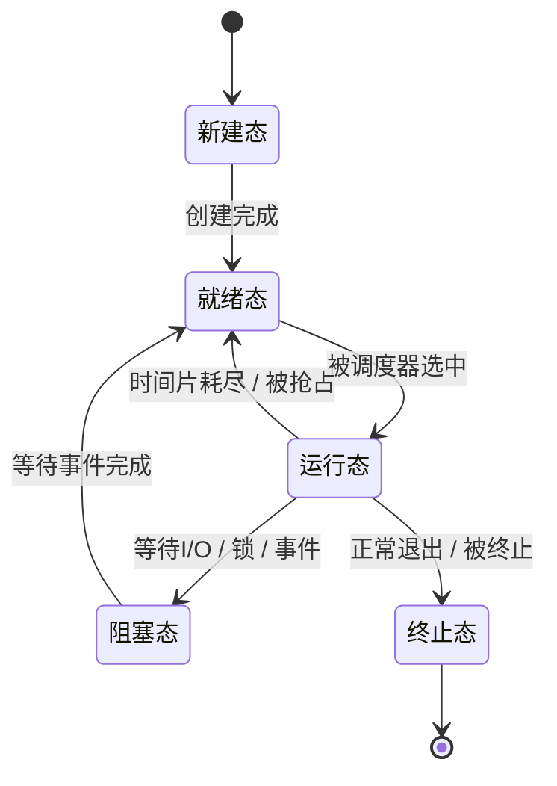

#操作系统 #应试笔记与八股 

# 1 目录

```toc
```

# 2 通用八股

## 2.1 操作系统概述

### 2.1.1 前后台系统与实时操作系统的区别是什么

1. 前后台系统是指将任务分类为前台任务和后台任务的系统，其前台任务往往承担着用户交互、音视频播放等更为重要的任务，因此前台任务的响应优先级更高。而后台任务则反之。
2. 前后台系统的问题是在前台任务较多或任务较重的情况下，后台任务可能会饥饿。其总体实时性较低，调度模型为优先级调度。
3. 而实时操作系统使用了时间片轮转等调度系统，其更能保证任务响应的实时性。

### 2.1.2 剥夺型内核和不可剥夺型内核的区别

1. 不可剥夺型内核是指在执行任务过程中，一个任务可以一直运行，只有当前运行的任务主动放弃CPU控制权才会进行任务切换。
2. 可剥夺型内核是指系统可以强制中断正在执行的任务，并将控制权交给其他高优先级的任务。
3. 而FreeRTOS和Linux都是剥夺型内核，FreeRTOS通过时间片轮转来实现任务切换。

## 2.2 进程与线程

### 2.2.1 死锁产生的条件是什么

考查企业：
- 小米 相机驱动
- 百度 小度 嵌入式开发

1. 死锁是指在多线程的并发执行中，因争夺互斥资源所导致的一种循环等待，且若无外力的作用时该情况会无限僵持下去的现象。
2. 死锁产生的必要条件有： ^gsnhxz
	1. <span style="background:#fff88f"><font color="#c00000">互斥条件</font></span>：线程所争夺的资源为互斥资源，即同一时刻内只允许被一个线程访问的资源
	2. <span style="background:#fff88f"><font color="#c00000">循环等待条件</font></span>：发生死锁时，必定存在的循环等待现象
	3. <span style="background:#fff88f"><font color="#c00000">保持并请求条件</font></span>：线程在新的互斥资源前已经持有了某一互斥资源
	4. <span style="background:#fff88f"><font color="#c00000">不可剥夺条件</font></span>：进程已获得的资源在未使用完之前，不能剥夺，只能在使用完时由自己释放。

### 2.2.2 死锁的检测方法

考查企业：
- 电子科技大学 初试

在《操作系统》课程中，往往会提到如下的死锁检测方法：
1. <font color="#c00000">死锁定理</font>：
	1. 先记录一个各线程和互斥资源之间的请求和持有关系图，该图被称作<font color="#9bbb59">资源分配图</font>。
	2. 随后找到可以正常运行的进程(拥有所有所请求资源的线程)，删除该线程并解除资源持有，循环该步骤，若最终资源分配图无法完全化简，则死锁存在，剩余进程为死锁进程

### 2.2.3 单个互斥资源或者互斥锁是否可以构成死锁

相关问题：
- 单个线程能否构成死锁

考查企业：
- 百度 小度 嵌入式开发

<span style="background:#fff88f"><font color="#c00000">通常来说不会</font></span>，但是：
1. <span style="background:#fff88f"><font color="#c00000">单个线程重复获取非可重入锁</font></span>，通常也会认为构成的是死锁
	- 常见情况：<font color="#c00000">递归调用</font>，或者<font color="#c00000">持有互斥资源的函数A调用了申请该资源的函数B</font>
2. 单核CPU上，如果<font color="#c00000">中断中错误等待了某个互斥资源</font>，<font color="#c00000">而这个资源又被普通线程持有</font>，就导致死锁

### 2.2.4 如何避免死锁

考察企业：
- 百度 小度 嵌入式开发

1. [[操作系统/应试笔记与八股#^gsnhxz|死锁产生的必要条件有]]：![[操作系统/应试笔记与八股#^gsnhxz]]
2. 只要破坏了上述必要条件中的一个，就可以避免死锁，具体方法有：
	- <font color="#c00000">互斥条件</font>：改造为非互斥资源，或者不直接依赖互斥资源(比如通过队列等方式避免)
	- <font color="#c00000">循环并等待</font>：资源有序分配，所有锁之间的加锁顺序必须严格有序
	- <font color="#c00000">保持并请求</font>：一次性申请所有资源，若无法一次性申请，则释放所有资源并等待条件满足
	- <font color="#c00000">不可剥夺</font>：通常来说不能直接把持有资源的进程或线程杀死，因此必须其自己释放
3. 依赖更先进的机制，例如：
	- 可重入锁，避免某些单线程死锁的情况
	- 使用无锁机制(RCU、原子变量等)

此外，如果不局限于"完全避免"死锁，只考虑缓解的话，还有如下的方法：
- 使用更合理的锁，例如读写锁(但是通常不认为可以避免)

### 2.2.5 TCB和PCB是什么，讲一下他们之间的区别 ^d40dqt

在操作系统中：
- PCB是指进程控制块(Process)
- TCB可以指：
	- 线程控制块(Thread)
	- 任务控制块(Task)
	通常这俩是同一个概念的不同称呼，具体称作哪个通常来说取决于该操作系统是否有"进程"概念，不过也不严格绝对

总而言之：
- 一个服务于进程，一个服务于线程，分别可以代表进程和线程
- 其分别用于保存和管理进程和线程的数据，存储的内容也因此有些许不同

#### 2.2.5.1 进程控制块(PCB)

PCB 进程控制块：
- 进程是资源分配的最小单位，而PCB则是记录和维护这些资源的数据结构，其主要包含：
	- 进程ID(PID)，包含当前进程ID、父进程ID、子进程ID等
	- 进程状态，包含运行态、就绪态、阻塞态、终止态等
	- CPU上下文，包含PC、寄存器、<u>堆栈指针</u>等
	- 调度信息，包含任务优先级、时间片等
	- 内存和资源管理信息
	- 资源统计等
- PCB可以用于表示一个进程、保存运行现场、参与进程调度、管理进程资源等

#### 2.2.5.2 线程/任务控制块(TCB)

TCB 线程/任务控制块：
- 线程是任务调度的最小单位，TCB负责记录和维护线程的数据结构，其主要包含：
	- 线程ID(TID)
	- 线程名、所属进程
	- 线程状态
	- CPU上下文，包含PC、寄存器、<u>栈信息</u>、<u>返回地址</u>等
	- 调度信息
	- 同步与等待信息，包含等待的互斥量、信号量、时间、阻塞超时时间等
	- 其他拓展信息，比如线程局部存储、任务通知等
- TCB用于表示一个线程，用于保存线程现场等

### 2.2.6 什么是互斥资源

考查院校：
- 电子科技大学
考查企业：

同时只允许一个访问者访问的资源就叫作互斥资源。

### 2.2.7 互斥量与信号量的区别

考察企业：
- 海康威视
- 百度 小度 嵌入式


### 2.2.8 互斥锁能否使用二值信号量代替，区别是什么，什么时候用哪个

考察企业：
- 百度 小度 嵌入式

二值信号量可以实现“同一时刻只允许一个任务访问资源”，但<font color="#c00000">不能完全替代</font>互斥锁：
1. 互斥锁具有所有权，如果其他线程错误释放，则可能会触发错误
2. 以FreeRTOS为例，其会为<font color="#c00000">互斥锁自动执行优先级继承</font>，避免优先级反转问题；而二值信号量没有对应的机制。
3. 互斥锁不能在中断中使用，而二值信号量可以在中断中释放
4. 互斥锁通常用于保护临界资源，二值信号量通常用于任务同步和事件通知

### 2.2.9 Linux中进程间通信的方式

考查企业：
- CVTE
- 百度 小度 嵌入式

![[Linux用户态IPC#2 概述]]

### 2.2.10 Linux中共享内存应当如何使用

考查企业：
- 百度 小度 嵌入式

1. 共享内存创建时需要指定其大小，并且在部分创建方式下，其不会随着进程退出而自动销毁，<span style="background:#fff88f"><font color="#c00000">需要手动销毁或删除</font></span>
2. 共享内存通常有：
	- <font color="#c00000">匿名共享内存</font>：用于fork这种父子进程的进程间传递方法
	- <font color="#c00000">文件mmap共享内存</font>：通过打开同一个文件，并配置为共享的 `mmap` 创建和匹配共享内存
	- POSIX共享内存：通过名称进行进程间匹配
	- System V共享内存：通过key或id进行匹配
3. <font color="#c00000">共享内存本身不提供线程间数据同步方式</font>，需要约定并提供<span style="background:#fff88f"><font color="#c00000">进程间</font></span>互斥锁、信号量、条件变量等方式进行同步


### 2.2.11 Linux中消息队列如何使用，是否需要循环阻塞接收

考查企业：
- 百度 小度 嵌入式

1. 消息队列的机制为：
	![[操作系统/用户态开发/IPC/Linux用户态IPC#^0x5zs3]]
2. 其接收方式通常也是循环阻塞接收

### 2.2.12 Linux中管道如何使用，是否需要循环阻塞接收

考查企业：
- 百度 小度 嵌入式

1. 管道的机制为：
![[操作系统/用户态开发/IPC/Linux用户态IPC#^0fhcgw]]

2. 其可以创建包含和不包含文件相同节点的管道，分别用于父子进程和普通进程之间的使用
3. 由于其<span style="background:#fff88f"><font color="#c00000">只能单向消息传递</font></span>，因此通常需要创建两条管道
4. 其读写通常使用 `read/write` 方式进行，<font color="#c00000">通常是循环阻塞等待</font>

### 2.2.13 讲一讲IO模型(阻塞、非阻塞、同步、异步)


### 2.2.14 操作系统为什么要分内核空间和用户空间

考察企业：
- 海康威视

[[Linux内核原理及其开发/应试笔记与八股#^zcncz8|请讲一下用户空间和内核空间的区别]]

### 2.2.15 讲一下线程和进程的区别？

考查企业：
- 影石 嵌入式


### 2.2.16 进程间的通信方式有哪些(IPC)？

考查企业：
- 影石 嵌入式

### 2.2.17 讲一下线程调度原理？

考查企业：
- 影石 嵌入式

1. 在任务调度时，线程主要会在"运行"、"就绪"和"阻塞"这三种状态中流转
2. 而在调度的触发时机上，可以分为抢占式调度和协作式调度(非抢占式)。抢占式调度主要依靠于<font color="#c00000">定时器</font>和<font color="#c00000">触发系统调用</font>进行，而协作式调度只能依靠线程主动放弃CPU实现。
3. 当调度器被调用时，调度器会进行上下文切换工作，主要包含保存寄存器和CPU的各种状态到内存(TCB中)，并从内存中加载并恢复下一个上CPU的线程。该步骤中可能还涉及内存调度(页面切换)等工作。
4. 在Linux中可以简单理解为(精准的流程见对应专题)：
	1. 当触发定时器从而触发调度器时，其会检查线程的时间片是否用完，并取消 `RUNNING` 状态标记，调用 `shedule()` 函数执行调度。
	2. 当由系统调用触发阻塞等待时，该线程会被加入资源对应的等待队列中，随后取消 `RUNNING` 状态标记，调用 `shedule()` 函数执行调度。当等待的事件得以满足时，对应的服务程序会从队列中取出被阻塞的任务，修改状态并挂回运行队列中等待调度。
5. 在FreeRTOS中，<font color="#c00000">开启了抢占式调度后</font>：
	- 调度时机：
		1. 以时间片为单位的<font color="#c00000">定时器中断触发</font>调度器
		2. <font color="#c00000">任务主动</font>让出并触发调度器
	- 任务选取规则：
		1. <span style="background:#fff88f"><font color="#c00000">高优先级任务严格优先</font></span>：
			1. <font color="#c00000">只要高优先级任务就绪</font>就会<span style="background:#fff88f"><font color="#c00000"><b><u>立刻</u></b></font></span><font color="#c00000">上处理器</font>，哪怕当前时间片未用完。
			2. 调度器被调度时，只要有高优先级任务就绪，则一定不会选取低优先级任务上处理器。
		2. <font color="#c00000">同优先级任务</font>则按<span style="background:#fff88f"><font color="#c00000">时间片轮转机制调度</font></span>
		3. <font color="#c00000">让出机制</font>：每个任务可以<font color="#c00000">通过等待资源或延迟等方式</font>，直接或间接地让出处理器并离开就绪队列

### 2.2.18 讲一下操作系统中，进程和线程的调度成本与资源共享区别

见章节[[Linux内核原理及其开发/应试笔记与八股#^2f2vhq|讲一下进程和线程在Linux下的调度成本与资源共享区别]]。

### 2.2.19 进程切换时，局部变量(也就是栈)是如何切换的？

考查企业：
- 影石 嵌入式

1. 任务切换时，栈数据的切换主要依靠<span style="background:#fff88f"><font color="#c00000">修改栈指针寄存器实现</font></span>(SP寄存器)。
2. 在部分操作系统的设计中(如FreeRTOS)，会把栈指针寄存器放到TCB结构体的第一个成员中，从而省去偏移量计算的操作

### 2.2.20 讲一下进程都有哪些状态，状态之间怎么切换

考察企业：
- 百度 小度 嵌入式

- 进程的状态主要有： ^vub0zj
	1. 创建态：进程正在创建的状态
	2. 就绪态：进程满足运行条件，等待上处理器的状态
	3. 运行态：进程正在CPU上运行的状态
	4. 阻塞态：进程等待资源或事件，并发生阻塞的状态
	5. 终止态：进程执行结束后，资源还未回收的状态

其流转图为：


其中：
1. 运行态只能由就绪态得到
2. 阻塞态事件满足后，会转化为就绪态

### 2.2.21 讲一下线程都有哪些状态，状态之间怎么切换

考察企业：
- 百度 小度 嵌入式

1. 经典线程状态和经典进程状态一致，均为如下的五个状态![[操作系统/应试笔记与八股#^vub0zj]]
2. 其流转状态图也基本一致。

## 2.3 内存管理

### 2.3.1 为什么需要逻辑地址

考察企业：
- 商汤科技 嵌入式


## 2.4 文件管理

## 2.5 设备管理


# 3 用户态开发专题

本专题为通用用户态开发专题，不限定编译器与操作系统。

## 3.1 如何实现网络编程中的某一端口的快速重启

场景：
- 在程序崩溃或被强制结束时，其所绑定的某一端口上可能会留存有未被来得及关闭的连接。此时若有新的进程尝试重新绑定该端口，则可能遇到端口仍然被占用的错误。

解决方法：
- 在程序绑定端口之前，使用 `setsocketopt` 开启 `SO_REUSEADDR` 选项，允许绑定到一个已存在连接的地址(<span style="background:#fff88f"><font color="#c00000">开启该选项后甚至允许多个进程共用同一个端口</font></span>，但是这些进程<font color="#c00000">必须同时开启该选项</font>)。

## 3.2 讲一下mmap系统调用

1.  `mmap` 调用可以将文件映射到进程的内存空间中(Memory Mapped File)，映射后进程就可以像操作普通内存一样操作文件。而Linux中又有万物皆文件的设计哲学，因此其实际上可以将任意实现了 `.mmap` 回调的VFS文件进行内存映射。
2. 其主要优势是：
	1. <font color="#c00000">减少拷贝次数</font>：以读写任务为例：
		- 普通的 `fread` ：`VFS-(DMA拷贝)->PageCache-(拷贝)->用户空间`
		- `mmap` 读取：`VFS-(DMA拷贝)->PageCache<=>映射到用户空间直接访问`
		- 普通的 `fwrite` ：`进程-(CPU拷贝)->PageCache-(DMA/异步)->VFS`
		- `mmap` 写入：`用户空间<=>PageCache-(DMA/异步)->VFS`
	2. 将实际的内存句柄完成映射，减少内存拷贝
3. `mmap` 的内存映射主要依靠于MMU实现
具体可见章节[[操作系统/用户态开发/MISC/mmap#^go6lxw|函数原型及用户态调用]]。

## 3.3 对于单个指令就可以完成读写的变量的访问有必要使用互斥机制吗？为什么？ ^fc4b4u

1. 有必要，尽管单个周期就可以完成读写的变量在其访问时不会出现自身的数据一致性错误。
2. 因为编译器可能会为了优化程序运行速度，在编译时进行指令重排；而CPU在执行时也可能为了运行效率打乱指令执行的顺序性(乱序执行)，此时若发生读取或写入指令的对调执行，则会出现逻辑错误问题。
3. 这种技术或者设计思路即为内存屏障，使用互斥机制可以建立起内存屏障。

## 3.4 讲一下通常如何实现多线程的线程同步及数据竞态预防

1. 线程同步通常可以依赖于信号量、条件变量、互斥量、自旋锁、原子变量等
2. 数据竞态主要是指：在有线程<font color="#c00000">写入</font>资源的同时，有其他线程去访问该资源的情况，通常的预防方式有：
	1. 互斥锁及信号量
	2. 原子操作
	3. 自旋锁
	4. 无锁机制

## 3.5 若现在进程已经出现死锁，如何只使用shell查看究竟是哪两个线程在死锁

1. 优先考虑使用GDB：
	1. 将GDB附加到进程
	2. 查看进程的所有线程堆栈
	3. 分析堆栈，并检测当前堆栈运行状态，从而找到阻塞源头
	4. 根据阻塞源头找到相关信号量或其他锁机制
	5. 持有当前锁的线程
2. 也可以使用其他的轻量级的堆栈查看工具
3. 当Release版本，删除符号表后，或无法连接GDB时，则可以直接打印内核态和用户态堆栈信息，从而进行上述分析

## 3.6 讲一下什么是"惊群"效应

1. 惊群效应指的是当事件只发生了一次时，所有等待该事件的线程都被唤醒，然后最终只有一个能成功处理，其他线程再次进入睡眠的现象。
2. 


## 3.7 讲一下Linux用户态C++通常如何进行性能分析

1. 针对：
	- 耗时分析，可以使用 `perf` 、 `FlameGraph` 等工具
	- 内存分析，可以使用 `Valgrind` 、`Heaptrack` 等工具
	- IO分析，可以使用 `strace` 等工具
2. 分析时，通常使用保留符号和栈帧的编译模式

## 3.8 网络编程专题

### 3.8.1 在TCP的简单客户端-服务端的实现中，会使用哪些socket函数，具体流程是怎么交互的，函数的执行成果又是什么

考察企业：
- 百度 小度 嵌入式

- 对于服务端来说，其使用的函数及流程主要有：
	1. 使用 `socket()` 函数创建并监听 `socket` 
	2. 使用 `bind()` 函数将 `socket` 绑定到指定IP和端口
	3. 使用 `listen()` 函数将端口设置为监听状态
	4. 使用 `accept()` 函数等待客户端连接
	5. 使用 `send/recv` 或 `read/write` 函数执行通信
- 对于客户端来说，其使用的函数及流程主要有：
	1. 使用 `socket()` 函数创建并监听 `socket` 
	2. 使用 `connect()` 函数连接目标IP和端口
	3. 使用 `send/recv` 或 `read/write` 函数执行通信
	4. 使用 `close()` 函数关闭连接

### 3.8.2 TCP服务端和客户端在连接过程中，都会创建几个/哪些socket

1. TCP服务端在绑定IP和端口之前，需要创建一个对应的监听 `socket` ；随后每建立一个新连接，都会创建一个新的 `socket` 
2. TCP客户端每次只需要创建一个 `socket` 用于连接和数据收发即可。

### 3.8.3 listen和accept中，哪个会阻塞

考察企业：
- 百度 小度 嵌入式

1. `listen` 和 `accept` 中，`accept` 中会阻塞
2. `listen` 函数只负责将 `socket` 转换为监听型 `socket` ，使其可以接收客户端连接，并建立监听队列
3. `accept` 函数会从全连接队列中取出一个已建立的连接，并返回新的 `socket` 描述符

## 3.9 Linux中，用户态程序crash的原因有哪些

考察企业：
- 百度 小度 嵌入式

1. Linux用户态程序crash的原因通常有：
	1. 非法内存访问，例如段错误、访问非法内存区域等
	2. 内存管理错误，例如重复释放内存等
	3. CPU执行异常，例如非法除零
	4. 程序主动终止，例如 `assert` 失败、主动 `abort` 等
	5. 资源不满足，例如OOM
	6. 外部信号终止

## 3.10 crash后，定位原因的方法有哪些

考察企业：
- 百度 小度 嵌入式

1. 通过日志判定
2. 编译时保留符号、栈帧等，随后借助崩溃现场反查堆栈，获取现场的方法有：
	1. 开启 `core dump` ，程序crash时会把现场转存。常见的 `核心已转储` 即是此行为
	2. 附加gdb调试器，崩溃时主动保存现场

# 4 操作系统原理

与系统无关的原理放这里，相关的放到对应的八股笔记。

## 4.1 页表的实现机制有哪些?页表有什么缺点?

考察企业：
- 海康威视