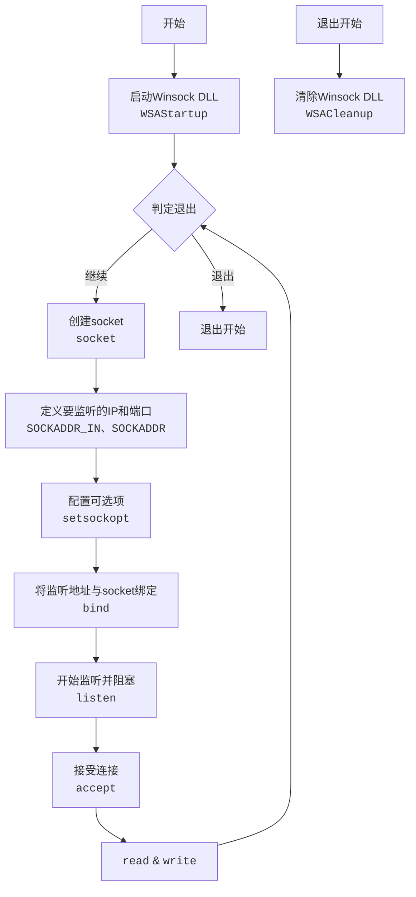

#Windows用户态开发

## 1 目录

```toc
```

## 2 socket概述

## 3 BIO socket

### 3.1 Server端Demo

单线程的server段的主要逻辑如下：



在Windows下，<font color="#c00000">socket每进行一次连接都需要重新创建</font>。

```CPP
#include <iostream>
#include <winsock2.h>
// Link with ws2_32.lib
#pragma comment(lib, "Ws2_32.lib")

int main()
{
	using namespace std;

	// WSADATA: 有关Windows套接字实现信息的数据结构(结构体)
	WSADATA wsaData;

	// 1. 启动Winsock DLL
	//	  参数：
	//		- [in]  WORD      wVersionRequested: 调用方使用的最高版本的Windows套接字规范
	//		- [out] LPWSADATA lpWSAData:         用于存储返回的Windows套接字实现的详细信息
	if (WSAStartup(MAKEWORD(2, 2), &wsaData)) {
		cout << "Windows Socket API startup failed." << endl;
		WSACleanup();
		return -1;
	}

	// 本质是uint64_t，用于存储套接字的文件号
	SOCKET sockSer, sockConn;

	while (true)
	{
		// 2. 创建绑定到特定传输服务提供程序的套接字
		//    参数:
		//		- [in] int af:       地址系列规范, 常用AF_INET(IPV4)、AF_INET6(IPV6)、AF_BTH(蓝牙)等
		//		- [in] int type:     socket类型规范, 常用SOCK_STREAM(流式传输)、SOCK_DGRAM(数据报传输)等
		//		- [in] int protocol: socket要使用的协议，常用0(默认)、IPPROTO_ICMP(ICMP)、IPPROTO_TCP(TCP)、IPPROTO_UDP(UDP)等
		sockSer = socket(AF_INET, SOCK_STREAM, 0);

		// 3. 定义服务端需要绑定的地址和端口信息
		SOCKADDR_IN addrSer;
		addrSer.sin_family = AF_INET;
		addrSer.sin_port = htons(8888);
		addrSer.sin_addr.S_un.S_addr = inet_addr("127.0.0.1");

		// 4. 声明客户端的地址变量
		//	  注: `SOCKADDR` 和 `SOCKADDR_IN` 的大小一致。
		SOCKADDR addrCli;

		// 5. Set options
		//    参数:
		//		- [in] SOCKET     s:       标识套接字的描述符
		//		- [in] int        level:   定义选项的级别，例如SOL_SOCKET
		//		- [in] int        optname: 要为其设置值的套接字选项, 例如SO_BROADCAST
		//		- [in] const char *optval: 指向指定所请求选项值的缓冲区的指针
		//		- [in] int        optlen:  optval 参数指向的缓冲区的大小
		const char opt = TRUE;
		setsockopt(sockSer, SOL_SOCKET, SO_REUSEADDR, &opt, sizeof(opt));


		// 6. 将本地地址与套接字相关联
		//    参数:
		//		- [in] SOCKET         s:       标识未绑定套接字的描述符
		//		- [in] const sockaddr *name:   指向要分配给绑定套接字的本地地址的 sockaddr 结构的指针
		//			- IPV4可以使用 `SOCKADDR` 和 `SOCKADDR_IN` , 并且这两个数据结构大小一致, 均为16Byte
		//			- IPV6可以使用 `SOCKADDR_IN6` , 大小为28Byte。
		//			- 关于 `SOCKADDR` 和 `SOCKADDR_IN` 的强转问题可见笔记。
		//		- [in] int            namelen: addr指向的值的长度, 以字节为单位
		bind(sockSer, (SOCKADDR*)&addrSer, sizeof(SOCKADDR));

		cout << "Start listening 127.0.0.1:8888." << endl;

		// 7. 在主线程中单线程侦听转入的连接
		//	  参数:
		//		- [in] s:       标识绑定的未连接的套接字的描述符
		//		- [in] backlog: 挂起的连接队列的最大长度
		int ret = listen(sockSer, 5);

		if (ret == 0) {
			// 8. 未发生错误, 接受连接
			//    参数:
			//		- [in]      SOCKET   s:        标识已使用listen函数置于侦听状态的套接字
			//		- [out]     sockaddr *addr:    存储客户端地址实体的指针
			//		- [in, out] int      *addrlen: 指向包含 addr 参数指向的结构长度的整数的可选指针
			sockConn = accept(sockSer, &addrCli, NULL);

			if (sockConn != INVALID_SOCKET) {
				cout << "Connection successful." << endl;
				const string msg = "hello, world!";

				// 9. 发送数据
				send(sockConn, msg.c_str(), msg.length() + 1, 0);
			}
			else {
				cout << "accept failed with error: " << WSAGetLastError() << endl;
			}

			// 10. 关闭套接字
			//     注意:
			//		- 必须开启 `SO_REUSEADDR` 选项, closesocket后才能立即被再次listen。
			closesocket(sockSer);
		}
		else {
			cout << "listen function failed with error: " << WSAGetLastError() << endl;
		}

	}

	WSACleanup();

	return 0;
}

```

### 3.2 Client端Demo


### 3.3 相关APIs

#### 3.3.1 数据结构 SOCKADDR_IN 与 SOCKADDR


#### 3.3.2 setsockopt

##### 3.3.2.1 setsockopt概述

##### 3.3.2.2 setsockopt选项列表

![[setsockopt及其选项列表#3 setsockopt选项列表]]

