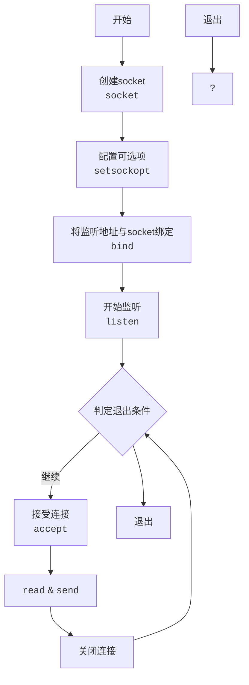

#Linux用户态开发 

## 1 目录

```toc
```

## 2 socket概述


## 3 BIO socket

### 3.1 Server端Demo

单线程的server段的主要逻辑如下：




```CPP
#include <sys/socket.h>
#include <netinet/in.h>
#include <stdio.h>
#include <stdlib.h>
#include <string.h>
#include <unistd.h>
#include <iostream>

#define PORT 8888

int main() {
    using namespace std;

    int socket_fd = socket(AF_INET, SOCK_STREAM, 0);

    int yes = 1;
    setsockopt(socket_fd, SOL_SOCKET, SO_REUSEADDR, &yes, sizeof(yes));

    struct sockaddr_in server_addr;
    memset(&server_addr, 0, sizeof(server_addr));
    server_addr.sin_family = AF_INET;
    server_addr.sin_addr.s_addr = htonl(INADDR_ANY);
    server_addr.sin_port = htons(PORT);

    bind(socket_fd, (struct sockaddr*)&server_addr, sizeof(server_addr));

    cout << "Start listening 0.0.0.0:8888." << endl;
    listen(socket_fd, 10);

    while (1) {
        cout << "Waiting for connection." << endl;
        int conn_fd = accept(socket_fd, NULL, NULL);
        cout << "Connected." << endl;

        const string msg = "hello, world!";

        // 发送数据
        send(conn_fd, msg.c_str(), msg.length() + 1, 0);

        shutdown(conn_fd, SHUT_WR); // 关闭发送
        close(conn_fd); // 关闭连接
    }
}

```

### 3.2 Client端Demo

### 3.3 相关APIs

#### 数据结构


## 4 拓展

### 4.1 八股与思考

