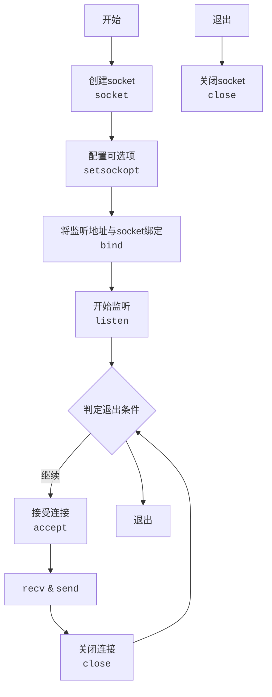

#Linux用户态开发 

## 1 目录

```toc
```

## 2 socket概述


## 3 BIO socket

### 3.1 Server端Demo

单线程的server段的主要逻辑如下：




```CPP
#include <sys/socket.h>
#include <netinet/in.h>
#include <stdio.h>
#include <stdlib.h>
#include <string.h>
#include <unistd.h>
#include <iostream>

#define PORT 8888

int main() {
    using namespace std;

    int socket_fd = socket(AF_INET, SOCK_STREAM, 0);

    int opt = 1;
    setsockopt(socket_fd, SOL_SOCKET, SO_REUSEADDR, &opt, sizeof(yes));

    struct sockaddr_in server_addr;
    memset(&server_addr, 0, sizeof(server_addr));
    server_addr.sin_family = AF_INET;
    server_addr.sin_addr.s_addr = htonl(INADDR_ANY);
    server_addr.sin_port = htons(PORT);

    bind(socket_fd, (struct sockaddr*)&server_addr, sizeof(server_addr));

    cout << "Start listening 0.0.0.0:8888." << endl;
    listen(socket_fd, 10);

    while (1) {
        cout << "Waiting for connection." << endl;
        int conn_fd = accept(socket_fd, NULL, NULL);
        cout << "Connected." << endl;

        const string msg = "hello, world!";

        // 发送数据
        send(conn_fd, msg.c_str(), msg.length() + 1, 0);

        shutdown(conn_fd, SHUT_WR); // 关闭发送
        close(conn_fd); // 关闭连接
    }

	close(socket_fd);
	return 0;
}
```

### 3.2 Client端Demo

### 3.3 相关APIs

#### 3.3.1 数据结构 sockaddr_in 与 sockaddr


#### 3.3.2 setsockopt

##### 3.3.2.1 setsockopt概述

##### 3.3.2.2 setsockopt选项列表

![[setsockopt及其选项列表#3 setsockopt选项列表]]

#### 3.3.3 close与shutdown


## 4 NIO socket

### 4.1 相关APIs

#### 4.1.1 select

select函数是跨平台的函数，已验证支持的平台有：
- Linux
- Windows
- Mac OS
select底层使用的数据结构为线性表，<font color="#c00000">默认的连接上限为1024个</font>：
- 内核中维持的文件描述符表默认长度也为1024个，但是这个可以通过API进行修改。
- 如果需要修改则需要重新编译内核。

在Linux中， `select` 函数的定义如下：

```C
extern int select (int __nfds, fd_set *__restrict __readfds,
                   fd_set *__restrict __writefds,
                   fd_set *__restrict __exceptfds,
                   struct timeval *__restrict __timeout);
```

其中，参数：
- `nfds` ：委托给内核的三类文件描述符集合的<font color="#c00000">最大集合的个数</font><span style="background:#fff88f"><font color="#c00000">+1</font></span>
- `__readfds` ：大小默认为1024bit，<font color="#c00000">即1024个标志位</font>。
	- 传入时：为委托内核需要<font color="#c00000">检测读缓冲区</font>的文件描述符的集合
	- 传出时：读缓冲区<font color="#c00000">可读</font>的文件描述符集合
- `__writefds` ：大小默认为1024bit，<font color="#c00000">即1024个标志位</font>。
	- 传入时：委托内核需要<font color="#c00000">检测写缓冲区</font>的文件描述符的集合
	- 传出时：写缓冲区<font color="#c00000">可写</font>的文件描述符集合
- `__exceptfds` ：大小默认为1024bit，<font color="#c00000">即1024个标志位</font>。
	- 传入时：委托内核需要<font color="#c00000">检测异常</font>的文件描述符的集合
	- 传出时：发生异常的文件描述符集合
- `__timeout` ：select函数阻塞的时长，需要注意该结构体有两个成员，分别为秒级成员和微秒级成员。注意两个成员都要初始化。
返回值为：

其中：
- `fd_set` 与内核之间的交互如下图组所示：
	![[Pasted image 20241118000708.png]]
	![[Pasted image 20241118000735.png]]
	(该图片出自[https://subingwen.cn/](https://subingwen.cn/))
- 内核也为 `fd_set` 提供了如下的操作API：
```C
// 清空set集合中所有标志位
void FD_ZERO(fd_set *set);

// 将fd对应的标识符置1
void FD_SET(int fd, fd_set *set);

// 将fd对应的标识符清空
void FD_CLR(int fd, fd_set *set);

// 判断fd对应标识符是否被置1
int  FD_ISSET(int fd, fd_set *set);
```

在Windows中，


其中：
- `nfds` 参数无效，<span style="background:#fff88f"><font color="#c00000">填写为-1即可</font></span>。


通常使用的函数为select和epoll。


#### 4.1.2 poll

poll函数底层使用的数据结构为线性表

#### 4.1.3 epoll

epoll函数底层使用的数据结构为红黑树

