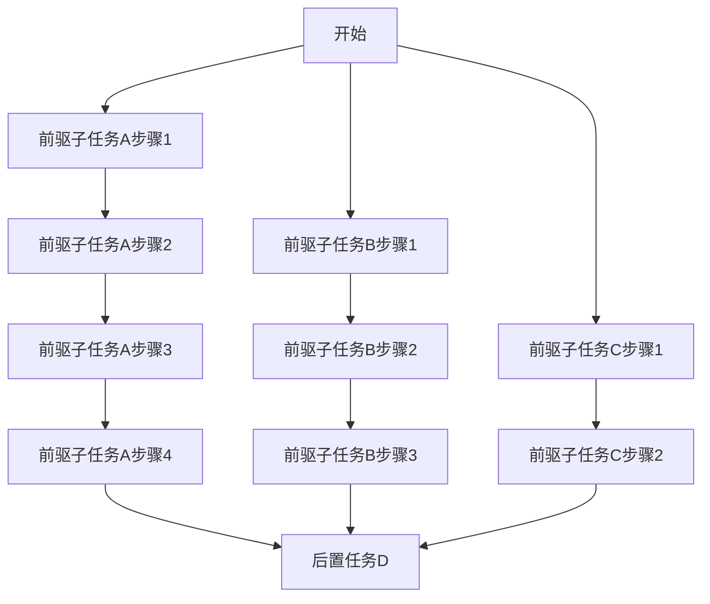

#操作系统

## 1 目录

```toc
```

## 2 概述

在学习本章前，需要对基本的IO操作(socket等)有所了解。

## 3 IO模型

在IO模型上，主要可以分为阻塞IO(BIO)、同步非阻塞(NIO)和异步非阻塞(AIO)三种。

基本定义：
- <font color="#9bbb59">阻塞</font>：在进行请求时，若系统不能立即处理或满足该请求，则该线程会被该函数阻塞，直到处理结束或满足该请求。阻塞时该线程通常不会获得处理器时间。
- <font color="#9bbb59">非阻塞</font>：在进行请求时，无论系统能不能立即处理或满足该请求，该函数都一定会立即返回。
- <font color="#9bbb59">同步</font>：在进行一系列请求时，必须按照 "请求A发起-请求A结束-请求B发起..." 的顺序，在一个请求完成后才可以处理下一个请求的IO模型叫作同步IO。<font color="#c00000">在使用函数实现同步IO时，函数必须在该请求完成后才能返回</font>。
- <font color="#9bbb59">异步</font>：在进行一系列请求时，<font color="#c00000">可以在前一个IO请求完成之前就发起下一个IO请求</font>，这种IO模型叫作异步IO。<font color="#c00000">使用函数实现异步IO时</font>：
	- <font color="#c00000">函数可以在请求完成前就返回</font>。
	- <font color="#c00000">内核可以通过某种方式通知进程其所请求的IO事件完成</font>。

同步和阻塞之间的关系：
1. <font color="#c00000">阻塞IO一定是同步IO</font>：当应用程序执行阻塞IO时，它会同步地等待IO操作的完成。因此所有阻塞IO操作也是同步的。
2. <font color="#c00000">同步IO</font><span style="background:#fff88f"><font color="#c00000">不一定</font></span><font color="#c00000">是阻塞IO</font>：同步IO表示应用程序关心IO操作何时完成，并在操作完成前不会继续执行其他逻辑处理。<font color="#c00000">但是这并不意味着它一定会阻塞应用程序的执行线程</font>。

![[Pasted image 20241118155456.png]]

### 3.1 阻塞IO(BIO)

以常见的TCP编程为例，其BIO下的通信流程如下图所示：
	![[Pasted image 20241116230432.png]]
在上图中：
- `accept` 、 `read` 、 `write` 均是阻塞型IO：
	- 使用 `accept` 等待客户端的连接时，需要为每一个客户端单独创建一个线程，随后会阻塞在 `accept` 系统调用中，直到有新的客户端连接到达。
	- 使用 `read` 、 `write` 函数进行读写数据操作时，该线程会阻塞到该系统调用，直到读取/写入请求完成。

在基本的BIO模型中，用户空间-内核空间的交互如下图所示：
	![[Pasted image 20241118171723.png]]

设想一个场景：
- 在一个8个逻辑CPU的平台上
- 需要同时处理数百个客户端的连接与请求
则此时只能通过在操作系统中建立数百个接收线程阻塞在 `accept` 系统调用中等待客户端连接才可以完成此并发需求。但是这么多的线程必然会导致：
- <font color="#c00000">频繁的内核-用户空间切换</font>
- <font color="#c00000">频繁的线程调度</font>
- <font color="#c00000">频繁的上下文切换</font>
所带来的效率问题。

### 3.2 (同步)非阻塞IO(NIO)

正如上文所述，非阻塞型IO应当有如下特性：
- 该IO的打开、读写等操作一定是非阻塞的。
- 但是若干IO之间依旧需要顺序执行。


#TODO 

![[Pasted image 20241118171710.png]]


上述IO的基本特性为：
- 同步IO
- 非阻塞IO


本IO模型不常用。

### 3.3 IO多路复用(IO Multiplexing)

对上一章节末尾的场景进行分析，其效率问题主要集中在了：
- 线程利用率低，一个线程只能负责一个阻塞业务
- 线程数量太多所带来的附加问题
针对上述BIO线程数过多的问题，BSD提出了IO多路复用方案：<font color="#c00000">让一个线程同时监听多个IO的指定事件</font>。

#### 3.3.1 select解决方案

BSD socket最开始是为了BSD系统(类Unix系统)设计的，而类Unix系统的设计理念之一就是"一切皆文件"，因此BSD为socket等文件设计了如下的 `select` 解决方案：
1. 设计一个 `select` 函数，该函数可以<font color="#c00000">同时监听</font><span style="background:#fff88f"><font color="#c00000">多个文件</font></span>的<font color="#c00000">读缓冲区可读</font>、<font color="#c00000">写缓冲区可写</font>、<font color="#c00000">异常事件</font>。
2. 该函数由一个线程轮询调用，当<font color="#c00000">这些被监听的事件发生</font>或<font color="#c00000">函数阻塞到达最长等待时长</font>后，函数会返回并告知调用者轮询结果。
3. 在调用者收到轮询结果后，可以对需要操作的<font color="#c00000">多个文件</font>进行操作。

基本示意图如下：
	![[Pasted image 20241118011240.png]]

在上图中：
1. 按照正常流程创建socket。
2. 在调用 `listen` 时，将socket<font color="#c00000">设置为非阻塞</font>。此时socket也是文件。
3. 将socket加入<font color="#c00000">读缓冲区可读</font>监视集合。
4. 当socket文件发生缓冲区可读时，进行 `accept` 。
5. 将 `accept` 得到的文件<font color="#c00000">设置为非阻塞</font>，并加入listen集合。

本函数在Linux、FreeBSD、Windows、Mac OS上均有实现：
- 其基本函数声明为(具体声明取决于实现平台)：
```C
int select(int nfds, fd_set *readfds,
            fd_set *writefds,
            fd_set *exceptfds,
            struct timeval *timeout);
```
- 其参数：
	- `int  nfds` ：需要使用 `select` 委托内核查询的三个集合中的<font color="#c00000">最大fd号</font><span style="background:#fff88f"><font color="#c00000">+1</font></span>。
	- `fd_set	*readfds` ：
		- 传入时：为委托内核需要<font color="#c00000">检测读缓冲区</font>的文件描述符的集合
		- 传出时：读缓冲区<font color="#c00000">可读</font>的文件描述符集合
	- `fd_set *writefds` ：
		- 传入时：委托内核需要<font color="#c00000">检测写缓冲区</font>的文件描述符的集合
		- 传出时：写缓冲区<font color="#c00000">可写</font>的文件描述符集合
	- `fd_set *exceptfds` ：
		- 传入时：委托内核需要<font color="#c00000">检测异常</font>的文件描述符的集合
		- 传出时：发生异常的文件描述符集合
	- `struct timeval *timeout` ：
		- 最大阻塞时长
- 其返回值：
	- 大于等于0时，为检测到的符合要求的文件标识符总个数。
	- 为-1时，则函数调用失败。

其中需要注意的是：
- 在Linux中，`select` 默认可以监视的最大fd数量为1024
- 在Free BSD中，`select` 默认可以监视的最大fd数量为1024

此处仅简单列出参数含义用于大致对比不同的解决方案，具体定义见各操作系统的socket开发笔记。

#### 3.3.2 poll解决方案

poll解决方案与select基本一致，其只是<font color="#c00000">没有了1024的最大文件数的限制</font>，以及传参的形式有所区别。

本函数在Linux、FreeBSD上均有实现：
- 其基本函数声明为(具体声明取决于实现平台)：
```C
struct pollfd{
	int fd;
	short events;
	short revents;
};

int poll(struct pollfd *fds, nfds_t nfds, int timeout);
```
- 其参数：
	- `struct pollfd *fds` ：为 `struct pollfd` 构成的<font color="#c00000">数组</font>， `struct pollfd` 的结构体成员：
		- `fd` ：需要监听的fd号
		- `events` ：需要使用poll等待的事件，可以使用位运算
		- `revents` ：发生的事件
	- `nfds_t nfds` ：指定 `fds` 的数组大小
	- `int timeout` ：等待的毫秒数，其中：
		- `timeout = -1` ：永久等待，直到事件发生
		- `timeout = 0` ：立即返回
		- `timeout > 0` ：等待xxms
- 其返回值：
	- 大于等于0时，含义为 `revents` 域不为0的文件描述符个数
	- 失败时为-1，错误查看方法取决于各操作系统
注：
- 本函数在Windows上的实现为 `WSAPoll` 函数，作用与形式类似。
- 尽管没有了 `select` 中的1024上限，但是当数量过多时仍然会导致运行速度降低。

#### 3.3.3 epoll解决方案

epoll是Linux中独有的一种IO多路复用方案。该方案的使用比上述两个方案更为复杂，但是由于其内部使用的是红黑树的数据结构，其效率相较于 `select` 和 `poll` 更为高效。

epoll方案的使用步骤为：
![[chrome_8uyFjkPyld.png]]
1. 使用 `int epoll_create(int size);` 创建epoll实例，其中 `size` 参数表示 `epoll` 实例可以管理的最大文件描述符数。
2. 将一个或多个事件通过 `int epoll_ctl(int epfd, int op, int fd, struct epoll_event *event);` 添加到epoll实例中。
3. 使用 `int epoll_wait(int epfd, struct epoll_event *events, int maxevents, int timeout);` 函数等待事件。
4. 处理发生的事件。

具体实现可见[[Linux用户态socket]]笔记。

#### 3.3.4 三种IO多路复用方案的比较

|        |                 `select`                  |                 `poll`                  |                      `epoll`                       |
| ------ | :---------------------------------------: | :-------------------------------------: | :------------------------------------------------: |
| 操作方式   |                                           |                                         |                                                    |
| 底层数据结构 |                    数组                     |                   链表                    |                        哈希表                         |
| IO效率   |                                           |                                         |                                                    |
| 最大连接数  |           1024(x86) 或 2048(x64)           |                   无上限                   |                        无上限                         |
| fd拷贝   | 每次调用 `select` 都要完成<br>fd集合的用户-内核-用户的两次拷贝。 | 每次调用 `poll` 都要完成<br>fd集合的用户-内核-用户的两次拷贝。 | 调用 `epoll_ctl` 时拷贝进内核并保存，<br>随后 `epoll_wait` 时不拷贝。 |

### 3.4 信号驱动型IO(Signal Driven IO)

IO多路复用解决了线程数过多的问题，允许使用一个线程监听和服务多个IO事件。但是仍然没有解决非阻塞IO的轮询问题。在多数情况下的 `select` 操作是无效的。

在进行程序设计时，通常会有 "回调函数" 的设计思路。而信号驱动型IO就可以简单的描述为 "使用回调函数进行IO事件处理" 的一种IO模型。

![[Pasted image 20241118171902.png]]

基本的使用流程为：
1. 使用 `sigaction` (推荐)或 `signal` (不推荐)注册需要监听的信号及其回调函数
2. 在回调函数中对IO进行处理

但是这样的IO设计引入了一些新的问题：
1. 信号的回调函数可能会在任意一个没有显示的阻塞等待该信号的线程中处理，也就是该信号可能会打断任意一个线程。
2. 在处理一个信号的过程中，该信号可能会再次发生。
3. 在处理事件时，回调函数本身就有可能带来线程安全问题(死锁等)。
4. 当高频率IO事件进入时，每处理一个事件就要完成一次用户态-内核态切换，且需要切换上下文。
因此在文件、socket等IO中通常也不使用。
在程序设计中，可以对 `SIGINT` (交互式信号，如 `ctrl+c` 中断)等常用IO进行注册和使用。

### 3.5 异步IO(AIO)

![[Pasted image 20241118171908.png]]

在拥有了非阻塞的IO模型后(注意非阻塞IO和NIO的区别)，就已经可以实现异步请求了：

```CPP
int service(){
	// 发起数据库读取请求
	db_promise = nio_db_read();
	
	// 发起文件下载请求
	dl_promise = nio_file_download();

	// 轮询等待IO完成
	while(!nio_db_read_complete() || !nio_file_download_complete());

	// do sth...

	return 0;
}
```

#### 3.5.1 Promise方案

但是上述的异步请求伪代码只是实现了同时请求多个IO操作，并在后续的 `while` 中进行轮询，浪费了大量的CPU时间。

因此可以引入一个 `promise` 对象：
- 上述非阻塞IO大致可以分为如下两个部分：
	- IO请求部分：本步骤只负责发起IO请求
	- IO完成部分：IO完成后的通知形式，或者说是进程获取 "IO请求的状态" 的方式
- 而进程获取IO请求的状态有如下三种形式：
	- 非阻塞查询
	- 阻塞等待
	- 回调函数
因此可以设计如下的 `Promise` 类：

```CPP
class Promise() {
public:
	// 非阻塞查询
	bool IsReady() const;
	// 阻塞等待
	void Wait() const;
	static void WaitForAll(const std::vector<SimplePromise<T>*>& promises);
	// 回调函数, 返回值为参数内回调函数的返回值
	std::optional<R> Then(const std::function<R(const T&)>& callback);
}
```

上述的Promise类可以基于IO多路复用等方式实现。

则原先的代码可以如下编写：

```CPP
int service(){
	// 发起数据库读取请求
	Promise db_promise = aio_db_read_async();
	
	// 发起文件下载请求
	Promise dl_promise = aio_file_download_async();

	// 阻塞等待多个Promise
	Promise::WaitForAll({db_promise, dl_promise});

	// do sth...

	return 0;
}
```

#### 3.5.2 await/async方案

考虑如下的任务流：



则明显地，此时可以考虑使用嵌套回调函数完成：

```CPP
int service() {
	Promise taskA_Promise = 
		task_a_step1_async().Then([](){
			return task_a_step2_async().Then([]{
				return task_a_step3_async().Then([]{
					return task_a_step4_async();
				})
			})
		});
	
	Promise taskB_Promise = 
		task_b_step1_async().Then([](){
			return task_b_step2_async().Then([]{
				return task_b_step3_async();
				})
			})
		});
	
	Promise taskC_Promise = 
		task_c_step1_async().Then([](){
			return task_c_step2_async();
		});
	
	Promise::WaitForAll({taskA_Promise, taskB_Promise, taskC_Promise});
	
	// Do sth.
	
	return 0;
}
```

但是这样调用会存在 `callback hell` 问题，为了解决问题从而引入了await/async方案。

该方案可以理解为语言为异步IO模型提供了一种异步编程的简化，其主要特性如下：
1. 
2. 在编译层面，使用 `async` 和 `await` 的代码通常被编译器转换成状态机，即yi wei


