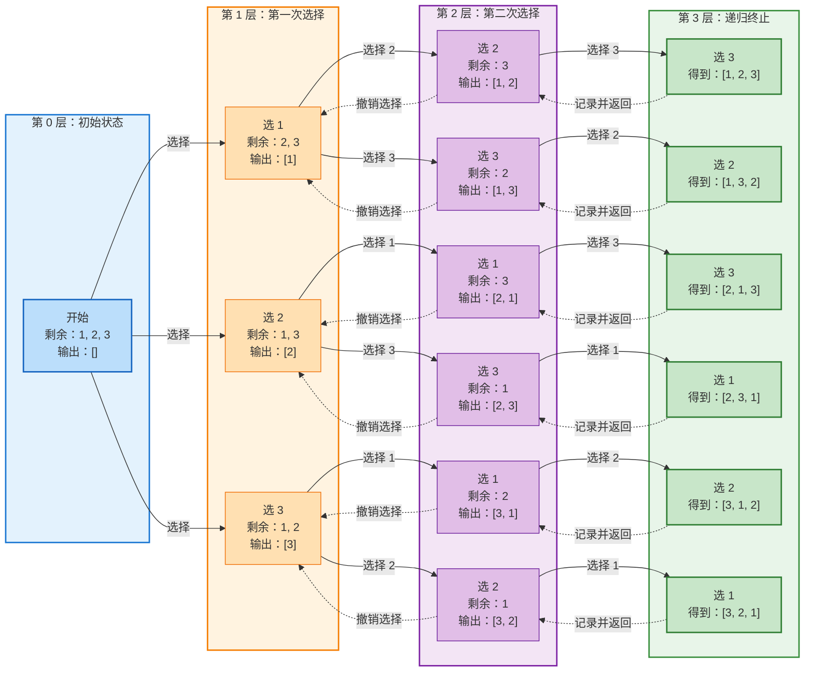

#数据结构算法 #应试笔记与八股 

# 1 目录

```toc
```

# 2 回溯概述

回溯是用于<span style="background:#fff88f"><font color="#c00000">暴力遍历</font></span>的一个方法，其：
- 相较于 `for` 循环，<font color="#c00000">其更适合树形任务而非分层任务</font>

例如：
- 组合问题：
	- 回溯分支：本次选择哪个元素
- 子集问题：
	- 回溯分支：选择或不选择某个元素
- 切割问题：
- 排列问题：
- 棋盘问题：
	- N皇后
	- 解数独

对于回溯，其<font color="#c00000">通常均可以抽象为N叉树</font>，并且：
- 叶子节点通常是遍历结果
- 非叶子节点通常是问题子集

其模板通常为：

```CPP
void backtracking(参数) {
	if(终止条件) {
		收集结果();
		return;
	}
	
	// 分层遍历 (子集问题则不需要分层，可见后续章节)
	for(遍历集合元素) {
		// 执行操作
		do_sth();
		// 执行递归
		backtracking(子节点);
		// 撤销操作
		undo_sth();
	}
}
```

具体可结合下方实例进行理解。

# 3 回溯实例

## 3.1 全排列问题

[[../../LeetCode/LeetCode题目汇总#46 全排列|LeetCode 46]]：
![[../../LeetCode/LeetCode题目汇总#46 全排列]]

回看上方回溯模板，不妨考虑如下的回溯：




```CPP
/**
 * @brief: 递归选择排列
 * @param:
 *     - result: 最终的结果列表
 *     - curr_set: 当前递归分支的剩余未选择元素
 *     - output: 当前递归分支的已选择列表
 */
void backtracking(vector<vector<int>>& result, vector<int>& curr_set, vector<int> &output) {
    if (curr_set.empty()) {
        // 当所有元素均被选择时，把选择结果加入最终结果列表
        result.push_back(output);
        return;
    }

    for (int i = 0; i < curr_set.size(); i++) {
        // 做选择
        int value = curr_set[i];
        // 将选出的元素从待选择列表中移除
        curr_set.erase(curr_set.begin() + i);
        // 加入到已选择列表
        output.push_back(value);

        // 递归
        backtracking(result, curr_set, output);

        // 撤销选择，注意两个列表均需要完全还原
        output.pop_back();
        curr_set.insert(curr_set.begin() + i, value);
    }
}

vector<vector<int>> solution(vector<int>& nums) {
    vector<vector<int>> result;
    vector<int> output;
    backtracking(result, nums, output);
    return result;
}
```

当然，上述两个数组可以合并，程序也可以继续化简。

## 3.2 子集问题 ^390chd

[[数据结构/数据结构算法/LeetCode/LeetCode题目汇总#78 子集|LeetCode 78]]：
![[数据结构/数据结构算法/LeetCode/LeetCode题目汇总#78 子集|LeetCode 78]]


```CPP
class Solution {
public:
    void backtracking(vector<vector<int>>& result, const vector<int>& nums, vector<int>& output, int curr_pos) {
        if(curr_pos == nums.size()) {
            result.push_back(output);
            return;
        }

        // 添加当前元素
        output.push_back(nums[curr_pos]);

        // 执行递归
        backtracking(result, nums, output, curr_pos + 1);

        // 删除当前元素
        output.pop_back();

        // 执行递归
        backtracking(result, nums, output, curr_pos + 1);
    }

    vector<vector<int>> subsets(vector<int>& nums) {
        vector<vector<int>> result;
        vector<int> output;
        backtracking(result, nums, output, 0);
        return result;
    }
};
```

虽然还是推荐使用更简单的[[数据结构/数据结构算法/必背算法/技巧&MISC/迭代法解子集问题#^3k7iww|迭代法解子集问题]]。


